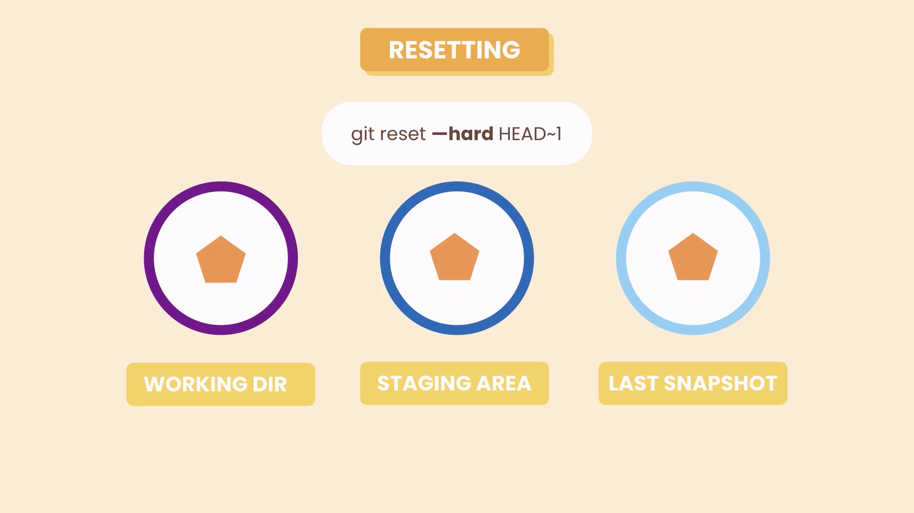
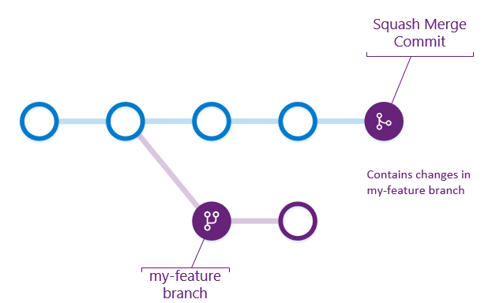
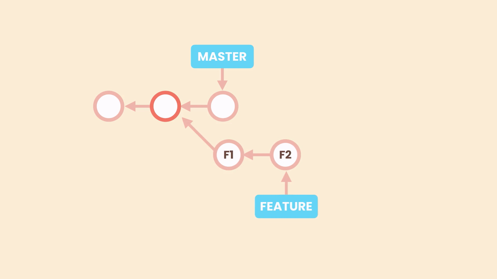
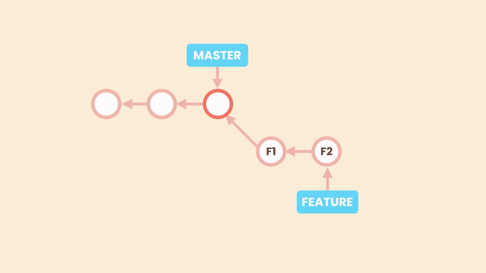
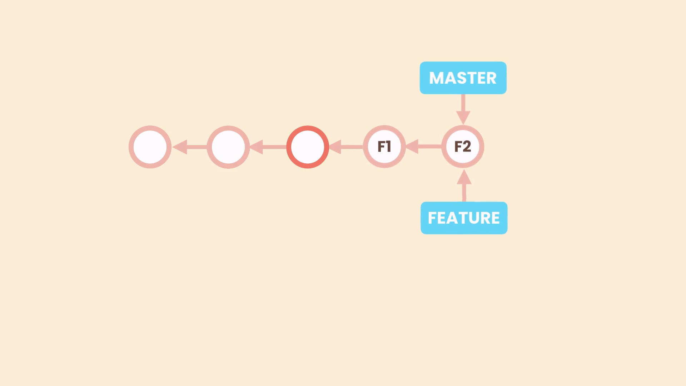
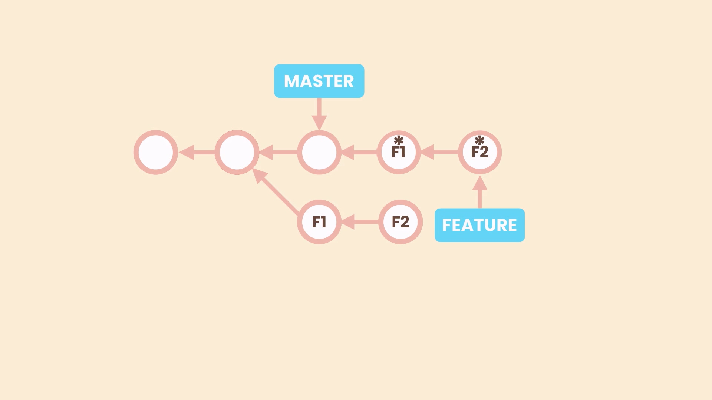
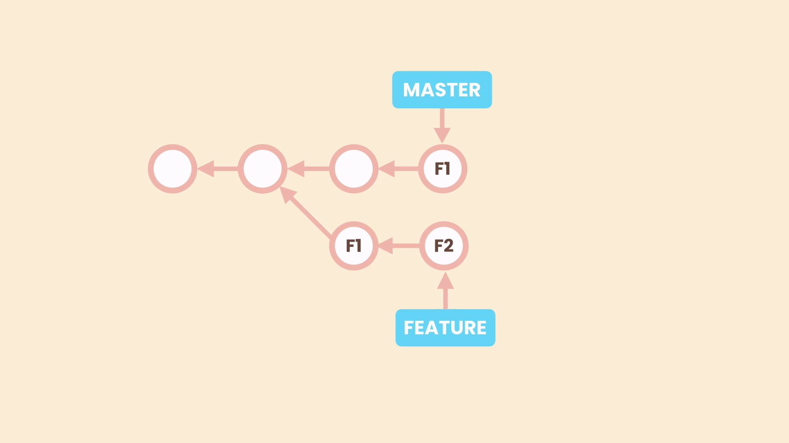

# Branching in Git

## Managing Branches

### Create a branch

using fix-bugs/login help us to organize branches better in vscode gitlens, it make folder with name fix-bugs and put login into it

```zsh
git branch branch-name
# example
git branch fix-bugs/login
git branch fix-login-bugs
```

### Switch branch

```zsh
git checkout branch-name
git switch branch-name
```

### Create a branch and switch to it

```zsh
git checkout -b branch-name
git switch -C branch-name
```

### Delete a branch

```zsh
git branch -d branch-name
# delete branch by force
git branch -D branch-name
```

### Rename a branch

```zsh
git branch -m old-name new-name
```

## Comparing branches

### See difference commits between branched

```zsh
git log master..branch-name
# example
git log master..feature
```

### See content differences between branches

```zsh
git diff master..branch-name
# example
git diff master..feature

# to see difference between current branch and other branch
git diff branch-name
git diff --name-status branch-name
git diff --name-only branch-name
```

## Stashing changes

we stash changes to switch between branches and save current branch changes without any commit

```zsh
git stash push -m “New tax rules” # Creates a new stash
git stash push -am “New tax rules”
git stash list # Lists all the stashes
git stash show stash@{1} # Shows the given stash
git stash show 1 # shortcut for stash@{1}
git stash apply 1 # Applies the given stash to the working dir
git stash drop 1 # Deletes the given stash
git stash clear # Deletes all the stashes
```

## Merging branches

using no fast forward merge help us to make revert a commit easier and we don't need to revert multiple commits

### Fast forward merge

```zsh
git log --oneline --all --graph
git merge bugfix
```

### No fast-forward merge

```zsh
git merge --no-ff bugfix
```

### Disable fast forward

```zsh
git config ff no
git config --global ff no
```

### See merged and unmerged branches

to organize our branches and delete merged branches

```zsh
git branch --merged
git branch --no-merged
```

### When merge conflicts occur?

it happens when git cannot comprehend changes automatically, and below are potential cases:

1. change a file in two different branches
2. change a file in a branch and delete it in another branch
3. add a file with same name and different content in two branches twice

### Abort the merge

if you do not want to to resolve the conflict now you can abort it.

```zsh
git merge --abort
```

## Undo a faulty merge

### using reset command

**_this change history and it's not recommend for developer team_**

```zsh
git reset --hard HEAD~2
```

**_different type of resets_**

1. **soft**:


```zsh
git reset --soft HEAD~2
git reset --hard fd432a
```

- **mixed**:


```zsh
git reset -- mixed HEAD~2
```

- **hard**:



```zsh
git reset --hard HEAD~2
```

### revert the merge

```zsh
git revert -m nth-parent target-commit
git revert -m 1 HEAD
```

### Perform squash merge

Squash merging is a merge option that allows you to condense the Git history of topic branches when you complete a pull request. Instead of adding each commit on the topic branch to the history of the default branch, a squash merge adds all the file changes to a single new commit on the default branch. Squash merge commit doesn't have a reference to the topic branch. It produces a new commit that contains all changes from the topic branch. We recommend that you delete the topic branch to prevent any confusion.



A simple way to think about this is that squash merge gives you just the file changes, and a regular merge gives you the file changes and the commit history.

How is a squash merge helpful?
Squash merging keeps your default branch histories clean and easy to follow without demanding any workflow changes on your team. Contributors to the topic branch work how they want in the topic branch, and the default branches keep a linear history by using squash merges. The commit history of a main branch updated with squash merges has one commit for each merged branch. You can step through this history to find out exactly when work was done.

```zsh
git merge --squash feature-branch
```

then you need to commit changes

```zsh
git commit -m "Fix the bug"
```

after seeing merged branches we see squash merge is not in the list

```zsh
git branch --merged
```

if we try to remove the branch, we see an error that says the branch is not fully merged and we need to force the deletion

```zsh
git branch -D bugfix
```

## Use rebasing to have linear branch history

you can use rebase to change the emergence commit of other branches,
**Caution**:_This action change repository history and rewrites it and in a team project can cause a complete mess._
before rebase



after rebase



then after an fast-forward merge



**why rebasing is a complete mess**


```zsh
git rebase master
```

**_example_**:

```zsh
git switch feature/shopping-cart
git rebase master
git log --oneline --graph
git switch master
git merge feature/shopping-cart
git log --oneline --graph
```

```zsh
# we use these command after encounter an conflict
git rebase --continue
git rebase --skip
git rebase --abort

# to clean current untracked files
git clean -fd
```

## Cherry picking

we want to have a certain commit of feature branch in our master branch



```zsh
git switch master
git cherry-pick 1ba5sd
```

### Pick an specific file from a branch and add it to another branch

```zsh
git restore source=branch-name -- file-name
```

**_example_**:

```zsh
git switch master
git restore --source=feature/send-email -- test.txt
```
