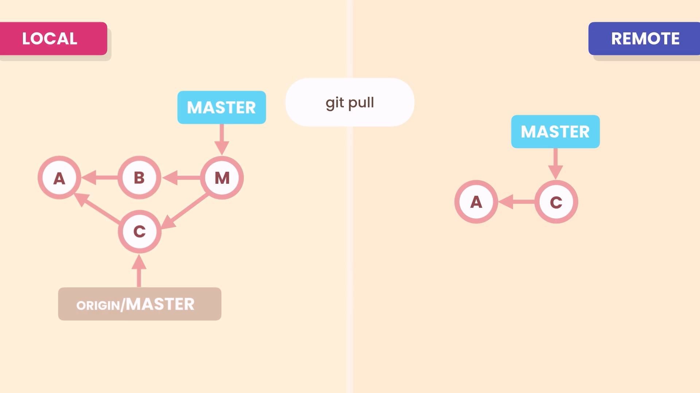
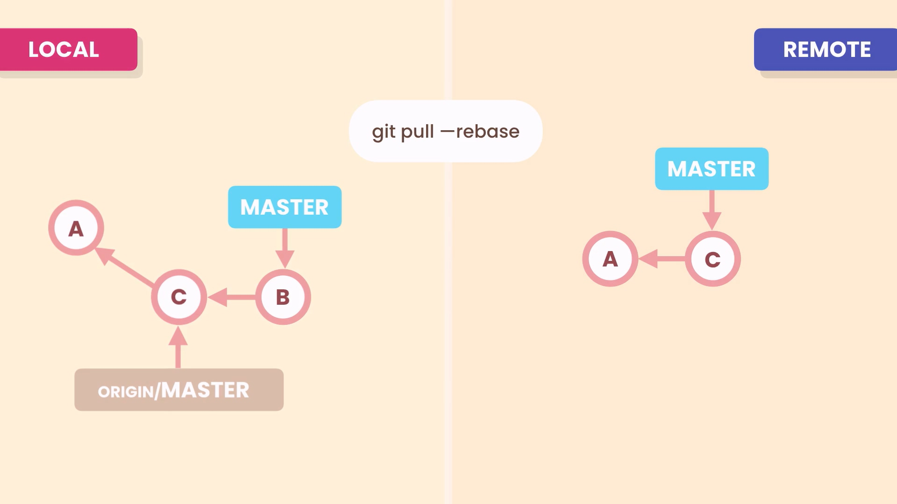
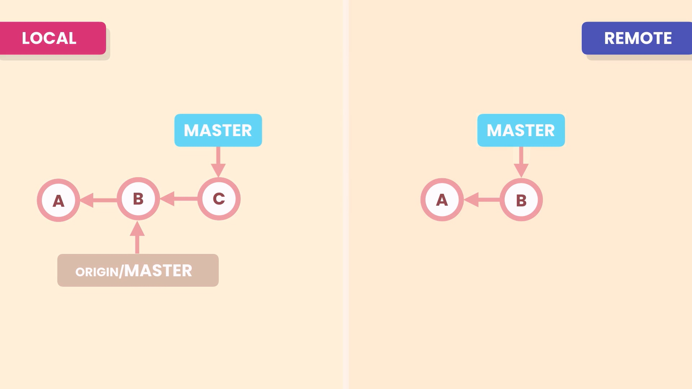
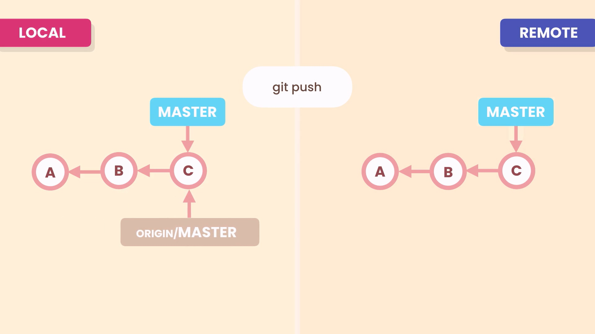

# Collaboration

## Clone a repository

```zsh
# clone a repository with name of cloned repository
git clone url
# clone a repository with and name it as you want
git clone url my-repository-new-name
```

### Show the list of remote repository branches

```zsh
git remote
git remote -v
```

## Fetch remote repository changes

```zsh
git fetch origin master # Fetches master from origin
git fetch origin # Fetches all objects from origin
git fetch # Shortcut for “git fetch origin”
```

## Merge remote repository changes

```zsh
git merge origin/master
```

### See local repository and remote repository divergence

```zsh
git branch -vv
```

## Fetch remote repository and merge local with it

pull requests make 3 way merge



```zsh
git pull
```

### Create linear history for pull request



```zsh
git pull --rebase
```

## Push changes to remote repository

before our push, graph is as below



after out push graph is as below



```zsh
git push origin master
# Shortcut for “git push origin master”
git push
```

**Note**:most of times our team add some commit to the remote repository, so we need to pull changes first then push it to remote

```zsh
git pull origin master
git push origin master
```

**Caution**: if you encounter an conflict while pushing to the remote, don't use -f option for push command, because it remove your partner changes on remote

```zsh
git push -f # dangerous push command
```

## Set push credentials

to store credentials for 15 mins

```zsh
git config --global credential.helper cache
```

**and to set it permanently**
for windows:
you should install git-credential-manager-for-window

for macos:

```zsh
git credential-osxkeychain
git config --global credential.helper osxkeychain
```

## Sharing tag

### Add tag to latest commit

```zsh
git tag v1.0
```

### Push the tag to remote repository

```zsh
git push origin v1.0
```

### Delete tag from remote repository

```zsh
git push origin --delete v1.0
```

### Delete tag from local repository

```zsh
git tag -d v1.0
```

## Push branches to remote repository

```zsh
git push -u origin branch-name
```

### Removes branch from origin

```zsh
git push -d origin branch-name
```

### Show remote tracking branches

```zsh
git branch -r
```

### Show local and remote tracking branches

```zsh
git branch -vv
```

## An example scenario

1. make a remote branch on github
2. fetch the remote branches

   ```zsh
   git fetch
   git branch # see local branches
   git branch -r # see remote branches
   ```

3. create a local branch mapped to remote branch

   ```zsh
   git switch -C local-branch-name origin/remote-branch-name
   ```

4. pull changes from remote

   ```zsh
    git pull
   ```

5. push your changes

   ```zsh
   git push
   ```

6. remove branches from local and remote

   ```zsh
   git push -d origin/branch-name
   git branch -d branch-name
   ```

7. remove tracking removed remote branch

   ```zsh
    git remote prune origin
   ```

## How to update forked repository

### add , remove or rename upstream(or base) repository

```zsh
git remote
git remote add upstream base-repository-url
# see remotes
git remote -v
# remove remotes
git remote rm upstream
# rename remotes
git rename upstream base
```

### update our repository

```zsh
git fetch base
git switch master
git merge base/master
```
