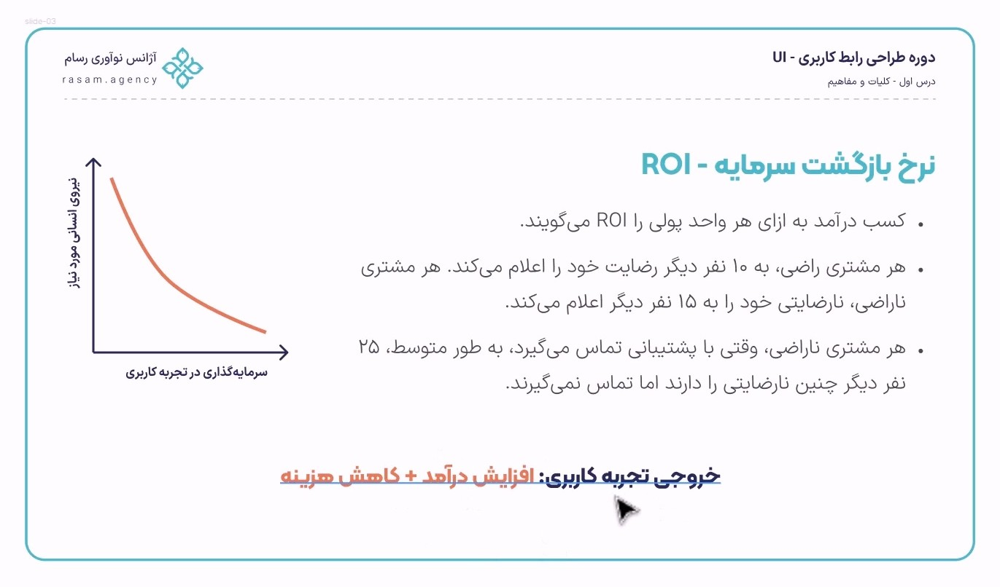
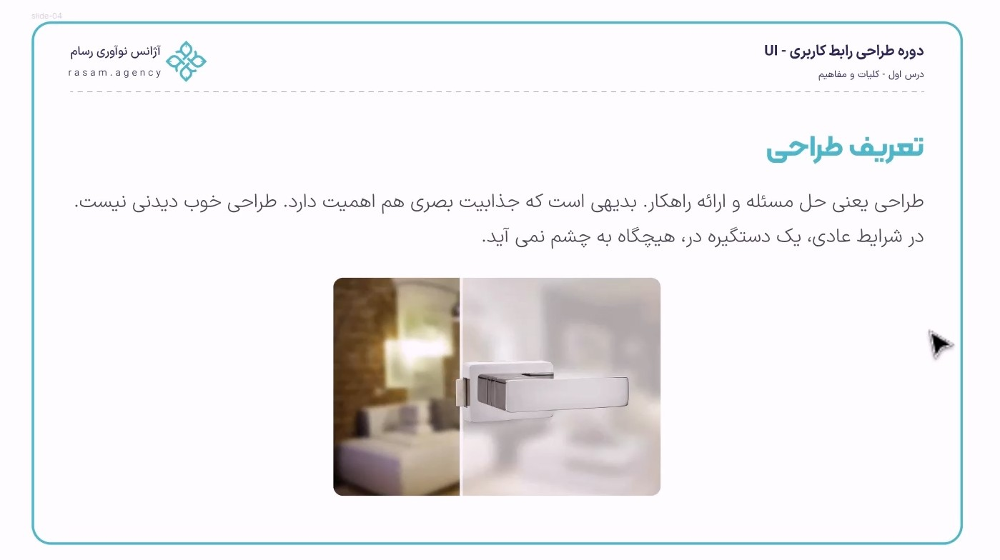
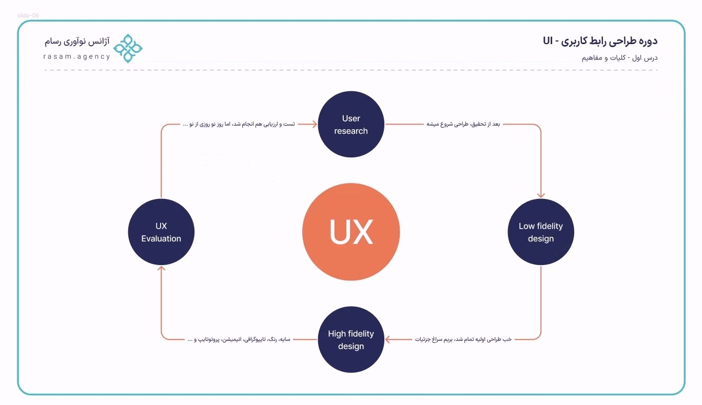

# Definitions of interface design and user experience

## UX

User experience refers to all our emotions, feelings, reactions, and memories of different products. These memories may be positive or negative and may not be the same among different people in society. For example, you may be very satisfied with a brand like Snap, but your friend or colleague may be dissatisfied with this brand.

## UI

UI is considered an interface between the user and the system. (Like a secretary connecting you to a doctor). Perhaps this interface is very well designed and tailored to the user's needs, or conversely, it is considered an interface with a poor and unprincipled design.

Look at the image above. The user interface is part of the user experience. We want to reach a conclusion. To have a good and user-friendly digital product, we need to perform strongly in this entire circle. So, user satisfaction with Snap or any other brand is not limited to its UI and graphic design and visual design. In the big circle, other issues are also of particular importance. For example, after-sales service, technical support, price or anything else may cause satisfaction or dissatisfaction. So, UI design alone does not include user experience

## User Experience Subcategories

Now, what does this lovely big circle include? (This division may vary in different texts and periods, but the generality of what you see is common and correct.)

- **Persona**: A form that expresses the characteristics of the group of users who use our services or products. First, every business must correctly answer the question of what is a customer persona to carry out the ui ux design process.
- **User research** : User experience research refers to methods for collecting information because we need to make sure
  the video. This section also has a series of tests with which you can measure your design.)
- **Accessibility** : About 15 percent of the population is disabled, but not disabled. Digital products should be optimized for this group of people as well.
- **Information Architecture** : Information architecture is like a public library in user experience . So how should we organize their content to suit the user's needs and wants? How can users access content faster and more easily?
- **User interface design** : UI and UX user interface design, which represent your presence.
- **Writing Experience** : Who will write the text and content inside digital products? Of course, we don't mean long blog and product texts. Error texts, buttons, CTAs, etc.

## Donald Norman's User Experience Cycle

stated in the early 90s at Apple (probably as a consultant) that we were not providing a good user experience. Since then, this expertise has been added to IT knowledge. User experience expertise is an academic trend called HCI, which is a sub-category of IT and is recognized as an academic discipline in many countries today.

Of course, Mr. Norman has presented the design in two stages. That is, after the persona and user experience research, the design is first implemented in simpler scales (sketch and wireframe) using ui ux design software. This stage is called low-fidelity. After that, the design goes into more detail, which is called high-fidelity. After completing this process, now, using usability tests, we need to measure whether the product for which we did research and design has followed its path correctly? So we need to test and evaluate carefully.

Does everything end here? Definitely not. Big software like Snap has been updated many times and has undergone external and internal changes. This shows that user tastes and needs change over time. Our knowledge and information also increase. So this cycle repeats itself over and over again and is never going to end. Like the cycles we know in biology and… Of course, the 7 things we introduced above are actually these cycles that have been defined in more detail and titles. They can even be explained in more detail, which we will do in the rest of the course.

## The difference between low-fidelity and high-fidelity

This image is perhaps a good example of the difference between a wireframe and a prototype. In wireframe, which is a low-fi design (the second stage of the Norman cycle), our goal is to implement the skeleton of the project with a shorter cost and time, and then, after discussing with the client and stakeholders and approving them, we move on to High-fi (the third stage of the Norman cycle). In fact, in the third stage, we add colors, styles, design system, precise typography, grading, interaction, etc. to the design.
