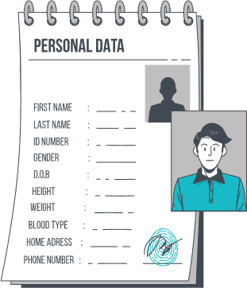
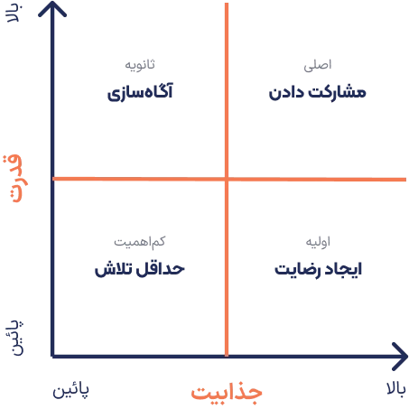
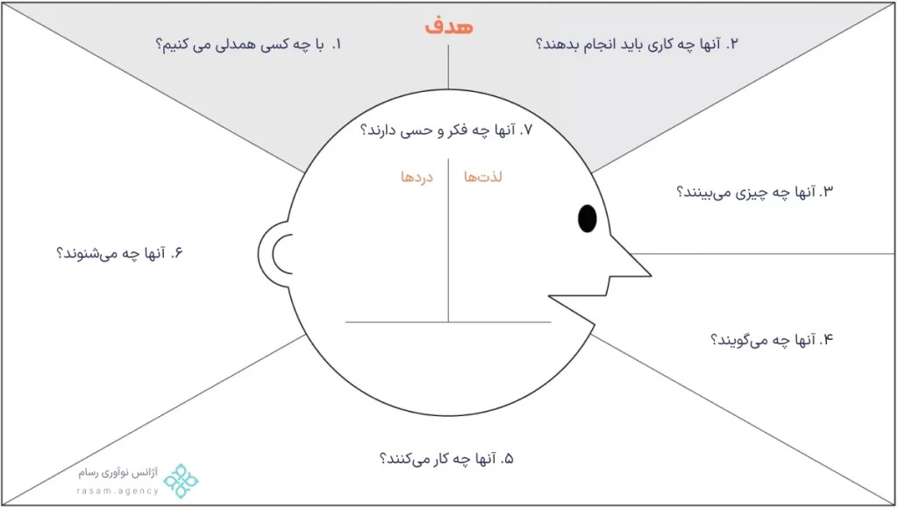

# What is Persona

In this part, we want to fully answer the question of what is a persona. Also, in this part of the free user interface design training, we are going to examine the importance of the role of the customer persona.

- A persona is the user who intends to use your products or services. This is a hypothetical character but resembles your user.
- A persona includes name, gender, age, education, location, employment, hobbies and interests, income, hobbies, concerns, challenges, etc.
- Based on the persona, user research is conducted in UX projects.

## Where does persona creation start?

- Meeting with the employer and receiving business assumptions
- Holding brainstorming sessions with experts
- Creating questionnaires, surveys, and in-person and online interviews
- Current customer database and contact forms (if available)

## Interviewing stakeholders

Whether it is to create an audience persona or to improve the research process, there is a need to talk to stakeholders. A stakeholder is not just an investor or employer. Suppose you are working in a company where different people work in the website design team, product design team, and SEO services . Therefore, regardless of the employer and investor, the product manager, and even the programming team, can all be stakeholders. Because our performance can also affect the output of their work. But at what level and when to talk to stakeholders can be presented in the table below

In conversations with stakeholders, we may spend time and energy on certain groups, depending on their power, appeal, and influence in the product design process.

## Competitor analysis

In order to succeed in the process of extracting customer personas and user research, the process of analyzing competitors is considered one of the most important tasks. We can get closer to this issue by drawing a table. In the columns, we can bring our product and competitors. Also, in the rows, we can bring the factors that we want to compare. For example, we have an online smartphone store and we want to compare our competitive advantages with other competitors such as Digi Kala.

- Review competitors who have similar personas, observing their solutions, weaknesses, and advantages over your own activity.
- Competitor analysis is the beginning of research and before getting to know the users. So, it is better to know the main players of that product before analyzing competitors.

## Introduction to Empathy-map

Empathy mapping is created to improve user experience and after personas.
Empathy with the user is one of the early stages of design thinking.
In empathy mapping, we try to put ourselves in the user's shoes to better understand the needs, behaviors, and emotions of that person and add them to this map.

### Negative persona

Some groups of users may not necessarily use our services and are not the audience or buyers of our services and products. This group of users is called a negative persona. Obviously, we will not conduct interviews or research with this group of users.

## What happens after Persona?

- Can someone with these characteristics be found? If not, the persona should be changed. Because there is no group of users who use our services or products.
- Is there exactly one person who is this persona? If yes, the persona should be changed. Because it is so specific that the persona will no longer include a group. Obviously, we will not have just one audience or customer. The statistical population may be small. But not to the point that only one real person is included in our persona.
- Does this persona represent our target population? If not, we should create another one. Like Snap, a persona of a driver, a passenger, a person who rents an eco-lodge.

## Always put yourself in the user's shoes

In this part of the ux ui design course, we defined the concept of personas, how to create them, empathy maps, competitor analysis, and negative personas. We also described a sample audience persona in this session.
