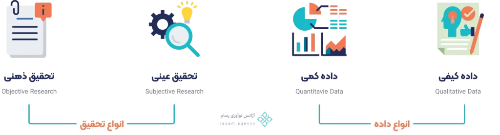

# User experience research and its methods

In this part of the course, we are going to discuss user experience research methods, including interviews, observations, surveys, questionnaires, and focus groups. These steps are done after completing the audience persona and before design. Obtaining information from the above methods can have a positive impact on the design process. So, if you want to get acquainted with user experience research techniques, just be proud and dedicate a few minutes of your time to the free user experience design training.

User research begins with data collection. In order to conduct the research process well, we must first collect data and then analyze and evaluate it. In addition, we must be able to draw conclusions from this collection and analysis. This conclusion helps us to better advance the research process, such as information architecture and user interface design.

## Data – Research

Qualitative data is descriptive and quantitative data is numerical and countable. For example, you cannot say how many of your classmates you like. Because it is a qualitative quantity. But for example, you can say that you buy cologne 8 times a year, here it is a quantitative and countable quantity.

Objective research is based on objective and undeniable facts. For example, a human being is 178 cm tall. This is based on a fact and cannot be changed. But subjective research is based on our beliefs and feelings. For example, our preference for the color blue.

## The difference between a startup and a business with a focus on user experience research

User experience research is hard, time-consuming, and expensive. But that’s no reason not to do it. Failure to do user research leads startups and businesses to failure. Before we explain the reason for failure, it’s better to explain the difference between a startup and a business. Businesses operate in a competitive and relatively low-risk environment. For example, a company that provides website design services is a business. Providing good service and competitive prices will greatly contribute to the success of the brand. Or, for example, a car repair shop, if its shop is in the right place, does not sell expensively, and has expertise, it will definitely succeed.

But a startup with a specific topic (for example, the Divar app), even if it has a good design process, content production, and SEO , may not be accepted by the public, and even with advertising, if it does not have a good needs assessment, it is doomed to failure. On the other hand, if this startup succeeds in the topic it pursues, its growth rate will be very high. (I deliberately used the Divar example because we have seen its success).

What happens if the same digital marketing company or the same car repair shop, which are simply businesses, double their customers in one day? They have to double their workforce, equipment, and facilities to handle projects and tasks. Now imagine, if the amount of software ads on the wall increases fivefold in one day. What happens? Almost nothing! Maybe they add a support specialist. So startups are highly scalable and can grow rapidly. But they are also difficult to start and achieve results.

We can draw a conclusion from this section. If startups do not conduct user research, they will definitely fail due to high risk. Of course, businesses may also fail due to not conducting user research. But with less risk.

## Things to consider before starting user experience research

- Due to the cost of these methods, some conduct user experience research and testing online and remotely.
- When doing testing and research, you shouldn't use teammates. People who know the ins and outs of the software like you do!
- Don't cheat users! Avoid over-explaining the process during the user research process.
- There are different methods for user research and usability testing. We don't necessarily use all of them in every project. The choice of these methods will be tailored to the needs of the project and the persona.

## User experience research methods

In this section, we will discuss some of the user experience research methods. Of course, these are the most important research that are present in most projects.

### Interview

Interviews are a valuable way to gather data for user experience research. In this method, most of the information received is qualitative. But it can also be quantitative. Interviews are difficult, time-consuming, and expensive. Of course, they are worth the time. In this method, you talk directly to users. Of course, be careful that these users are selected within the framework of the customer persona.

- Be prepared before the interview! Prepare your questions.
  Save the audio file. All that information that you can't memorize or write down! This is a good way.
- The interview should be held in a friendly atmosphere and should last less than an hour.
- You should not ask questions that force the user to say "yes"! Our questions should not be such that they lead the user in the direction we want. In this regard, I recommend reading the book "The Mom Test".
- After conducting the interview, you should analyze your findings. The interview should definitely have some value for you.

### Survey

- Surveys are one of the easy and quick ways to collect information from a large community.
- The survey contains a series of questions to assess user attitudes and preferences. Such as: user satisfaction, NPS questions, etc.
- You can use Iranian tools like Porcelain and Formalo to create surveys. These tools are Iranian, not sanctioned, optimized, and accurate. In addition, their paid versions are rials and cheap.
- But at least you should know one international tool for this. Hotjar and Survey Monkey are good options.

### Observation

First, let me say that this method is different from an interview. Observation is a user research method in which we observe and examine the user's behavior and take notes on important points. In fact, suppose you have a product and you show it to the user and ask him to work with that product without paying attention to anything. For example, a mobile application or a website. Now you can take notes and collect a lot of information by observing the person's performance. In this method, it may also be necessary to record the sound or even the screen. Observation is done in three ways.

- Descriptive method: In this method, the researcher writes down whatever he sees. Some information may even be unnecessary and he deletes it later.
- Focused method: In this method, the researcher writes only on topics that are important to him/her.
- Selection method: In this method, the researcher only considers topics that he has previously selected, such as login time.

### Focus Groups

It is considered one of the qualitative exploratory methods in user experience research. In this method, knowledgeable people in a specialized field freely express their opinions. Usually, a moderator manages the session. However, unlike the previous methods, this method is not as common and may be used less often due to its high costs.

## Increase the success rate of user interface design with user experience research

In this part of the UI/UX designer course, we explained the concept of user research, the difference between a business and a startup, and finally user research methods including interviews, surveys, observations, and focus groups.
