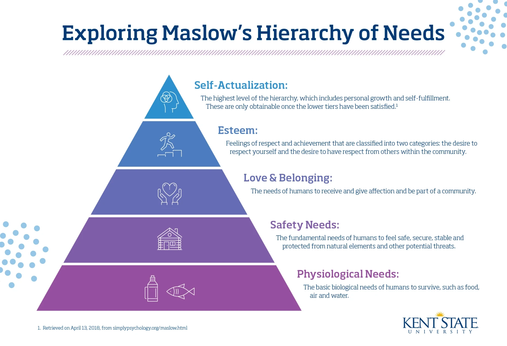
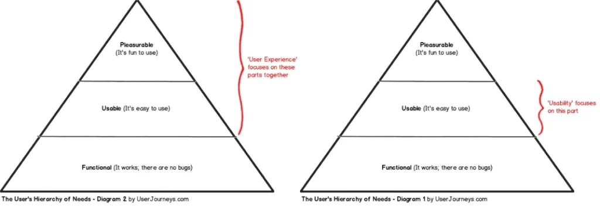
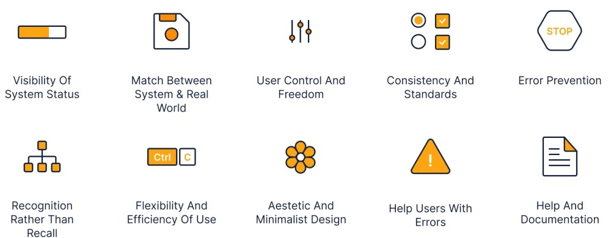
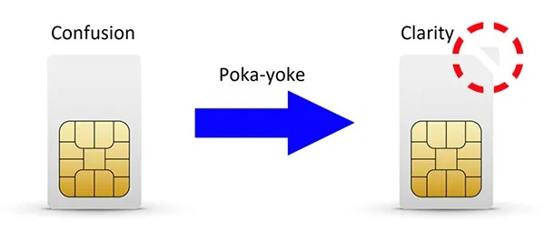
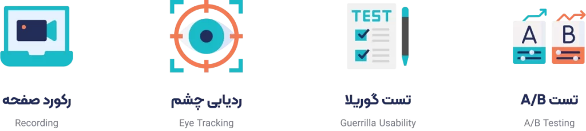
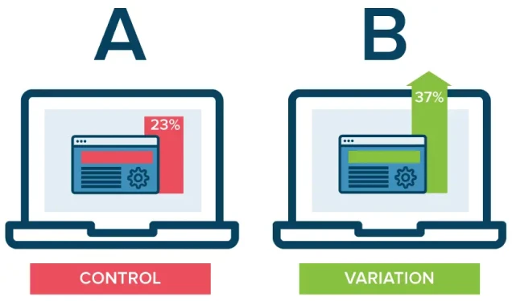
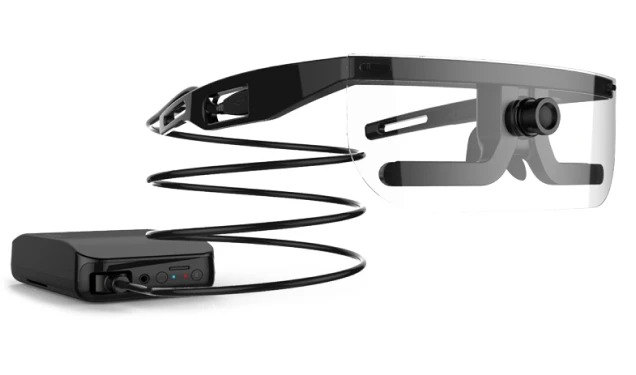
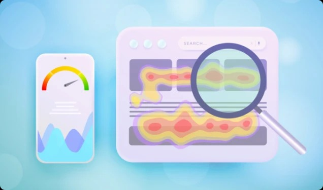
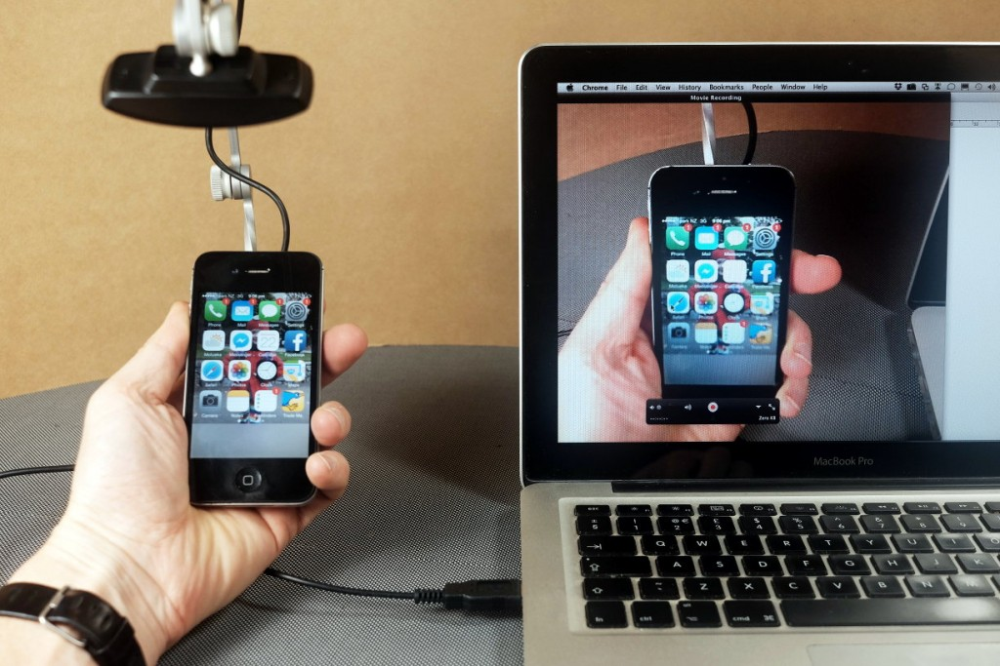
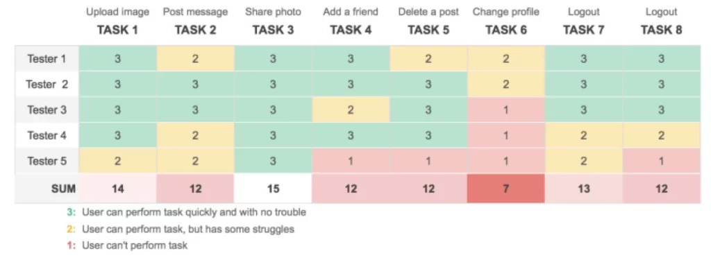

# Usability in UX and its tests

Did you know that you can make the ui-ux design process more professional by using usability tests? In this section, we are going to define usability in user experience design and learn more about usability tests. Using these tests will undoubtedly help you a lot in the interface and user experience design process. Therefore, we invite you to join us until the end of this part of the free user interface design course.

Usability in design is a set of qualitative indicators that evaluate the ease of use of user interfaces, which is defined by the following components. (Of course, in some tutorials, this division may be less or more). In the following, we would like to provide a more precise definition of usability in the user interface experience, citing the Wikipedia source.

## What does usability include in user experience design?

Efficiency : The efficiency of a product helps users accomplish their intended task. The efficiency characteristic refers to the quality of the product's performance when used, and its capabilities to increase productivity.

Safety: A product's safety features protect users from dangerous and unwanted conditions. A good product should protect the user from dangerous external factors (such as radiation) or from accidentally performing unwanted actions. It should also be equipped with Undo, Recovery, and Restore capabilities, if possible.

Utility : The utility feature of a product indicates what functional capabilities it provides to help users do what they want or need. A good product should provide a variety of features to simplify and speed up operations—in a way that the user prefers. For example, some software is equipped with shortcuts that make it easier to perform a long operation.

Learnability : A product should have good learnability. Sometimes users know how to use a product but struggle to use it. In general, it is difficult for a user to learn a new feature in that product.

Memorability : The user should easily remember how to use the product when using it.

Usability goals are usually formulated as questions to assess various aspects of a product. For example, the question “How long does it take for a user to learn how to use the basic features of this web browser?” assesses the “learnability” goal.

## Usability Pyramid in Design and Abraham Maslow's Pyramid

Maslow's hierarchy of needs helps us understand the concept of usability. In this theory, human needs are divided into five levels: physiological, safety, love and belonging, self-esteem, and personal fulfillment. As you can see in the pyramid, people often move up from the lower levels of the pyramid. Obviously, if a person's needs at the lower level of the pyramid are not met, they will not be able to understand the higher levels of the pyramid (they are not defined for them).

The usability pyramid also follows this general trend. That is,A product must first be usable and functional. Usable and usable. Next, it must be enjoyable and attractive. For example, a car must first be able to drive and be safe and sturdy so that the lives of its occupants are not endangered.It should cover the basic needs and, as a next priority, have attractive options and features. When designing a digital product, we should pay attention to how much we have respected the obviousness of that product?

## Heuristic evaluation

Heuristic evaluation is a usability evaluation method introduced by Nielsen and Molich in 1990. In this method, evaluators use a list of usability rules, or "heuristics," to examine the user interface using 10 to 15 strategies and identify strengths and weaknesses.

These strategies help you evaluate your product without the presence of users and the public. Heuristic evaluation helps you evaluate some of the obvious things that may be in any product. For example, training documents, product errors, etc.
This method is low-cost and valuable. Because you can evaluate your product without the presence of users, considering the obvious things that have been prepared like a checklist.

## The Japanese rule of Poka Yoke

The Japanese have an interesting rule that may help us in the usability category. In English, it can be called Mistake Erroring. That means making it error-proof! Or preventing an error from occurring. This perspective helps you prevent user errors and mistakes as much as possible when designing a product.

## Usability tests

Apart from the exploratory evaluation method, there are other methods you can use to test your product. To do this, you need to expose your designed product to users who fit your audience persona . These tests vary and should be chosen according to the needs of your product. We will describe four of the most important usability tests here.

## A/B testing

Testing two different states to see which one is more tangible to users. Let’s say your current shopping cart button on a shopping site is red. We show 50% of the audience (over a certain period of time) the same state. We show the other 50% of the audience the second state (for example, the same button turning green). Assuming that all other things are constant, whichever of these two states had the better conversion rate and performance, we choose it. Precise targeting is essential to success in this test.

For this, you can use tools like AB/B Tasty, Optimizely, VWO, and many others. Google Optimize was also a powerful tool for this task, but it has been discontinued by Google for some time.

## Eye tracking test

With Eye tracking tools, the user's eye movements are saved as Heatmap maps.
Of course, in the absence of equipment, Mouse tracking can be used. These tools are a bit expensive. For this reason, mouse movement can also be used as a criterion.

## Heatmaps

These maps show us click, scroll, drag, and eye-view information. The red and orange areas are the most viewed. This valuable statistics will help you understand which parts of your product users viewed the most.

## Screen Recording

They help you better understand user behavior on your site by capturing video of the user's page. They show information about clicks, drags, and scrolls in phone, tablet, and desktop modes.

The tools Hotger, Hantana, and Mouseflow have all of the methods mentioned above. Hotger is a good international tool and it is better to start with it. Hantana is also an Iranian and Persian tool and naturally its prices are in rials.

## Guerrilla testing

One of the quick and inexpensive usability tests that you can do with a small number of users. This test can be performed without any tools or software. You can create a table in Excel or Google Sheets. Give your product to the users who want to test it (for example, use it on a mobile phone or laptop). The columns of this table are the tasks that users need to perform. For example, upload an image. The rows are the users who participated in this test.

It is not necessary that there are five testers or that there are eight tasks. It can be different or based on your design, esteemed user experience experts. Of course, we must also pay attention to the needs of the project. If each tester performs each of these eight tasks correctly, we give it a score of three. If it is difficult to perform, we give it a score of two, and if it is not possible to perform that task, we give it a score of one. For example, the third task, which is in the third column, all testers managed to perform it. The sixth task also seems to be impossible for three people to perform and two people barely managed to perform it.

Even with row analysis, we can achieve some analysis. Finally, we do column summation, and with this method, we can run a valuable usability test very cheaply and quickly.

## Simplify UI design with usability testing

In this part of the free user experience design training, we explained the fascinating discussion of usability in design and reviewed some of the tests related to this topic together. We also introduced its various tools in this part.
