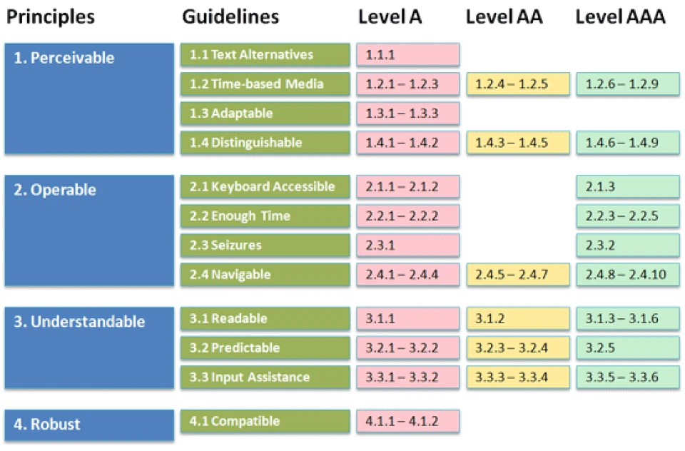
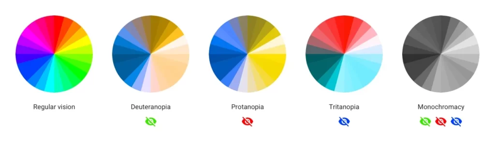
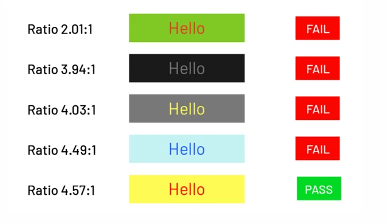
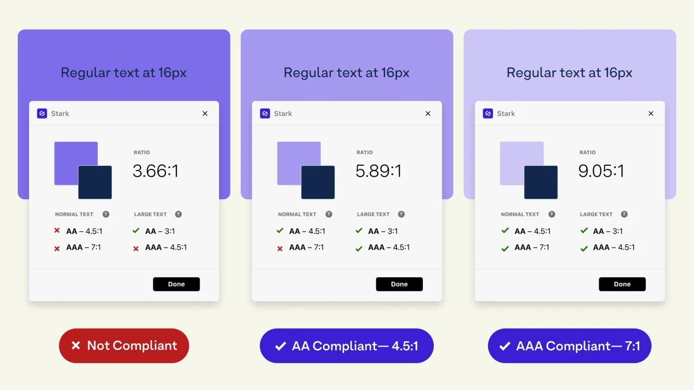
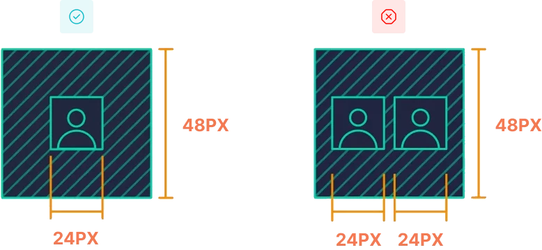

# Accessibility

In this part of the free user interface design tutorial, we are going to mention the discussion of accessibility in design. By understanding the issue of accessibility, you will undoubtedly be able to provide more basic products and services to different users.

How well is your product optimized for use by people who are visually impaired, blind, or otherwise disabled ? These indicators are provided by the W3C Consortium under the name WCAG for use in the web and digital products. Accessibility is abbreviated as A11Y, and the image opposite represents its symbol. The third Thursday of May every year is World Accessibility Day.

## Why is accessibility important in design?

You may have noticed the mosaics in parks, where the lines help the blind find their way around. You may have seen a disabled person unable to use the subway because the station they are in doesn't have an elevator. Or someone with the same condition may want to enter an insurance branch, but they are unable to do so because of the stairs. The same can be extended to the world of information technology. How easily can disabled people use digital products?

Look at this picture, did you know that this product was originally invented for people with hand tremors? But today everyone in society uses it. What about text messaging? Did you know that text messaging was originally designed for the deaf? But today we all use it. So if our products are designed Disability First, everyone in society benefits from it.

Attention to the able-bodied is moral. All humans deserve to have a peaceful and carefree life. In some countries, there is a strong legal requirement. That is, if we launch a digital product and that product is not so-called inclusive, that brand may be sued. (In countries such as Germany, Canada, the United States, etc.). Another important issue is economic justification. If you do not care about the accessibility category, you lose 15 percent of the market volume. So if you look at the issue economically, accessibility is still justified.

## Accessibility implementation layers in design

Unlike other areas of UX work that have a specific order and timing of implementation, accessibility in design is with you from the beginning of the persona process and even during the programming and implementation stages of the product. This means that accessibility is the background of the entire project and its rules should be considered even at the front-end programming stage.

## Accessibility levels in design and the WCAG standard

The W3C consortium has presented WCAG standards in the following 3 levels. The newer the levels, the more stringent (complete) their implementation.

The WCAG principles are based on the four principles of acceptability, applicability, understandability, and capability, which are formed into 13 strategies and three levels. Today, we should try to cover at least level AA in digital products.

## Types of disability (ability)

Disability can be permanent (like going blind), temporary (like a broken arm), or based on the situation we find ourselves in (like driving). We'll go into a little more detail in the section below.

- Visual (blindness, low vision, color blindness)
- Auditory (deafness, hearing loss)
- Motor (skeletal, muscular, Parkinson's)
- Mental (autism, dyslexia, dyscalculia)
- Old age and senility
- Situation (driving, pregnancy, etc.)

If we look at the statistics a little, 15% of the population is affected by a permanent disability. (Not a small amount). Also, 70% of the population is affected by temporary disabilities such as broken hands. All humans will be affected by situation-based disabilities, such as aging, low vision, hand tremors, driving, etc. (Every human experiences at least some). We have about 40 million completely blind people in the world and 285 million people have vision disorders. So the statistics are a bit shocking.

## Color blindness

The retina is composed of cone cells (for receiving RGB color) and rod cells (for receiving HSB light). Disorders in the color channels of cone cells, which are blue, red, and green, cause color blindness and visual impairment. According to the Ishihara test, if a person does not recognize the number 6 in the image above, he or she is color blind. For more information on this subject, you can refer to the Wikipedia source.

If a person lacks only the blue channel, they will have blue blindness, as well as two other colors, red blindness and green blindness. This causes vision loss in a significant range of colors. Also, if this is severe and the other channels are also affected, so-called monochromacy occurs, and the person sees everything in black and white.

Color blindness is more common in men or in people with poor eyesight. 8 percent of men and half a percent of women are color blind. Of course, if someone considers both colors (for example, red and magenta) to be red because they don't care about them, it doesn't mean they are color blind or in people with poor eyesight. The reason is that the person doesn't care about the colors and doesn't mean they don't understand the difference between the two. Unfortunately, there is no specific treatment for color blindness, but people with this condition can improve their vision with special glasses.

## Visual impairment

One of the most common issues in people with disabilities is vision. We will examine a few important issues that occur more often in older ages. For example, macular degeneration, or the deterioration of the yellow spot, causes people to be unable to see the center of vision. Another is glaucoma, or black water, which causes sufferers to be unable to see the periphery of vision and see the center. Retinopathy causes scattered spots to form in the vision and sufferers do not have good vision. Cataracts also cause difficulty and blurring of vision.

## Mental and motor disabilities

These disabilities may be even more difficult for those affected. It is clear that motor, skeletal and mental disorders may create further limitations and people may face problems in using digital services and products by default.

## Disability due to old age

This disability, which may be faced by all members of society, may have some limitations. Of course, if there is only old age and no specific disease, the conditions and difficulties are better than the above cases. Things like hand tremors, blurred and reduced vision, low energy and increased fatigue are characteristics of this period. Of course, it is obvious that old age is also an attractive part of human life and should not be viewed negatively. Our goal is simply to examine accessibility.

## Temporary and situation-based disability

There are other types of disabilities that happen to all humans. Like driving, using a phone while walking, or eating. These are situational. It is also possible for a disability to be temporary and only experienced at a certain time. Like during pregnancy. Although it is a very positive event, it is still more difficult for the person to use digital products during those nine months. Or, for example, a broken hand and similar problems that only occur during a certain period of time.

## Testing and assessing accessibility issues

One way to improve accessibility in design is through simulation. We need to put ourselves in the user's shoes to understand them. By using simulation devices, we can understand accessibility conditions to some extent and take action to fix them.

We can take a piece of tarnished plastic and use it to inspect a product. Or a pair of glasses that have been tarnished with cream and used to inspect a product. In the third image, someone is simulating pregnancy (of course, it certainly can't simulate feeling and pain, but it's a little closer to the target user). In the fourth image, using a series of simulators, things like color blindness and nearsightedness can be simulated.

## Contrast – Text and background color difference

The contrast ratio value is a number between 1 and 21. The closer we get to 21, the greater the difference in color between the text and the background. 21 means black and white. If it is 1, both are the same color and there is no difference between the text and background colors.
You can find the Contrast ratio on the contrastchecker.com website. You can also evaluate this category in your projects with the Contrast plugin in Figma.

According to the WCAG standard, at level A we must achieve a value of 3 out of 21. In addition, if the Contrast ratio reaches 4.5, we have also met the AA level. If this value exceeds 7, we have paid special attention to Contrast and met the AAA level. Note that if there is text, the size of that text is more than 24 pixels (or 18 pixels bold), we have also responded one layer higher.

Look at the image above. On the left, the difference in color between the text and the purple background is small, and naturally the contrast ratio is also small. 3.66 means that only level A is met. It is better to meet at least AA. In the middle image, the difference in color between the text and the background has increased and reached 5.89. So the AA level is covered. In addition, in the image on the right, the difference in color between the text and the background has increased again and reached 9.05, and the AAA level is also covered.

When designing a site and inserting buttons and icons, we should also note that the first joint of the human index finger is about 48 pixels (of course, human hands are different), but at least the 24-pixel icon and its border space should total 48 pixels so that the user is comfortable when tapping and does not click two items. This also applies when using a mouse.

## Typography and its rules in WCAG

Users should be able to enlarge the text up to 200%. Also, the spacing between words should be at least 0.16 times the font size. The body font should be at least 16 pixels and the captions should be at least 12 pixels. The spacing between lines in the body text should be twice the font size. Of course, these values ​​​​also differ in different projects. For example, Persian and Latin typography are slightly different. In the typography section , these topics are opened in more detail. Typography is one of the most important topics discussed in the world of user interfaces. As you have seen, it is also important in the category of accessibility in design.

## Do not justify the text

It is better not to justify the texts. The two-sided alignment of the text may seem attractive and neat at first. But this stretching creates gaps between words and letters. For this, you can check the world's biggest brands. Most of them do not justify the texts. Also, this alignment makes the texts difficult to read for the user. It is better if the texts are more than 3 lines, and not centered. If it is Persian, align it to the right and if it is not Persian, align it to the left.

## Font weight and selection

Users easily distinguish Bold titles from body text. It is also better to have regular body text. Light weight is also used for captions and meta information. When choosing a font, make sure that it suits the needs of your users and is easy to read. It is better to use only one font in a project.

## More professional design by applying accessibility rules

In this part of the free ui ux course, we examined the concept of accessibility in design, types of disabilities, and solutions related to it. Of course, this topic goes beyond an article and educational video. But if you read this part of the user interface design course with Figma carefully, you have taken a good step.
