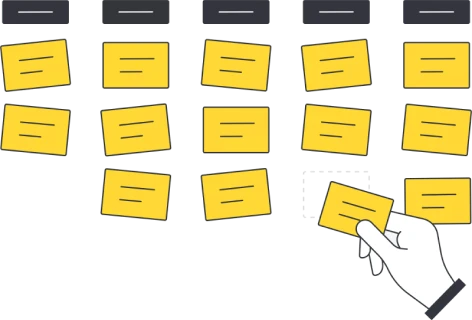
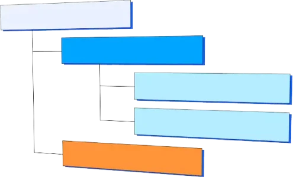
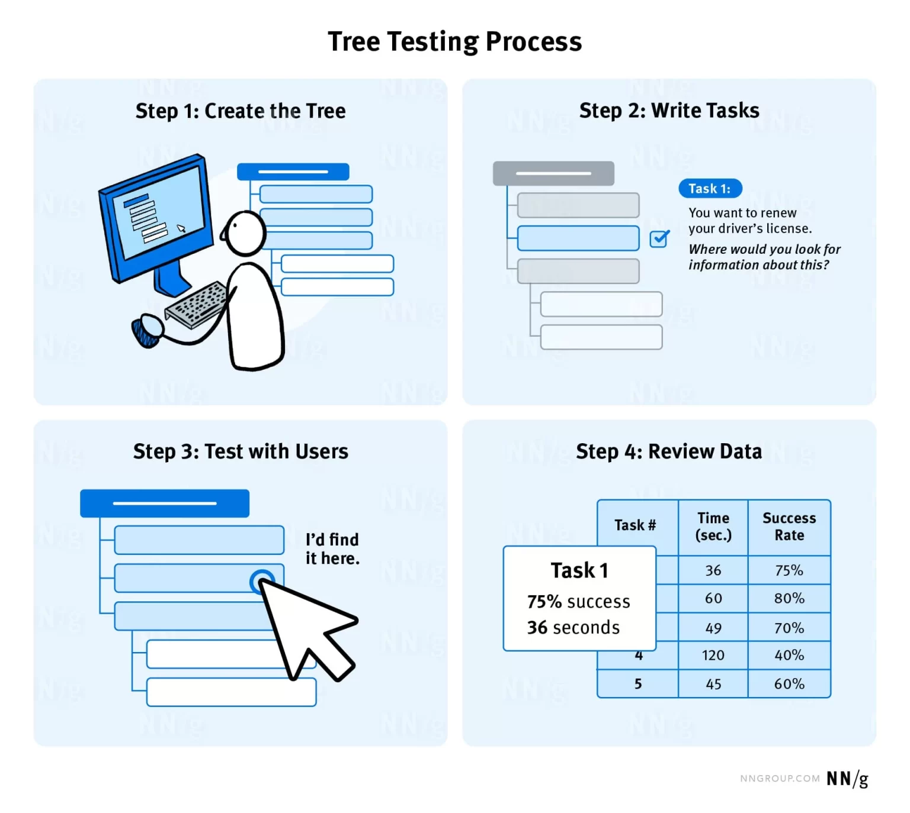
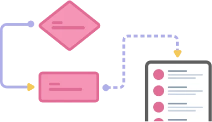
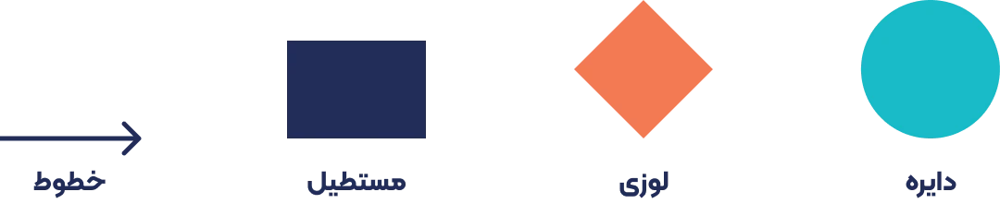
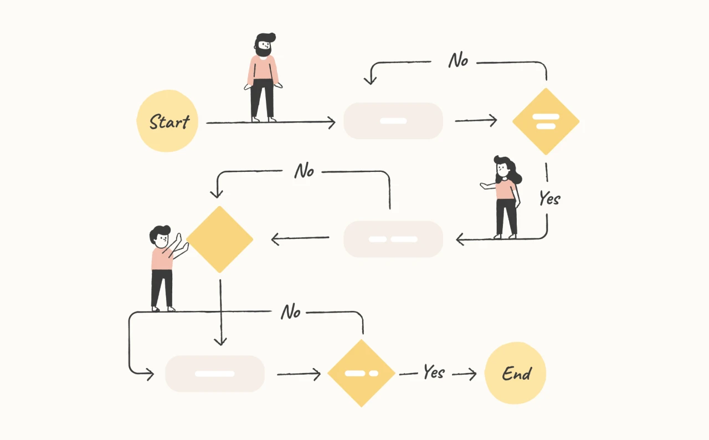
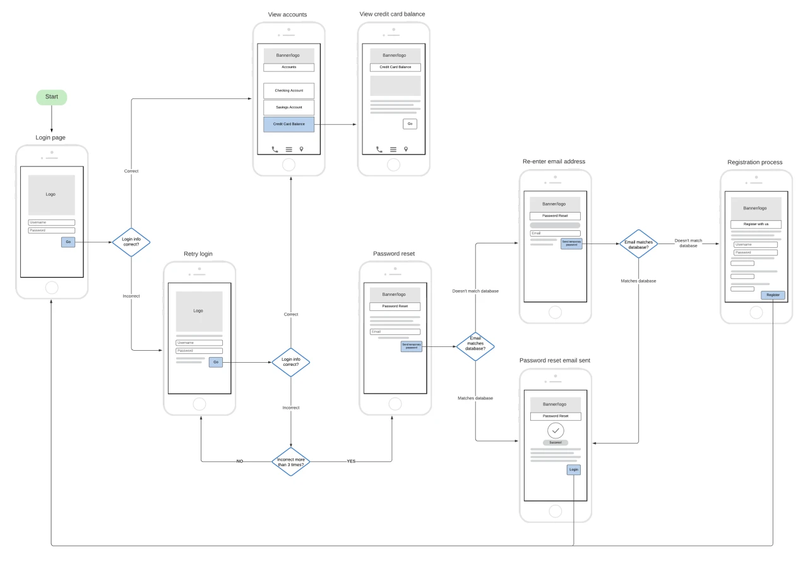

# Information Architecture in User Experience – IA

In this section, we intend to examine the concepts and tests related to information architecture in user experience.

Information organization is the science of organizing information into a framework for arranging information so that the user can quickly and easily access the information they want. Where is the user coming from? What is their purpose? Where are they going? You can improve your site's information architecture by using card sorting and tree testing.

## Information architecture concepts in user experience

Consider a library. It is arranged exactly according to the needs of its audience. Usually, first you will see content that changes frequently, such as newspapers, weeklies, and monthlies. Then you will see the most used books for college entrance exams and university. Finally, you will reach the less visited shelves. Not that they are bad. They have a smaller audience.

## Interaction Cost

Engagement cost is a set of mental and physical efforts. Users must use their mental and physical effort to interact with a site to achieve their goals. Users spend engagement cost by scrolling, reading, clicking and dragging, paying attention, etc. They spend a budget to explore your site. This is similar to the calories humans burn when doing something. We need to pay attention to how much engagement cost the structure of the pages we create creates for users.

## Cognitive Load

Cognitive load is the mental effort required for a user to process information, reason, and make decisions. When we learn new things, we load our brains to remember the new information. As users explore your site to learn and find new information, this type of approach will definitely create cognitive load for them. But we must try not to make this cognitive load so high that it makes your content and information useless to people.

## Mental Models

Whether we like it or not, users who view our site or digital product have a mental construct. Sometimes the information users see doesn't align with that construct and their mental models. This creates cognitive load.

## Findability

When a piece of information is findable, it means that it is easy to locate or identify. For example, in books, each chapter is clearly labeled and outlined. Textbooks contain subsections. Newspapers are organized by topic. A specific design system is in place. It is repeated and directs information to specific sections. This makes it easy for the reader to understand the material.

That is why online stores have both an advanced search section and a mega menu with different columns. Because a user may not know the exact name of a product and check the site menu. On the other hand, in the site menu, there are often categories of content and products. If you search, you can also find a product directly. So advanced search, menu, categories tailored to users' needs, the presence of Breadcrumb, etc. help to increase findability in information architecture.

## Hierarchy

We need to present our information and content to our users in a proper hierarchy. Consider the library example we gave at the beginning of the article. If it weren’t for that layout and hierarchy, people wouldn’t be able to find the content they want easily. There’s a famous saying in information architecture that says: It’s better to get to the page you want in 3 clicks. This is sometimes true. But a site may have little content and get to the page you want in 2 clicks. It may also have a very rich content and not get to the page or path you want in 4 clicks.The answer is that if there is a way to reduce the 6-step process to 5 steps, we should definitely do it.

## Tests to improve information architecture in user experience

To improve information architecture and understand user needs from a content layout perspective, usability tests such as card sorting, tree testing, A/B testing, etc. can be used.

## Card Sorting

You can write your digital product content topics in the form of cards and ask users (within the framework of your product persona) to sort them according to their needs. This test can be done both using tools and manually. We have introduced three powerful tools for conducting card and tree sorting tests.

## Methods for conducting the card sorting test

The card sorting test is conducted in three forms: open, closed, and combined. In the open method, users create their own categories by viewing the cards and place the cards in those categories. In the closed method, users already have the categories and simply sort them according to their needs. In the last method, which is a combination of the previous two methods, users already have the categories but are also allowed to create new categories.

## Tree Testing

Tree testing examines, tests the discoverability and hierarchy of information architecture. You can use the tools we introduced above to perform this test. Note that, similar to other methods, users should be used for testing that fit within your persona framework.

## How to perform a tree test

To perform this test, you have two important tasks. A tree or hierarchical menu is displayed as a set of accordions. The purpose of such a design is to display the navigation categories of the site without any visual design or content. Also, tasks or instructions that tell the study participants what to look for in the tree.

When the participant clicks on the categories, they expand to show the subcategories. The participant clicks through the tree (or nested structure) until they find a location that they believe contains the information they need.

## Sitemap

A sitemap is a diagram of the relationships between pages in terms of a parent-child hierarchy. It is important to note that a sitemap and a userflow are different. A sitemap does not have a conditional structure or flow. A sitemap is a visual representation of the organization of your site's content. A sitemap is a hierarchy of nodes. These nodes represent the pages or content of your website. Arrows or lines show the connections between web pages.

Sitemaps are not usually displayed to users because they are intended for internal planning purposes only. Some websites display sitemaps to supplement basic navigation features. In those cases, the sitemap is displayed as a hierarchical list of links to all pages on the site. The prominence of sitemaps displayed in this manner has declined over time, as they have been replaced by other, more advanced navigation features.

## Userflow

The process a user goes through when previewing a product. In userflow, it is better to have as few steps as possible. Of course, sometimes a product has nested flows due to its complexity.

User flows are diagrams that show the path a user can take to complete a task while interacting with a product. A user flow focuses on the user’s needs and the most efficient way to satisfy them. Designing a user flow is about guiding users through a website or app in an easy way. It starts with understanding their journey. Your goal is to create a path that meets their needs. You’ll often see 4 shapes in user flows.

- Circle: Represents the beginning and end of the flow.
- Diamond: Indicates a condition, such as whether the user is logged in or not.
- Rectangle: Represents pages in your digital product, such as a product page, shopping cart, blog, or any other page.
- Lines: Used to connect the above items together.

## Introduction to Taskflow and Wireflow

If we want to say what Taskflow is, we can use the same definition as userflow. The only difference is that it is based on a specific task. For example, Snap software. Naturally, it has many different flows. It is also so large that each section may have a flow. In fact, taskflow is the same user flow that has been added for a specific feature of the product.

In explaining wireflow, it should be said that it is a combination of userflow and wireframe. But why? The answer is that in large projects, sometimes in order to better understand the flow and show their wishes to other teams, instead of the rectangles that we said above are pages, they put a general schematic of the design. Take a look at the image below.

In the image above, instead of a rectangle, a general schematic of the wireframe of that page has been designed. This way, the flow details can be seen and understood better. Of course, wireflow may not necessarily be designed in all projects and some projects may only have userflow.

## Userflow design tools

There are many software for designing userflow. miro.com is a really powerful tool for designing flow and similar things. Also whimscal is really good. But we must also say that Figma itself has another tool called figjam in its heart, with which you can design all kinds of flows, charts and graphs, diagrams, personas, and in general any information you want in the pre-ui process. We have taught the Figjam software in detail in the userflow session . We have also explained the userflow design training after figjam.

## Conclusion

In this part of the UI/UX (User Interface and Experience) Designer course, we explained the concept of information architecture and the related aspects of this important knowledge.
