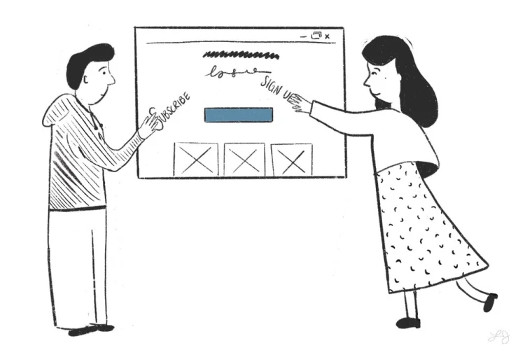
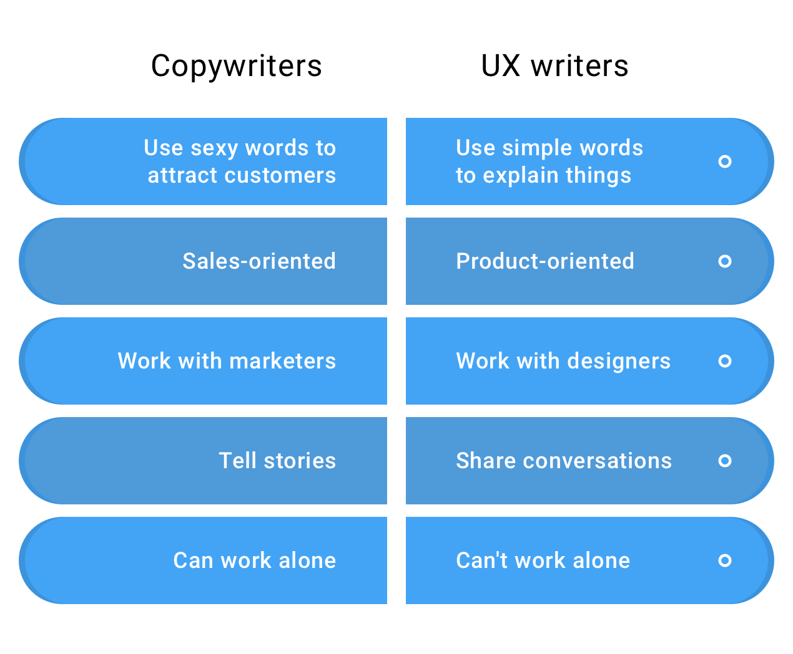

# Definition of UX Writing and its difference from content production jobs

UX Writing is the writing of product texts to guide the user and improve the product. These texts should be purposeful, consistent with the brand tone, concise, and clear. Experience writing is also defined as an independent job, and this specialist is called a UX Writer. It should be noted that we do not mean writing long articles and complex product content. Because this is another job called content production. Of course, content is also produced in experience writing, but only texts and content that are used in the product and during design.

In this session of the course we will discuss the topic of experience writing and its difference from advertising writing and microcopy. So, we suggest you follow our content until the end.

UX writing is part of design. It was previously stated that good design is not visual. Well, part of this design is the texts and content of your site or application. You should write in a way that the user has the least attention and can easily understand and skip it. Consider the Snap or Tapsi software. Without paying special attention to the design and texts, you open it and quickly take an internet taxi. The goal is that the entire design, including the UI, texts and every other item, makes it easy for the user to use.

## Copywriting

Sometimes people confuse the concepts of experiential writing and advertising writing. Advertising writing is writing advertisements with the intention of selling. Like the advertisements that you often see on billboards around the city, in paper and television advertisements. Of course, you might say that content producers also write with the intention of selling. That's true, but the situation is different.

A content producer writes often lengthy texts in accordance with a content strategy document developed for that content, on various channels such as the website and social networks. The content is usually long and indirectly leads the user to the sales funnel. While an advertiser sometimes writes just a single sentence to encourage people to directly purchase that product or service.

## The difference between UX Writing and Copywriting – UX Writing vs Copywriting

In UX writing, we try to keep the phrases very simple, whereas in advertising writing, we try to use seductive and persuasive words to attract customers. In experience writing, our focus is on the product and improving the design. But in advertising writing, the focus is on increasing sales. In this way, these days we see advertising writing on Instagram or other social networking spaces with the aim of providing services and products. Experience writers collaborate with people in the UI/UX design department .

If the collaboration of the advertising writers is with the marketing team. The text and content of the experience writers does not work alone. Like the label of a form. But the text and content of the advertising writers work alone. Such as: It was morning, it was not lunch, Snap Food! To gain more skills in this field, you can participate in a UX writing course to gain more experience.

# Microcopy

Microcopy deals directly with the user and is written to guide the user. That’s the main goal: to guide them in making the most of the digital product. Microcopy is the touchpoint between the user and the product. Touchpoints are textual interactions that the user interacts with directly. This interaction can be good or bad. Like push notifications.

- Button text: The text used inside buttons is a type of microcopy.
- Push notifications: Texts inside notifications and alerts
- Error messages: One of the most important touchpoints is communication with the user, and this microcopy should guide the user well.
- Waiting texts: Such as page loading texts that can guide the user.
- Placeholder text: Also called placeholder text, it is the help text that is written in a light color inside forms.
- Form Label: In general, microcopy, and writing experience in general, plays a big role in forms and improving their readability.

## Increasing sales with principled writing experiences

Many businesses work with UX writers to better introduce their products and increase sales. These people use experience writing to produce content with the aim of better introducing or guiding the product. In fact, the more targeted this content is, the better it introduces our product or service to users.

In this part of the UI/UX designer course, we have fully answered the question of what is experience writing. We have also explained the topics of microcopy and the accessories related to this important knowledge.
