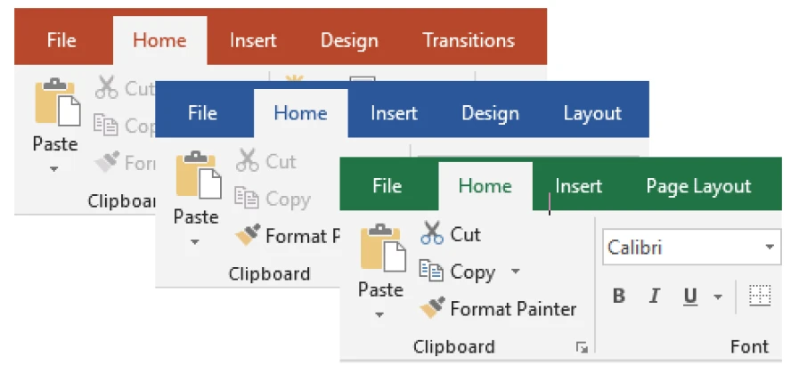
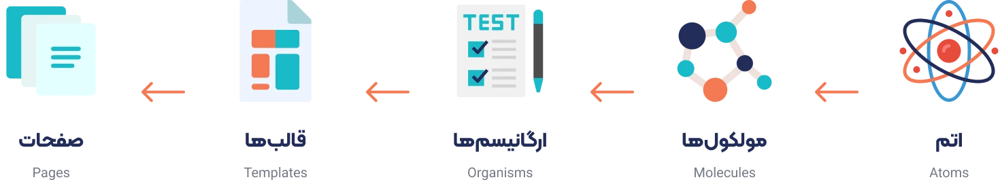
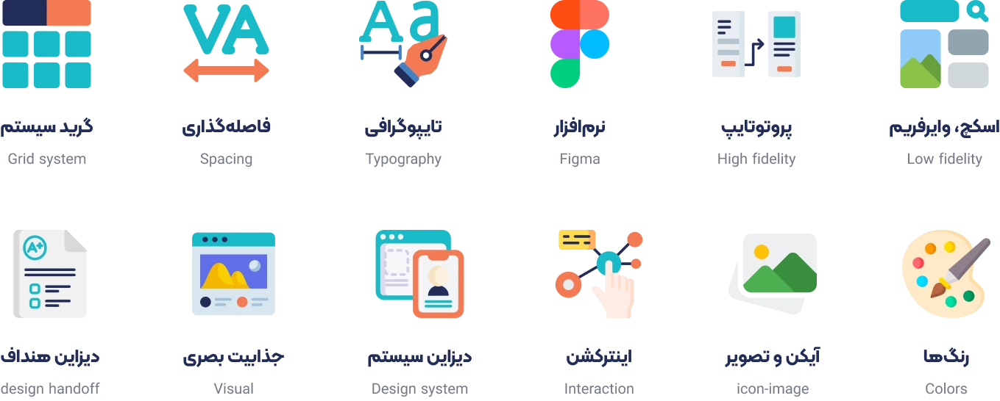
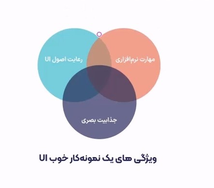
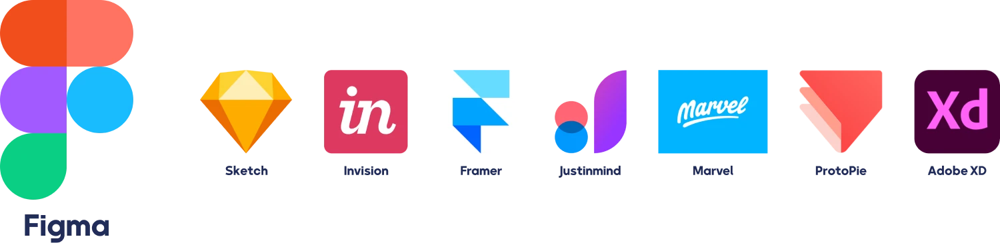

# User Interface Design

For a designer, there is nothing more enjoyable than creating a beautiful and functional design. Welcome to the most exciting part of the user interface design training course. In this section, we will first address the question of what is user interface design and then introduce user interface design software along with their features.

If you are one of those people who are interested in the world of website, application or product design, this training is for you. Or if you want to send your UI designer recruitment form to different companies, you will need the information in this course.

## Definition of user interface design

User interface design is part of the user experience skill. A user interface is an interface between the user and the system. It doesn't necessarily have to be a site or an application. For example, smart payment devices at gas stations also have their own UI. A reservation system, online store, accounting system, smart control inside a hotel, or any other digital product, will have its own UI.

The important point is that this UI must be designed in accordance with the principles of user experience. No matter how good a UI design is, if it is not tailored to the user's needs, it will not bring user satisfaction. To order a UI design tailored to your business needs, you can contact the expert designers of Rasam Innovation Agency. Various topics are influential in UI knowledge, which we will examine. Some of these topics (such as the golden ratio) are not only applicable to UI and are also helpful in other design topics. In general, if you strictly follow the principles of UI design, you will definitely have a good output.

## Visual hierarchy

With the help of size, color, typography, repetition, grouping, white space, etc., we can create visual hierarchy according to the needs of our users. Take a look at the image below. First, the large text in the middle of the page is visible, then the two texts below it, and finally, the text at the top of the page. The effort of user interface designers is to create visual hierarchy according to the needs of their audience and the importance of the content to them.

## Design consistency

Visual order and integration increase the learnability of the product. Like products from Microsoft, Adobe, and many other companies that have independent design systems . This integration makes it easier for users to understand that product and become familiar with the information architecture of that product.

## Golden ratio

Music, painting, photography, architecture, and even UI are arts that use the golden ratio. The number 1.618034 is the golden ratio or the ratio between the numbers of the Fibonacci sequence. This ratio can be seen in the Egyptian pyramids, Da Vinci's paintings, various works of ancient architecture, and even in nature. When taking photos, they use the golden ratio to better position the subject in the frame. Of course, keep in mind that using the golden ratio is not mandatory and is merely a method and strategy.

## Design thinking

A problem-solving mindset is centered around the user and the human. In the first session, we said that good design is not something to be seen. We gave the example of a door handle. As long as that handle works well, it doesn't attract attention. So users prefer to use a digital product comfortably and without attention or concern. Design thinking is in this direction. It has 5 general and attractive stages.

Notice that the entire process of personas, user research, information architecture, UI and usability, and basically every part of the user experience that we talked about, can move forward around these 5 steps. It starts with empathy. Where you do personas and research. You talk to users and you empathize with them. Now in the next step, the issues and problems that we researched are defined.

In the next stages we come to ideation and prototyping. That is where you start the information architecture and UI. Obviously after UI we need to test and evaluate our design. So in the last stage of design thinking, the designed product is tested and evaluated. I suggest you read the book Design Thinking by Nigel Cross.

## Atomic design

This rule emphasizes that instead of designing the entire page from scratch, we design the elements that make up the pages. If we design a small component well, we can certainly implement more and more complete details. Molecules themselves are made up of atoms. In UI, larger elements themselves have much smaller components. From the combination of these components, our templates and pages are built.

In China, some 10-story buildings are built in less than a week. But how? Each piece of this building is pre-fabricated and connected together in a short period of time. The same process exists in UI. Suppose you have specified the colors, typography, buttons, forms, and many UIkits of your project before designing. What do you think will happen? You will move at a great speed and with minimal mistakes. Like the same building, you no longer have to worry about the choice and disorder of its materials.

## What does website user interface design include?

People think that UI is just software skills and visual appeal. But it must be said that this is not the case. All the things you see are part of UI knowledge. Perhaps the list could even be more detailed. But in general, if you want to become a strong UI designer, you should first master the basics of user experience and then the following topics.

## User interface design software

Currently, designing user interfaces with Figma is a priority for designers because Figma is considered the best user interface design software. Of course, time sometimes changes everything and this may not be true in the future. Figma has a web version and you can design as a team. Website design , application, social media content, resume, even educational documents and many other things can be designed with it.

Sketch software only works on Mac and does not have a web version. Of course, it is a powerful software. I suggest you do not use Adobe XD software because it is no longer updated. Other software is also good, but it cannot be a replacement for Figma. Note that if you know one software well and have good examples, it is better to work with different software. Note that software is just one of the issues that you need to master to become a UI designer. There are other issues that were discussed above.

## The place of Photoshop and Illustrator in UI knowledge

It would be wrong to say that with Figma you no longer need to design user interfaces with Photoshop and other software. However, you may want to edit an image in a way that is not possible with Figma and its plugins. A UI expert will definitely need such software. But don't be too greedy to learn them. Try to become stronger in them over time. You will know that you have reached the goal even at an intermediate level. But you will not lose anything if you become a professional.

## Delightful design following user interface design principles

In this part of the UI/UX course, we answered the question of what is UI design and also explained the related aspects of this knowledge, including hierarchy, design integrity, golden ratio, design thinking, and atomic design. In the following, we will also provide you with a website design tutorial with Figma. We would be happy to share your experiences with us.
