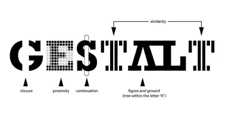
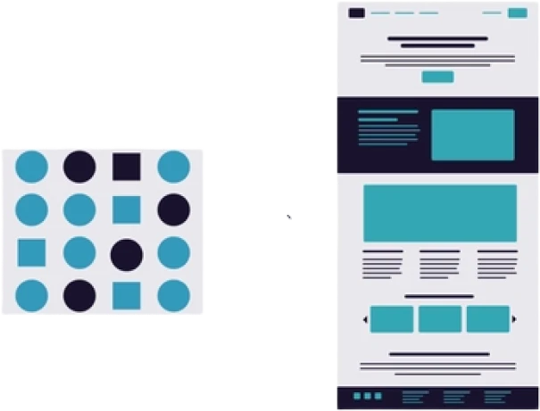
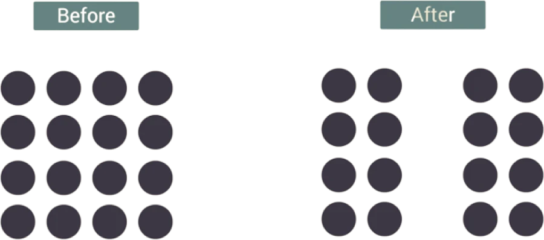
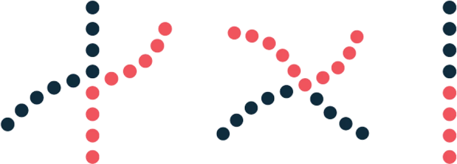
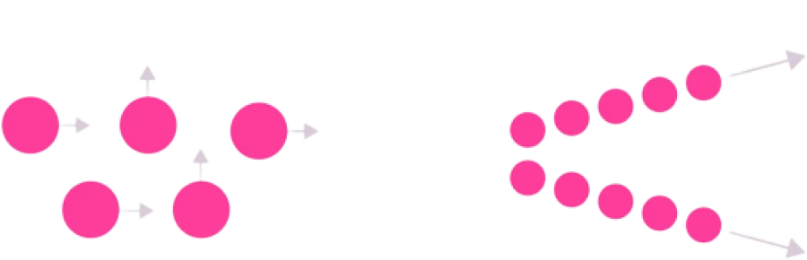
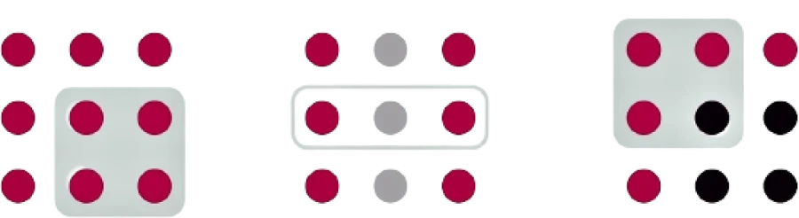

# Gestalt Principles in UI Design

rules and principles is Gestalt. Gestalt principles in UI design, in simple terms, mean that the human mind perceives phenomena as a whole to understand them. At first glance, the mind tries to present a whole image instead of understanding it in detail.
In this part of the course we want to explain the concept of Gestalt rules with examples. So we invite you to accompany us to the end of our content.

Gestalt principles were proposed by German psychologists in the 1920s. These principles help designers understand how humans perceive objects and nature. Look at the image below. Can you read the poem below? Pay close attention, you will be reminded of the poignant poem by Ostad Shahriar. But why? According to the principles and rules of Gestalt design, your mind tries to complete the incomplete objects it sees with its own mental models.

When you first read about Gestalt principles, they may seem like a no-brainer. But they’re not. They’re directly relevant to your UI. Using Gestalt principles, you can communicate with your customers and stakeholders, especially when you’re talking to them about a 100-year-old scientific topic. In the User Experience Principles session , we’ll introduce a good resource for further reading on Gestalt principles and other UX principles.

## The Principle of Similarity

The human mind sees objects that have similar characteristics as a single whole. The three main factors of similarity are size, color, and shape. Size has a stronger influence than the other two. This rule proves to us that humans, when examining an object, perceive common characteristics and consider those common characteristics as a factor for uniformity and similarity of their performance. Such as three blog cards placed side by side on a website.

## Proximity Principle

Elements that are close together are seen as a single whole. This proximity or proximity can mean that the edges of the elements are close to each other, touching or overlapping. Distances are one of the main issues that we need to address in UI. You have definitely seen on various websites that the titles and hierarchies are arranged in a way that allows users to better understand the content. The background of this is the Gestalt rules. Because the user sees objects that are close together as a group.

## The principle of continuity

According to this principle, the eye makes connections between elements that are on a path (a line, a curve). This connection continues until something interrupts this mental curve. Instagram posts are perhaps a good example of this. Your eye follows the path until something interrupts that path or the content ends.

## Principle of Completion and Integrity – Closure

When part of a shape or design is missing or missing, the eye completes it and sees it as a complete form. Pregnancy can be explained as the fact that humans inherently seek to complete incomplete and fragmented experiences of their environment.

## The Figure-Ground Principle

The human mind naturally tends to view one part of an image as the figure (foreground) and another part as the background (background). The image opposite is a famous example of this principle. Consider a pop-up on a website. When you click on it, the current page doesn't go anywhere. In fact, another page has opened on top of it. That's why they darken the background a little to tell us that the page is still there. But first, we need to clarify the purpose of the page that is being displayed.

## The Principle of Common Fate

This principle is most evident in moving images. Elements that move together in the same direction are treated by the brain as a single whole. Sometimes, by looking at them, part of their future path can also be discerned.

## Common Region Principle

Sometimes elements and objects may be in a specific area and share a common area. In this situation, users see these independent objects as objects that are in a group together.

## The principle of invariance

Users have the ability to recognize simple objects independently of rotation, scaling, and translation.
The human mind can recognize objects viewed from different angles even if their appearance and presentation change.

## Emergence and Reification

Users first recognize objects based on their overall range. Our minds recognize simple shapes with little detail faster than objects with high detail. Even if part of the objects is missing, the user can compensate and understand the imperfections.

## Better design using Gestalt principles and rules

By applying the basic rules and principles of design, we can definitely create better designs or products. Thus, in this part of the UI/UX designer course, we explained the Gestalt principles in UI design and the accessories related to this important knowledge.
