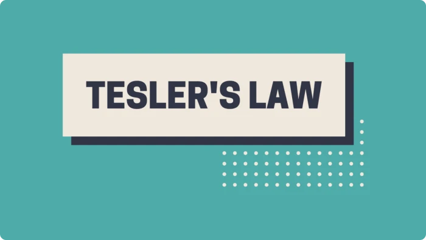
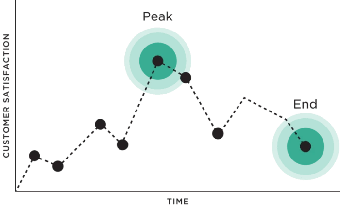
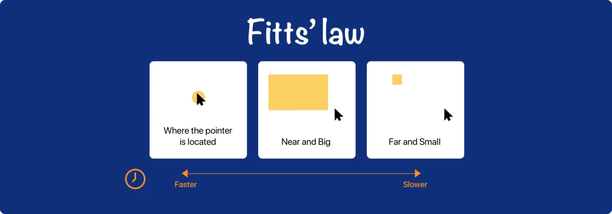
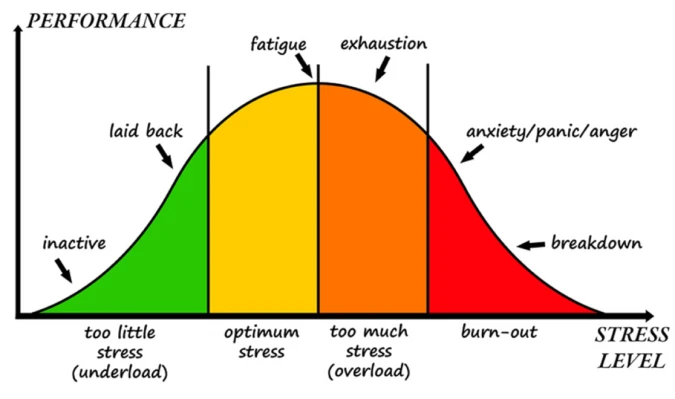
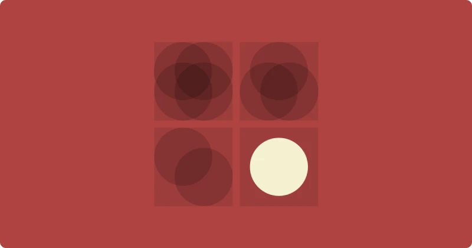

# Laws of User Experience – Laws of UX

Law prevents chaos and creates order and uniformity. By implementing the rules of the process, things become faster and more practical

## Introduction to the User Experience Rulebook

The Laws of UX are a set of mostly psychological strategies that designers can consider when designing UI/UX.
These rules are presented in a book of the same name. The content of this book is 21 rules, 5 of which are related to the Gestalt rules that were explained in the previous session. You can read the content of these rules in both the original language and Persian by visiting the website lawsofux.com.

## Aesthetic Usability Effect

People sometimes feel that things that look better also work better. In fact, they have a positive emotional response to your visual design, which makes them more tolerant of small usability problems. The results of a study of 252 ATM machines in 1995 led to this law. In fact, if people see an attractive and eye-catching design, they give it a little extra credit and may feel that the product necessarily performs well.

## Jakob's law

Users spend most of their time on other sites. This means that users prefer your site design to work like other sites they already know. They transfer their experiences from other sites. Suppose we design a gray button that symbolizes inactivity as an active button? What happens to the user? The truth is that they see products with their mental structure and with their previous experiences. This law was proposed by Mr. Jakob Nilsson, one of the founders of nngroup.

## Miller's law

A person can store 7 (+/-2) items in their memory. To help users process, understand, and remember easily, organize content into smaller chunks. This rule was proposed by George Miller, a professor of psychology at Princeton University.

## Hick's Law

Decision time increases with the number and complexity of choices. When response time is critical to increasing decision time, minimize choices. This rule was proposed by William Edmund Hick and Ray Heyman, two British and American psychologists, in 1952.

## Serial position effect law

Users tend to remember the first and last elements of a series better. It helps to put important items at the beginning and end of the list, and less important items in the middle. This rule was introduced by Hermann Ebbinghaus.

## Tesler's law

Law of Conservation of Complexity: There is always some complexity left in a product that cannot be reduced. Mr. Tesler believes that a UX specialist should spend one week more time than millions of users spend one minute less. This law was proposed by Mr. Larry Tesler. He is also the inventor and presenter of the idea of ​​ctrl + c and ctrl + v.

## Peak-End Rule

People judge an experience based on how they feel at the peak and the end of it. The peak of using a banking application is the card-to-card process. Why is this easier in Bluebank than in other applications? In fact, Bluebank has managed to understand the high points of the product and have a better design for those parts. This law was proposed by Mr. Daniel Kahneman.

This rule is very similar to enjoying something. Like a ride in an amusement park where you sometimes feel at your peak of enjoyment, or when the ride is over and you still feel good. These two parts stay in the audience's mind much longer. So know the high and low points of your product and design the best for those parts.

## Doherty threshold law

Productivity increases when the computer and its users interact at a speed (less than 400 milliseconds) that ensures that neither has to wait for the other. You may have noticed when opening some sites that a skeleton of their structure loads first. Especially when the Internet speed is slow. This makes the user understand that the site is loading properly and does not feel abandoned. This law was proposed by Walter J. Doherty and Ahrweind in 1982.

## Zeigarnik effect law

People remember incomplete or stopped tasks better than completed ones. By showing progress bars, you can increase users' motivation to complete a task. Such as authenticating and completing your store profile on various sites. In other words, it pushes users to complete their profile and provide information. This law was proposed by former Soviet psychologist Bluma Zeigarnik.

## Von restroff effect law

The isolation effect states that whenever a number of elements are similar, the different item is seen and remembered better. Such as price lists and support plans. This law was proposed by Mr. Hedving van Restof in 1993.

## Fitts law

The time it takes to reach a target is a function of its distance and size. Targets that are tactile should be of a suitable size for users to recognize them well. Suppose there are two squares, one large and the other small. If you want to move from the small square to the large square with the mouse, you will do it faster and easier. Now, if the distance between the two is close, the task becomes even easier. This rule was proposed by Mr. Paul Fitz in 1954.

Exactly like banking apps that sometimes display the wallet button or payment receipts larger because it makes more economic sense for them or because their users' needs dictate this.

## Pareto law

An Italian economist first realized that 80% of Italy's land is owned by 20% of the people. This law has also found its way into other sciences. Example: 80% of system problems can be solved by improving 20% ​​of tasks. This law was proposed by Mr. Vilfredo Perto. For example, if by improving 2 out of 10 user experience tasks, most of the system problems can be solved. We will go to those tasks first.

## Parkinson's law

Everything takes as long as it takes! Perhaps we can shorten the time for some tasks and this shortening of time will help the user to find and understand the product. This law was proposed by Mr. Cyril Parkinson in 1955.

## Occam's law

When several competing hypothetical answers are presented, the hypothesis that requires the fewest assumptions should be chosen. The reason for this is that it reduces the number of assumptions and gets closer to the facts. Of course, not all assumptions can be eliminated. This rule was proposed by the English philosopher William of Ockham.

## Functional design using user experience rules

By implementing user experience rules, you can definitely improve your design level. That's why in this part of the user experience training, we mentioned some rules, including usability beauty, Jacob, Miller, Parto, and Parkinson. You will undoubtedly be surprised by your design by applying ux rules
