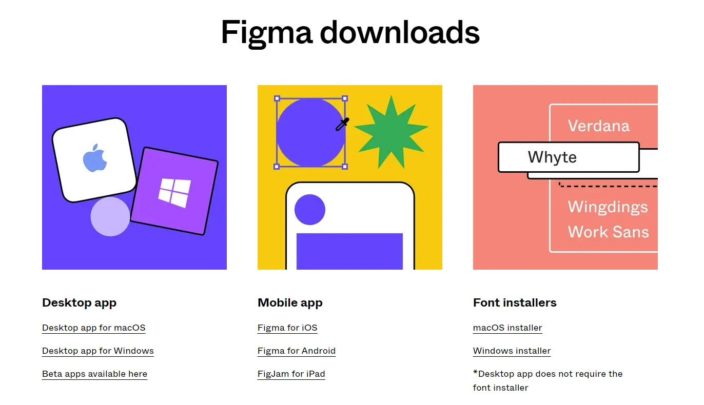

# Figma software training

Figma software attracts more than 3 million users per month. Currently, more than 1 million teams use Figma for their design processes. However, Figma’s user base has grown by more than 200 percent since 2018. These statistics show the popularity of this UI design software among individuals. For this reason, designers are more eager than ever to learn Figma software training.

## A History of Figma Software

Figma is a web-based vector software that was started in September 2017 by Mr. Dylan Field and Mr. Ivan Ballas as a research project at Brown University, USA. Adobe was planning to buy this software for $20 billion, but the deal was terminated after some time.

This software is mainly used for user interface design, but it is also used for other topics, such as social media content images, banners, web-based educational documents, online resumes, and other topics.

## Why is Figma best for UI?

Figma is a web-based software. You can access all your projects anytime, anywhere in the world by logging into your Figma account. Of course, Figma also has a desktop software, but this software also uses a browser and the internet. The free version of this software is very powerful. This software allows you to design as a team and simultaneously with your teammates. This feature of Figma is really enjoyable. Many people use Figma software to design websites and preview their work.

Some features, such as video embedding, conditional prototyping, and a few others, are only available in the paid version of the software. You can create as many teams as you want in the paid version, but you can only create 3 teams in the free version. However, it must be said that the free version is also very powerful, and perhaps the free version covers the needs of a significant portion of designers, especially those who are just starting out.

## Download the software and register on Figma

Log in to figma.com and click the blue Get Started button. After entering your email and choosing a valid password, a link will be sent to your email, and after clicking on it, your account will be created.

To download Figma, go to figma.com/downloads . Select and install the desktop version based on the Windows or Mac platform. As mentioned, the desktop version also uses the Internet and is practically not much different from the web version. There is just one small thing we need to know. The desktop version recognizes the fonts installed in the operating system. But if you use the web version, you must install the Font Installer for Windows or Mac. The Figma application is also used to manage and present the project.

## Personal experience installing Figma

I suggest you use the same web version. Also, to make this version understand your installed fonts, install the Font Installer on this page (its size is under 3 MB). To install fonts on the operating system, as you know, you need to add them to the font folder of your operating system or install it by right-clicking.

## What is figjam and how is it useful for designers?

FigJam software is a child and part of Figma software. As soon as you log into the software, you can create both Figma file designs and Figma files. FigJam's functionality focuses on non-ui design. Such as persona form design, usability test information, competitor analysis tables, chart types, graph types, Mind maps, and anything else for managing your information. FigJam is somewhat a competitor to web-based software such as miro.com and whimscal.com. (These two are also powerful tools). In these 4 videos, we only taught Figma. Of course, we have taught Figjam training and userflow design in it in another session, which you will encounter later in the course.

## One step to professional design with Figma software training

In this part of the UI design training, we explained the Figma training course and the accessories related to this important knowledge. We also plan to provide you with website design with Figma at the end of the training course. Without a doubt, having a work sample with Figma will increase your chances of being hired as a UI designer.
