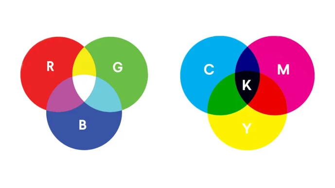
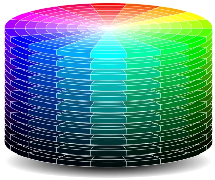
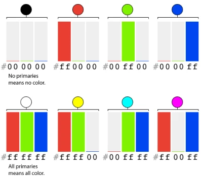
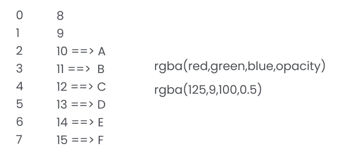
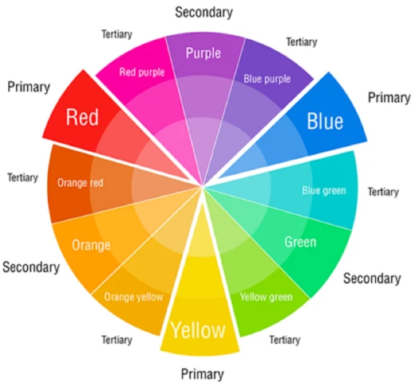
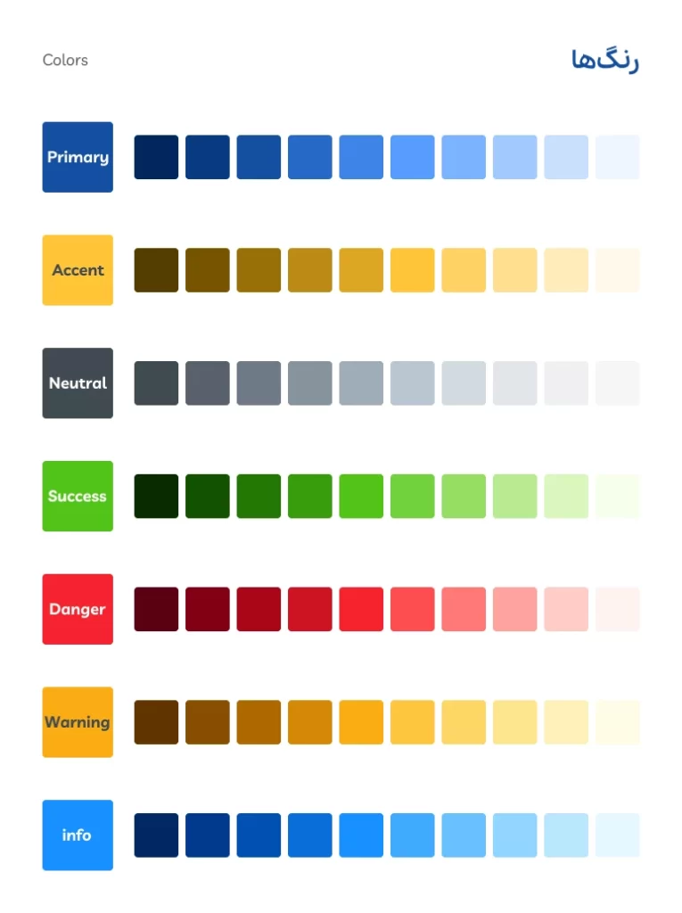

# Color theory in UI/UX design

Color theory in UI/UX design is one of the most fascinating parts of learning design. Colors are one of the main topics that we should pay special attention to in user interface design. Designers' understanding of colors, how to use them, and the psychology of colors is a great help to user interface designers in creating attractive and professional projects.

In this part of the course , we are going to examine the theory of colors in UI UX design. We invite you to follow us to the end of the article.

Color Psychology in UI/UX
The three primary colors in nature that are not combined with other colors are red, yellow, and blue. While the three primary colors that the human cornea combines to create other colors are red, green, and blue. These two should not be confused. It should be noted that all displays, such as monitors, televisions, and phones, have a logic similar to the functioning of the human cornea or retina. There is also another color structure called CMYK that is used in the printing industry. Cyan, magenta, yellow, black. In UI, we do not have anything special to do with CMYK, and this color standard is used in print design.

## HSB color structure

Using this structure and obtaining the hue, saturation, and brightness, which are HSB, you can create your own color palette.

- Hue: Determines what color spectrum we use.
- Saturation: If it is 0, it is gray, and if it is 100, it is the full spectrum of color.
- Brightness: If it is 0, it is black and if it is 100, it is completely bright.

## HSB color structure

The HSB color structure is one of the most common color structures used by designers. In fact, designers also use this structure for website design . It has a total of 6 characters, the first 2 characters represent red, the next 2 characters represent green, and the next 2 characters represent blue.

- Each number has 16 different states (from 0 to 15).
- The other structure has 16\*16 = 256 different states, which range from 0 to 255.
- This structure is called RGB, which is actually written in a different base.

Look at the image below. The hex structure has 6 characters, and each of the 2 characters represents a color. Each of the 2 colors can have 16 different states. These 16 states start from zero. Because for example, we can only put 2 characters for each color, so instead of 10, the value A is put, instead of 11, the value B is put, instead of 12, the value C is put, instead of 13, the value D is put, instead of 14, the value E is put, and finally, instead of 15, the value F is put.

Now, 16 different states are inserted for each color. Each color has 2 numbers. So we will have 16 states multiplied by 16 states, which is 256 different states for each of those 3 colors. Since this value starts from zero, it will usually be 0 to 255. This structure is also called rgb, and its written example is in the image below. Note that if there is alpha or opacity, this value becomes rgba and the numbers come in parentheses.

Reminder: Alpha or opacity is transparency, which is a value between 0 and 1. If it is zero, the object becomes completely invisible, and if it is close to 1, the color is complete and not invisible.

## Color wheel

Designers can use the color wheel to select a variety of colors. There are also online tools for this, which we will introduce. You will see the 3 primary colors of nature, red, blue, and yellow, with secondary colors and more subtle layers created between them.

- Warm colors are on the right and cool colors are on the left.
- Primary colors in nature, which are not formed by combining other colors.
- Secondary colors are created by combining primary colors.

## Thematic categorization of colors in UI

With the capabilities of Figma software, we can choose our own color palette and add it to Figma. Before that, we need to get familiar with this color category. We can also use Figma plugins to improve and speed up performance. Watching the free Figma software tutorial will help you a lot in this regard.

## Brand color – Primary

The main brand color is usually clearly visible in the logo and corporate brand book of companies. Such as the red color of Digikala or the yellow color of Irancell. Your brand will remain in the minds of the audience with this color.

## Secondary color

The secondary color is the next priority of the brand color. For example, when we mention the brand name Pepsi, you will also remember other colors. Of course, not all of these are necessarily supposed to be in the logo. The logo may be designed simply and gray. Like the Nike logo. In fact, if a brand also has a secondary color or colors, you will notice those colors by reviewing the documents and brand book of that collection. The secondary color is less memorable to the user than the primary color.

## Accent color – Accent

Accent colors may also exist in brands. For example, in Digikala, in addition to the main brand color, which is red, you will see turquoise and dark blue, orange, purple, which represents Digi Plus, and a whole host of other colors, especially on the product pages. In fact, accent colors are used to show details that are not necessarily neutral. In stores and busier designs, accents are used more often.

## Neutral colors

Contrary to popular belief, black, white, and gray are actually used a lot. For example, the color of inactive buttons, some of the texts and titles, background colors, captions, lines, shadows, and many other things can be created with this gray and neutral spectrum.

## Semantic Colors

There are other colors that convey meaning and concept. These colors are mainly green, red, orange and blue. You might ask what if a brand like Digikala had red as its primary color? The answer is that it can use that primary color as a semantic color or create another red for semantic.

- Green – Success: Indicates a message or action of success in products, such as a confirmation button, order confirmation text, and payment.
- Red – Danger: Indicates an error or problem with the product, such as a delete button, a request being rejected, or similar issues.
- Orange – Warning: Indicates a warning to the user. For example, there are only 2 items left in the shopping cart.
- Blue – Info: This color indicates information without warning.

## Color selection tools in color theory in UI/UX design

There are many different tools for creating color palettes. We've included some of the most important tools for choosing color palettes here. Check them out, create a few color palettes for practice, and share your experiences in the comments section of this session.

<https://color.adobe.com>
<https://coolors.co>
<https://colorhunt.co>
<https://flatuicolors.com>
<https://materialpalette.com>>
<https://www.w3schools.com/colors>

## Creating a color palette in Figma using tools and plugins

In the first step, you need to get the logo and color scheme from the client. The brand book is the visual identity document that contains the logo, color scheme, part of the typography, even the letterhead design and visual elements of the organization. If the client has it, that's great. If there is no brand book, at least we get the logo of the collection and extract the main color from it. In the video, we explained the colors section and how to scale them using the source starter kit design system. Of course , we will talk in detail about such files in Figma in the design system session.

In Figma, you can scale colors using plugins like the color scale generator, for example, to create 10 levels from dark to light. You can see an example of this scale in the image in the middle of this page of different color categories. This color scaling is applied to all categories such as primary, secondary, accent, neutral, and semantic colors. After this, your color style guide is ready and you can add it to Figma styles. This was also done more easily and quickly using the chroma color plugin.

## Choosing the right color using color theory in UI/UX design

In this part of the free comprehensive ui ux course, we explained the colors in UI and the accessories related to this important knowledge. We would be happy to share your experiences with us.
