# Typography in UI

Typography in UI is one of the most fundamental topics that is effective in the success of a user interface design project. In the Colors in UI session , you saw how UI principles, if designed well, can greatly contribute to the accessibility category . This specialty also includes typography. Typography in UI design includes font selection, font weight, font alignment, line spacing, sizes, etc. Titles, subheadings, paragraphs, and captions should be adjusted according to the project. In this part of the course, we intend to explain the principles of typography in this article in a practical way. So, dear friends, we invite you to accompany us to the end of the article.

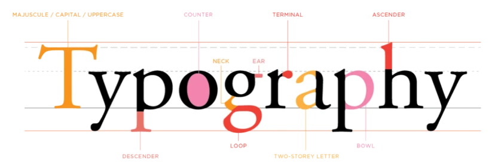

## The difference between font and typeface

First, it's best to examine the difference between font and typeface. Contrary to popular belief, these two concepts are not the same and are different.

Typeface: A typeface is a collection of design elements for letters and other characters. In fact, a typeface is a package of fonts that includes different weights, Persian and English numbers, vowels, etc. In fact, the word typeface is more comprehensive and complete than font. But today, both of these terms are called fonts.
Font: It relates to the weight, dimensions, and size of a typeface. For example, in the Iransans typeface, there are different modes of the font. Such as vowels, dot type, number type, etc.

## Font categories

Fonts can be categorized in terms of appearance, similar to the image above. In Latin fonts, serif is mainly used for more formal texts. Sans-Serif is also used more in digital products, such as websites and apps. The reason is that it is easier and better readable than Serif.

- Serif fonts that have breaks and curves.
- Sans-serif fonts have a simpler design.
- Monospace fonts are used for programming.
- Handwritten and cursive fonts

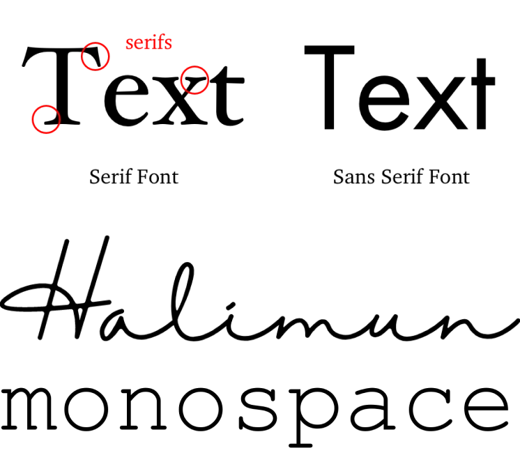

## Font Weight

Look at the image opposite. Fonts, regardless of their size, are not the same in terms of thickness. In typography, we do not show hierarchy solely with font color and size. Font weight and spacing are also very important and effective.
Titles are usually shown in Bold. Body text is shown in Normal or Regular. Captions are also often in Light. Font selection should be tailored to the needs of users and product personas. It is better to use only one type of font in the project. It should be noted that some fonts may only be suitable for titles and may not be a good option for body text. Now, look at the image below.

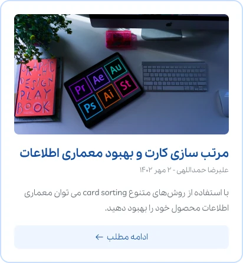

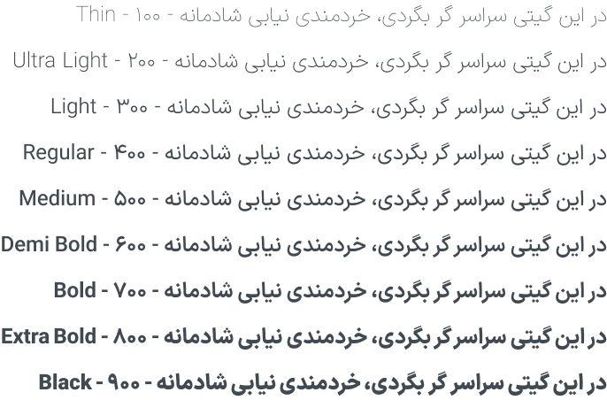

All 9 texts above have the same font size. But their weights are different. Font weights range from 100 to 900. They often come in a graduated range, with different weights in different numbers. In digital products, the 4 most commonly used weights are Light at 300, Regular at 400, Medium at 500, and Bold at 700. The number of weights depends on the font, and often, paid fonts have more variety in this regard.

## Variable Fonts

Font variability is a professional feature in today's typography. Even if the number of font weights is large, there is still no ability to choose between the number 100 and 900 that defines the font weight, for example, the number 354. But with the variable font, you will have this ability.

## Introducing fonts, websites, and plugins for typography

In the following section, we have introduced a number of common Persian and English fonts. For ease of use, we will also introduce various other websites and online tools for finding and using such fonts. In general, Iransense, IranYakan, Yakanbakh, WazirMatan and a few other fonts are among the most popular and common Persian web fonts. For this reason, most designers use the following fonts for website design .

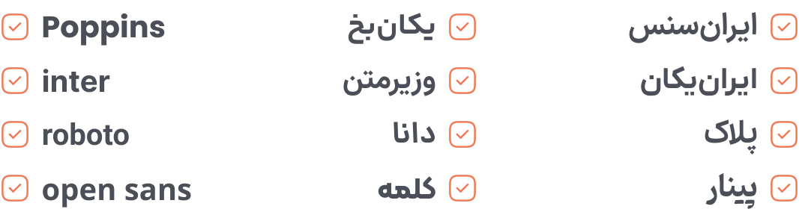

## Google Fonts

The website fonts.google.com is a strong collection of free but high-quality fonts. Of course, it should be noted that only some of these fonts are suitable for the Persian language. But for Arabic, English, and Latin in general, there are good and diverse, and at the same time free, fonts. On this site, you can sort by language and font type, and by searching you can also see a preview of your font and download it if you wish. Note that Google fonts are available in Figma and you do not need to install them.

On this site, there are also completely Iranian fonts such as Wazirmatan and Lalehzar. Note that Arabic fonts are not necessarily suitable for Persian. As you know, the writing of numbers and some characters in Persian and Arabic is not the same. Such as the numbers 4, 5, and 6, which are written slightly differently in Persian and Arabic. Therefore, it is better to use other tools for Persian fonts, which we will introduce.

## FontIran site, the best Persian font reference

Undoubtedly, the best Iranian website is fontiran.com . This website has contributed a lot to the Persian web with its professional designers. Iransense, Iranykan, Yakanbakh, Dana, Farhang, Ravi, Modam and many other attractive Persian fonts are for sale on this website. Of course, as mentioned, various designers have presented their designed fonts on this website. Before buying, assess the needs of your project and product and get a font that best suits the persona of your product.

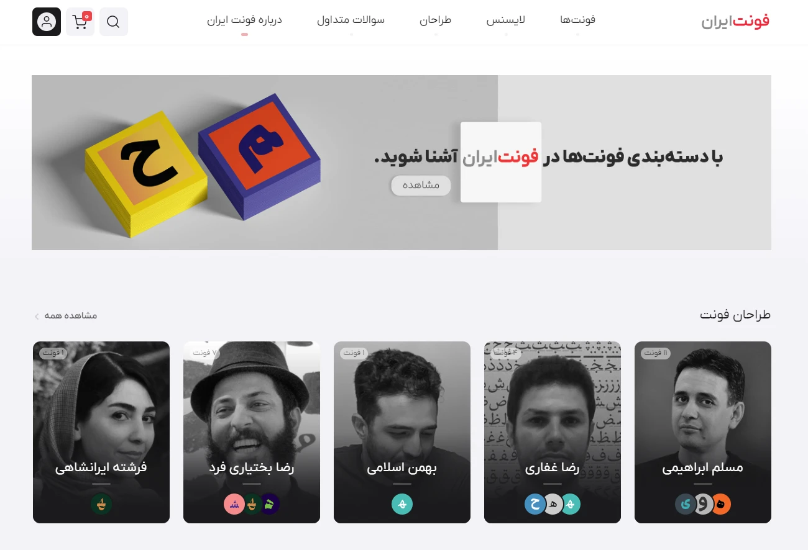

You can get the fonts you want for a small amount. With a single purchase, you can use the font as much as you want on your system. But if you want to use it for a website or application or any other digital product that generates revenue, you must also obtain a license or permission. In order to respect copyright rights, it is better to obtain premium fonts legally.

## Fontamin website

Another valuable website in the field of Persian fonts is fontamin.com. On this website, you will also find attractive and beautiful fonts such as Pinar, Azarmehr, Nataan, Badi, Maho, Minshru, and the free font Atat.

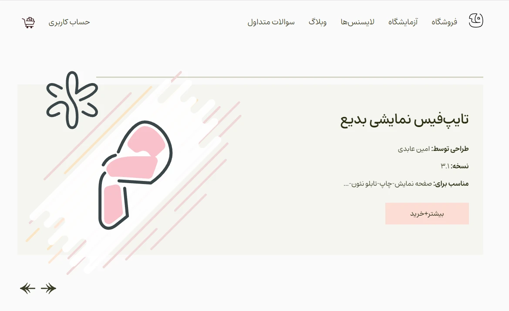

## Saber Rasti Khardar fonts

The late Saber Rasti Kirdar designed the fonts Wazirmatan, Sahel, Shabnam, Samim, Gandom, Tanha, Parstu, and Nahid in his short but blessed life. The Wazirmatan font is on the Google Fonts list, and Telegram also used this free font for its Persian version, and it is still used today. All 8 of these fonts are provided for free. A list of Saber Rasti Kirdar fonts is available on GitHub (downloadable).

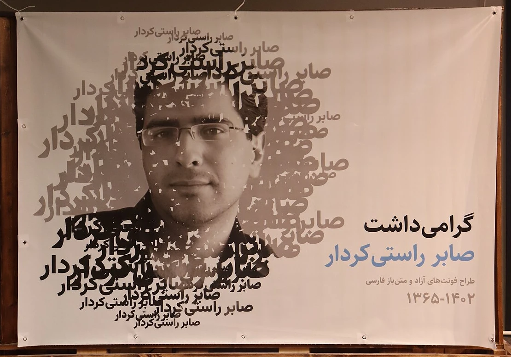

## Typography plugin for Figma software

Using the typescales plugin in Figma, you can create different sizes of titles and paragraphs according to the needs of your project. In this plugin, you can choose the size ratio, line spacing, font size, etc. Finally, you will arrive at the desired typography. You can also use the website typescale.com for this . Of course, the Figma plugin is more accessible.

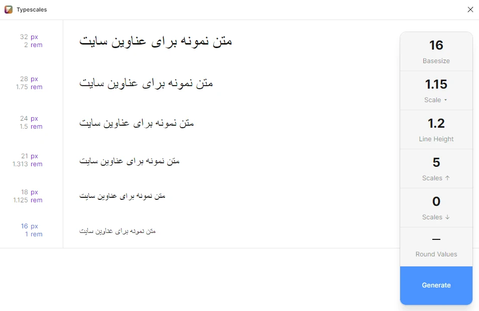

## Create typography without tools

### H1 to H6 headings and paragraphs

Look at the image opposite. Headings on the web have 6 levels. From an SEO perspective, each page has a main heading, or H1. Like a book that only has one main heading. Suppose the main heading is Basic Sciences. Your H2s are Mathematics, Physics, and Chemistry. Your H3 is Applied Physics and Pure Physics, and your H4 is Light and Optics. This process continues up to 6 levels, and there may be video, images, and text between these headings.

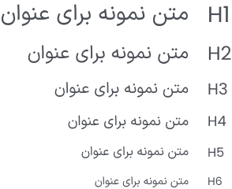

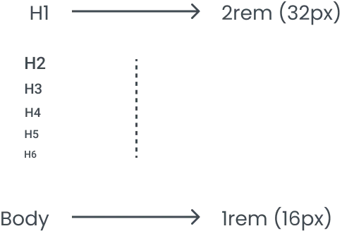

Look at the image above. Headings H1 to H6 are scaled by a certain ratio. Usually, if the body font size is 16, the largest heading will be 2 times the body size, which is 32. Of course, it is important to note that fonts are like shoe sizes. Numbers and figures are not always enough, and these values ​​may not be suitable for all projects. The default browser font size is 16 pixels, where 16 pixels is one rem. This value can be changed. The font of all headings is usually Bold. With that said, the H2 text, which was 32 pixels, would be equivalent to 2rem.

## Line spacing and using even values

We try to use even sizes. This also includes line spacing or line-height. In fact, it is the line spacing that determines the height of a text. So by having them even, the upper and lower spaces are not decimal, and this is considered an advantage. Caption values ​​​​that are for meta information (such as author name, article category name, article submission date, etc.) are also designed with a smaller size and less weight.

## Very large titles or Display

Sometimes we may use sizes beyond H1. Of course, their tag in HTML is H1. For example, in advertising campaigns where we may want to use very large titles. Or in some minimal English designs, these titles are seen. (See the image below).

## Creating a Typography Slideguide and Adding it to Figma

Look at the image opposite. The values ​​H1 to H6 have been extracted. Of course, this has been done twice, which is normal in some projects. For example, for the mobile version, we may display a title smaller. Or on a site like Digikala, because the product titles are very long, we may want to use a smaller H1 than on landing pages and blogs.

Once the style guide is created (similar to the image above or any other look that describes it well), we need to add it to Figma. To add it, just like colors, effects, and the grid system, you can add them to Figma's local styles.

Just as we quickly added style guide colors to Figma with the chroma colors plugin, in this section, we can add the created typography to the Figma styles list using the Text Style Generator plugin. By watching the free Figma software tutorial, you can perform the desired operations well.

It is important to note that not all projects are the same. This implemented process may not necessarily be suitable for all projects and may require some changes. We need to be a little patient with typography. More practice will lead us to good results.

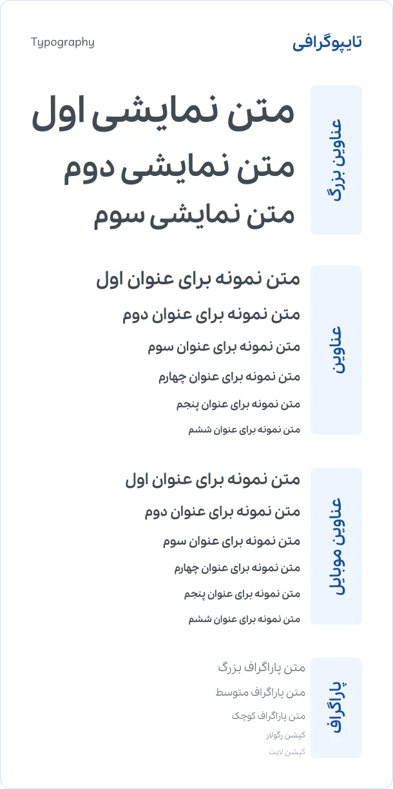

## Professional design following typography principles in UI

In this part of the free UI design tutorial, we examined typography in UI and the related aspects of this important knowledge. Without a doubt, by choosing the right font type, size, and observing the lines between paragraphs, our design will be a few steps ahead. So, we suggest that you definitely observe and implement the principles of typography in UI in your designs.
