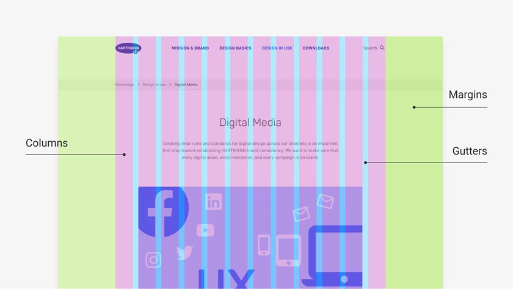
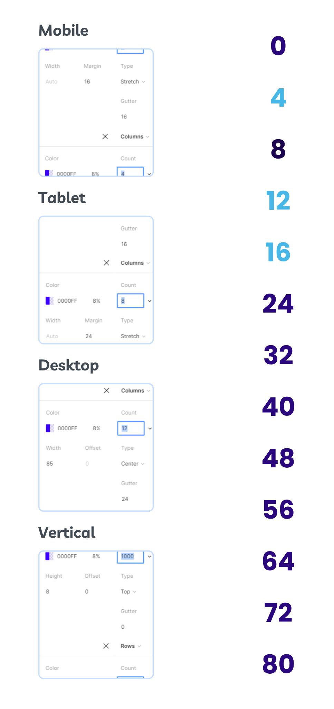

# Grid system and spacing in UI

Who doesn't like a neat and consistent design? For order in website design or digital products, we have no choice but to use a grid system. In this part of the free ui ux training course, we intend to answer the question of what is a grid system in a practical way. In fact, this article will help you design the different parts of your digital product in coherent and precise sections. To better understand this issue, we must first become familiar with the concepts discussed in the grid system. Note that all breakpoints, such as desktop, tablet, and mobile, have their own grid system.

## Difference between Container and Container Fluid

Look at the image above. If we take the entire width of the page as the criterion (i.e. all columns and the green margin that practically includes the entire width of the page), we have practically defined a fluid Container. But the Container is simply all 12 columns that you see above. Often in the desktop version, it is between 1200 and 1400 pixels. So the Container Fluid is not limited and as the monitor width increases (or the zoom decreases), the width of the page also increases. But the Container is limited to the size of those 12 columns. Most sections and their content are placed in the Container space.

## Grid System Components

Grid systems usually have rows and columns. The number of columns varies depending on the desktop or application version. Often, 12 columns are used in the desktop version. Some designers also use rows in their grid system for further guidance and height adjustment. Also, the grooves between the columns are called gutters. In addition, Margin or outer space is the same green space in the image above that distinguishes Container and Container Fluid.

Look at the image above. The grid system inside Figma was used to design the blog cards. The grid makes it easy for us to have 4 columns for each card without any problems with the appearance and sizes. Also, the presence of a groove or gutter between them creates a good separation between the blog cards. The 8-pixel horizontal lines that are visible are also to help adjust the height and spacing.Please note: the sizes listed here are not necessarily suitable for all projects and there are various grading systems. However, the sizes listed are often suitable.

## Mobile Grid

Most mobile grids are created with 4 columns. Also, due to the small size of this Breakpoint, we have set the Gutter value to 16. The Margin is also set to 16 pixels. (The frame width is set to 360 to 428 pixels, which is the common value for today's smartphones).

## Tablet grade

In this Breakpoint, the grid is often made as 6 columns. The Gutter value here is also considered to be 16. The margin value from the edge is also 48 pixels (of course, assuming the use of a tablet frame that is in Portrait mode).

## Desktop Grid

The desktop grid, assuming a 1440 Figma frame, is best made with 12 columns and a gutter of 24 pixels. Also, the Margin (for both left and right sides) is suitable for desktop, with this frame size, 80 pixels is suitable. Sometimes for a store project, we may take the Margin less so that the Container value reaches 1280 pixels from 1320 pixels. These sizes are generally good. However, the grid system may change depending on the type of project.

## Row Grid

This grid is also used to create rows. The reason for this is the ease of moving elements and the accuracy in height. (For example, using rows with 8 pixel spacing as explained in the video).

## Spacing in UI

In the image opposite, spacing is seen with a ratio of 8. (You can also see the numbers for this spacing in the image above). These numbers start from zero and are specified with spaces of 8. The difference is that the numbers 4 and 12 are also used. But why should we use a ratio of 8?

The truth is that there is no such thing as a must. But using the 8 ratio helps us avoid getting caught up in decimals and odd numbers. This can be a problem later in programming. In general, when spacing elements that are related to each other are closer together, according to Gestalt rules. The spacing steps make sure that the spacing is accurate and not based on guesswork or eyeballs.

## Grid system and greater consistency in design

In this part of the interface design and user experience course, we explained the grid system training, spacing in UI, and the accessories related to this important knowledge. The more we follow the principles of spacing in design, the more we will undoubtedly implement a unique digital product.
