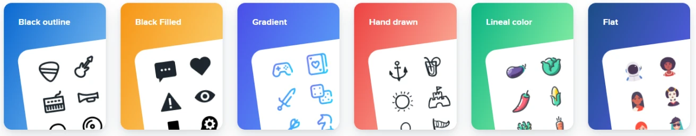
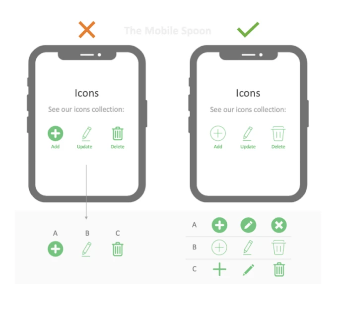

# Icons in the UI

Why do we always think that we can convey our meaning to the user only by using text? Sometimes using a small icon or image can replace a paragraph of text. Of course, we will also use vectors and images , which is the topic of our next session. Icons are one of the important elements in ui design. In this part of the ui ux training course , we are going to talk about different types of icons in design. We invite you to follow us until the end of the article.

Their consistency, relevance, and style should be such that the audience understands their concept and purpose well. For example, a magnifying glass icon is well-established among people today with the concept of search.

We should try as much as possible to select icons with uniformity and consideration for conveying the subject to the audience. Note that icon design and illustration are considered a professional specialty. A UI designer may not necessarily be an icon designer. However, as UI designers become more proficient with tools like Illustrator, they will have a hand in editing and improving icons.

## Choosing uniform icons

There are various icon packages. Some icons are in full color, which is also called Bold and sometimes Solid. Some icons are in Outline form and do not have a background color and only have a Border.

There are full-color, two-color, monochrome, gradient, broken, and other icon packages. It is important to note that your choice should be consistent and principled. Take a look at the image opposite. In the image on the left, the icons are completely uniform in color and style, which makes it easier for users to understand and read the content. For this reason, most professional designers try to use uniform icons for website design .

## Accessibility in icons

In the session where we talked about accessibility , we discussed various topics, including icons. When inserting buttons and icons, we should keep in mind that the first joint of the human index finger is about 48 pixels (of course, human hands are different), but at least a 24-pixel icon and its border space should total 48 pixels so that the user is comfortable when tapping and does not click two items. This also applies when using a mouse.

## Sources for using icons

The website and online tools, the Figma community (including files and plugins), downloadable packages within the system, the use of ready-made design systems, and even designing icons from scratch are available to us so that we can improve our website with suitable icons.

## Websites and online tools

Using tools like flaticon.com and icons8.com , we can edit and export our icons online. The package we used in the project is iconsax.io , which you can download by visiting its website. There are many other websites like hicon.me , which we have mentioned in the video tutorial. Also remember the powerful fontawesome.com package. The sites mentioned are also good sources for downloading free icons for website design.

## Figma Community

You can find a large number of ready-made and componentized icon files in the Figma community at figma.com/community. Just search for the word icon. You will find many. In addition, by searching Figma plugins, you will find many things such as the powerful Material design icons package, which is related to Google and the Material Design System . If you need training to work with the free Figma software, you can refer to the previous parts of the course.

## The positive impact of choosing the right icons in UI

It is true that using icons and images can give a different shape and color to a design. But be careful that if you do not choose your icon or image package correctly, this can have the opposite effect.
In this part of the free ui ux course, we explained how to use icons in UI and the accessories related to this important knowledge.
