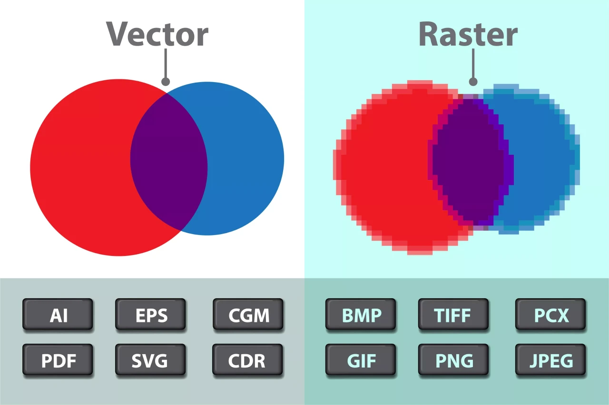

# Free UI course Vectors and images in UI

only texts is not enough to convey concepts. Also, keep in mind that most users connect better with visual content. So, it is better to use vectors and purposeful images in UI design as much as possible.

In this part of the free user interface design tutorial , we are going to examine different types of images, including vector, real, and pixel. We would be happy if you would accompany us until the end of the article.

## Vector and pixel images

Images taken with a digital camera and generally real images are called real. These images are made up of pigments or square pixels, and the higher the number and resolution of these images, the more zoomable they are and the slower their quality degrades. Unlike real images, which are also called pixelated and raster, there are vector images that are made up of color and lines and never degrade in quality. There are many resources for both types, which we will introduce.

## Real or pastel images

There are many sources for using real images. You can use powerful tools like unsplash.com or pexels.com. Unsplash also has a plugin for Figma, which makes it easier to import images into your project. The two sites mentioned have very high-quality images from different regions and cities around the world. There are also a lot of high-quality and free mockups and thematic images on these two sites. These images are taken by professional photographers.

## Vector images – Vectors

Vector images help you convey a concept to your users in a high-quality, small-sized way. These images are designed with Illustrator or similar software. You can download many vectors using websites like freepik.com. Of course, this website also has real images. You can also download vectors from other websites like storyset.com and undraw.co. Of course, there are also many plugins that you can use to add valuable vector resources to Figma. If you work as a designer in the field of website design or user interface design , it is better to use images suitable for this purpose.

## Figma plugins for images

Figma has plugins for images with different themes. For example, plugins like remove bg remove the background of images. Storyset also has a plugin inside Figma and provides you with high-quality vector images. Drawkit and iconscout also have attractive and lovely vectors that have many free items in them. These two plugins also have websites. In addition to providing icons, the icons8 plugin also has many real images and vector images that you can use. Many other items are also introduced in the videos of this session. We suggest you watch the free Figma software tutorial to make working with plugins and designing easier for you.

## The impact of using vectors and images correctly in UI

The more attractive and functional images you use, the better your design will undoubtedly be. You can use various sites such as Freepick and Unsplash for this. In this part of the UI and UX user experience design course, we explained how to use vector and real images in UI and the accessories related to this important knowledge.
