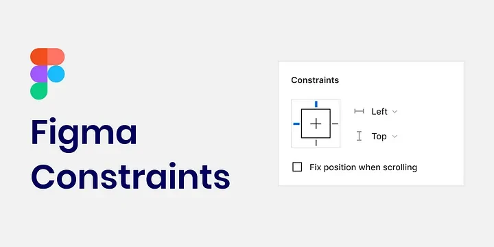
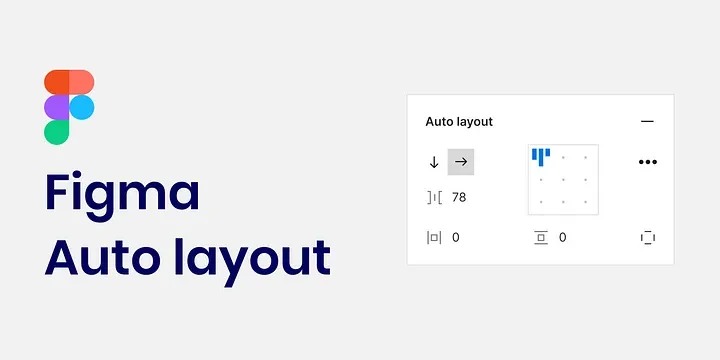

# Complete Auto Layout tutorial

with auto layout. This attractive feature of Figma has made for attractive and fast design. In this part of the free ui ux training course, we are going to answer the question of what is Auto Layout in Figma and what is its use? So we would be happy if you accompany us until the end of the article.

## Constraints

The Constraints feature in Figma allows you to specify how an element should be positioned or sized within a Frame. This way, you can place elements in a Frame either statically or dynamically. For example, you can place a button inside a card so that the width of the button increases with the size of the card. Or, the button can remain the same size. (It’s a bit difficult to describe Figma’s Constraints and Auto Layout in text, so I highly recommend watching the video.) There’s also a free project-based Figma tutorial on the site. This tutorial will definitely help you learn how to design.

## Figma's Auto Layout feature and responsive design assistance

When using Auto Layout, you don't have to manually adjust the size of each object. It does it automatically according to your specifications. It saves you time and effort when working with UIKit, responsive and complex designs. You can Auto Layout a Frame or any other element with Shift + A. After doing this, you can set the amount of space between the elements (Margin) and the surrounding space (within the frame) (Padding).

If you are familiar with html-css, I must say that Figma's Auto Layout structure is derived and similar to the Flexbox structure in CSS. You should Auto Layout the frames you create in Figma as much as possible. You can even implement a fully responsive design by Auto Layouting the main frame of the project.

Look at the image above. This is the same image we talked about in the spacing session. Of course, we want to look at it through the lens of Auto Layout. The Margin is set to 16 and the Padding is set to 24. If you edit the text in the middle of this card and increase or decrease its content, the content of the page adjusts itself. Without messing up the Margin and Padding spacing. Now, suppose this card wasn't Auto Layout. You had to re-spacing everything with a minor change.

Extend this to the entire page, now the mobile and tablet version. So if this feature wasn't attractive, we would have to spend a lot of time editing and correcting spacing. Now, let's say the project is 100 pages. For example, an application. So no matter how you think, the life of a UI designer would be disrupted without Auto Layout!

## Design neatly with Figma's Auto Layout

A design gains value and meaning when it is designed in a regular and responsive way. Figma's Auto Layout feature allows you to have a regular and principled design. In this part of the ui ux course, we explained how to use Auto Layout in UI and the accessories related to this important knowledge.
