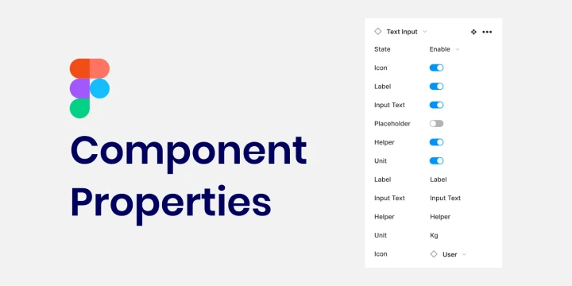
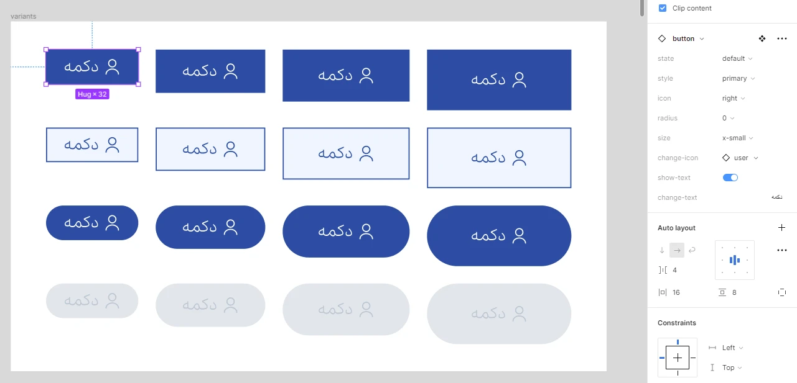

# Components and Variants in Figma

The features in Figma software make designing easier and more enjoyable. For example, if you have designed a large project and then the client asks you for changes, with the variants and components in Figma, these changes can be made in the blink of an eye. In this part of the free ui ux training course, we are going to discuss Variant in Figma as well as components. So we invite you to join us until the end of this session.

## What exactly do components do in Figma?

Let's say you have a large store project. In addition to the wireframe and mobile prototype, this store also has a tablet and desktop version. In addition, it has more than 80 pages. This project will definitely have a header and footer. Now the client wants you to change, for example, the background color of the header and the shopping cart icon. What do you do? Do you make each of them manually? If so, that project will be finished in a year!

Your solution is to use components. This cool feature of Figma allows you to componentize elements that are going to be repeated. You can do this with the Ctrl + Alt + K button. This way you can manage similar elements and change them all at the same time. Such as headers, footers, componentized icons, buttons, checkboxes, radio buttons and any UIkit you create that is going to be used more than once on the page. Even blog and product cards, sliders and generally larger UIkits can be componentized.

## Creating Properties and Variants in Figma

In this video we created a button component. This component had 192 different states. Different states, styles, sizes and curves. To be able to create different aspects of your component, use variants. Like different color and size states. Of course, Figma Properties, apart from variants, have 3 other ones that we taught in the full video. We will also mention them here. Note that these 3 items below, along with variants, only work when you have a component.

- Boolean value: Exactly like in programming, it has the states 0 and 1. For example, whether a button has an icon or not. Whether a text is displayed or not.
- Text value: This value is also used as a parameter to change the text inside a component.
- Instance Swap value: This value is used when you have another internal component inside your component. Suppose the button you created, apart from being a component itself, also has an icon inside it, which is also a component and the user (UI designer) may want to change that as well.

Of course, the things you see in the image are just part of the button uikit that we built together in the video. But if you look closely at the image, you'll see that on the right side, there are the same variants, text and boolean variables, and instance swap.Don't miss this interesting feature, namely components in Figma and variants, and even if you were able to watch the video a few times to master this feature, this part may seem a little difficult at first and really requires a few times of practice.

## Easy design with variant and component capabilities in Figma

If you use variants and components in Figma correctly, you will definitely not be bothered when making design changes. In this part of the Interface Design and User Experience course, we explained the variants and related components of this important knowledge
