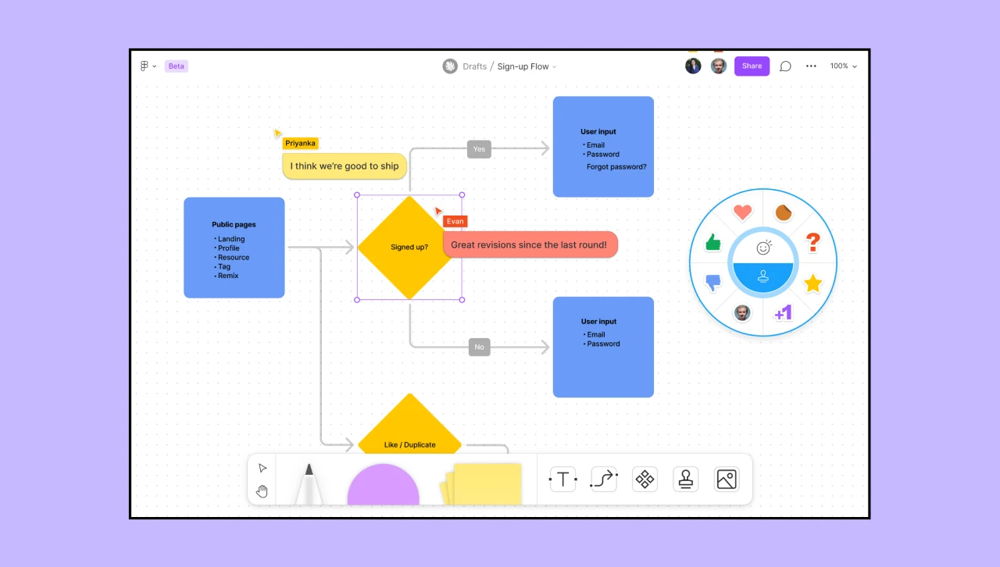
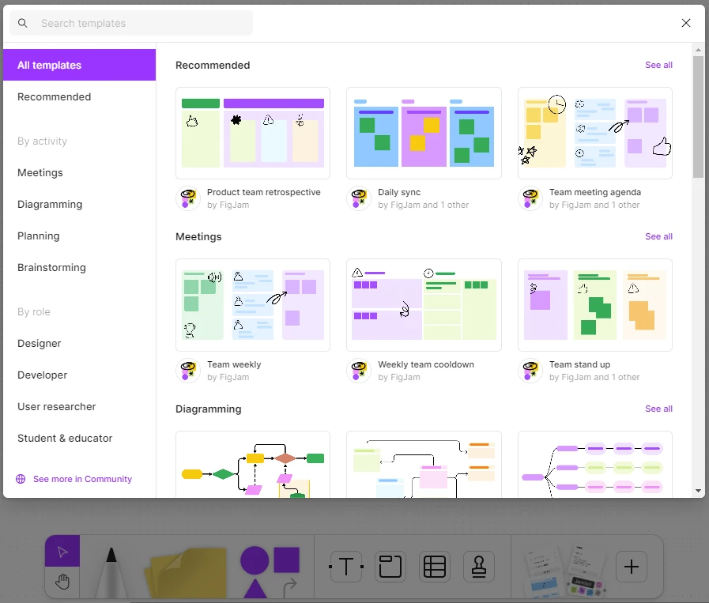

# Figjam training and Userflow design

Figma software provides users with ready-made designs in the Figjam section to provide information such as personas, competitor analysis, and user experience research. Using this software, you can use the default designs as quickly as possible. In this part of the ui ux training we are going to teach figjam. So, we invite you to join us until the end of this session.

## How does figjam help with UX?

Figjam software is part of Figma software itself. This section is for designs mainly related to the world of user experience, except for user interface issues. The reason for this is that we use Figma's own design file for wire frame and prototype design, with various topics such as applications and stores, etc. But Figjam is mostly used for designing information such as user flow, personas , research stages, competitor analysis tables, diagrams, charts and graphs, Mind Map design and anything else that can help the user experience process. For this reason, we recommend that you make figjam training your priority.

FigJam is exactly like the main part of Figma, with team activities, commenting and mentioning other users, access via the share menu, and even widgets and plugins. You can even copy your designs from FigJam to Figma.

## FigJam ready-made templates and the use of artificial intelligence

FigJam's ready-made templates section will help you a lot. There are various types of templates for the topics we mentioned above in FigJam. You can speed up your work by using them. In addition, FigJam has recently provided the ability to use artificial intelligence to generate the structures desired by the designer, in addition to ready-made templates.

## Fierce competitors FigJam, Miro and Whimsical

You may not believe it, but Figma has strong competitors. Of course, these two tools and other similar tools only share the same theme as Figma and often do not have the design capabilities of Figma. Like Figma, miro and whimsical have a variety of capabilities, a wide variety of templates, teamwork, and a whole host of other features. We recommend that you create an account at least in these two tools, which are both online and web-based, and work with them a little and become familiar with them.

## Userflow design tutorial in FigJam

Using the FigJam tool, you can easily design userflow. (We have taught this in the video of this session) Of course, it should be noted that userflow design makes sense when you advance the user experience process with a good hierarchy. In other words, you should do persona and research and also have the information architecture in a good place and then design userflow. If you remember, in previous sessions we explained information architecture and userflow with its sub-concepts. For example, we explained task-flow and wire-flow. Therefore, we will refrain from repeating these topics. If you wish, be sure to watch the information architecture session if you have not seen it.

## Easy userflow design with FigJam software

Using the default designs of the Figjam software, you can easily design different types of user-flows in the fastest possible time. In this part of the UI/UX (User Interface and Experience Designer) course, we will teach you Figjam and userflow design.
