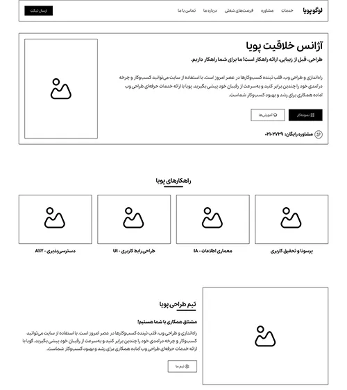
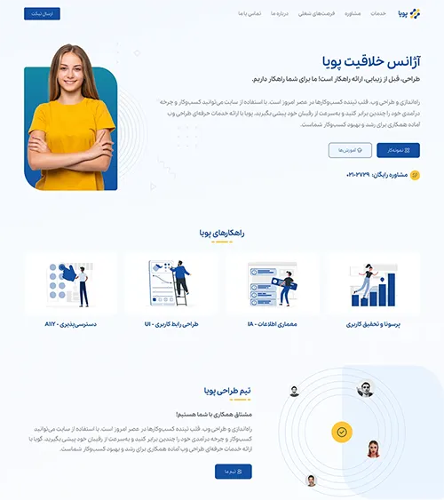

# Web wire-frame design

Sometimes a designer may spend a lot of time and implement the design in all its details. But in the end, it is not accepted by the client. What happens? No doubt, a lot of time is lost. But we can start the same process with a wireframe design first to get initial approval of the design. Then we can safely go into more details such as color, style, typography, components in Figma and images.

In this ui ux course, we are going to discuss wireframe design in Figma, or low fidelity. We also want to answer the question, what is a wireframe? By learning these topics, we will save more time in design. So, we invite you to join us until the end of this free ui training session.

## Low fidelity and high fidelity design

As mentioned in previous sessions, user interface design is divided into two parts: low fidelity design (sketch and wireframe design) and high fidelity design (prototype design). Of course, it can be divided in another way. Here, the division is based on the amount of detail. There is no detail in sketches and wireframe design. Colors, complex components, images, interactions, and even typography and grid systems may not be present with the same precision as in prototypes.

## Sketch Design

A sketch is a hand-drawn design made by designers. This design does not only include the user interface. Architects, painters, face designers, logo designers, even carpet designers use this method to implement what they have in mind. In user interface design, a sketch, similar to the other mentioned specialties, is simply done with paper and pen. Sometimes the sketch design in UI is annotated so that its details can be better remembered later. It is even possible to use line drawing instead of real texts. Similar to the image you see, this has been done in some parts.

A sketch is a design that is in your mind. Now you want to put it on paper. Obviously, this design is simple and there are no design details in it. It may even be irregular in its lines. Some people don't even use a ruler to draw, and this is not necessarily a problem with sketching because we don't want to spend a lot of time on it.

## Wireframe Design

A wireframe is a sketch, but a little prettier! In fact, a wireframe is a sketch imported into the software that has a little more detail than a sketch. Some wireframes may be designed more simply and some may have a little more detail. But what all wireframe designs have in common is the absence of color schemes, images, interactions, and complex components, and anything that would take time to implement the project.

If we want to give a reason for implementing wireframe design, we must say that wireframes or low fidelity design in general save money and time. When we implement the design as a wireframe in Figma, the entire design moves forward with much less cost and time. Then, talking to programmers, other members of the product design team, and stakeholders and the client in general helps us to prevent possible errors and problems in the future as much as possible. This preventive approach, especially in large-scale products, will help a lot in advancing the work and saving resources and manpower. Many professional designers may implement a sketch or wireframe design with less detail before designing the site (without the client asking them for a preliminary design or wireframe) to better advance their work.

Look at the image above. Both are wireframes. The wireframe on the right has more detail. But it is still a wireframe and is a long way from the finished UI project. The wireframe on the left is similar, just a little simpler. To display images, we usually either create a cross inside the boxes or use an icon that represents the image, giving the person viewing the wireframe a sense of the box that the image will later be placed in.

## At what stage of the UX process is a wireframe designed?

After doing the customer persona and user research, it is obvious that we are still far from implementing the UI. Other topics such as accessibility, usability and information architecture also need to be done. (Of course, some of these things are followed after UI and the UX cycle is always ongoing). Wireframing is done after information architecture. That is, when you have done the Card Sorting tests and Userflow design.

The important thing to note is that wireframes are only viable when you have a Userflow. Of course, if your project is one or just a few pages, you can start the UI without a Userflow . But let's say you have an app or online store that has over 80 pages. It also has a profile and a shopping cart process. Also, with the store filters and the process it has, you will definitely need to have a Userflow and design your wireframe according to it.

After implementing the wireframe, the next steps are to create a style guide and components, and finally implement the project prototype. In the two images above, you can see the wireframe and prototype. We will talk more about prototypes in the next session . Note that because this is a practice and practical task, be sure to watch the videos in this session and ask us any questions you may have.

## Save time with wireframe and sketch design

Using wireframe design, we can first implement the design we have in mind in general. After the design is approved by the employer, we can now go into more detail in our design. In this part of the user interface design tutorial, we explained wireframe design for UI projects and the accessories related to this important knowledge.
