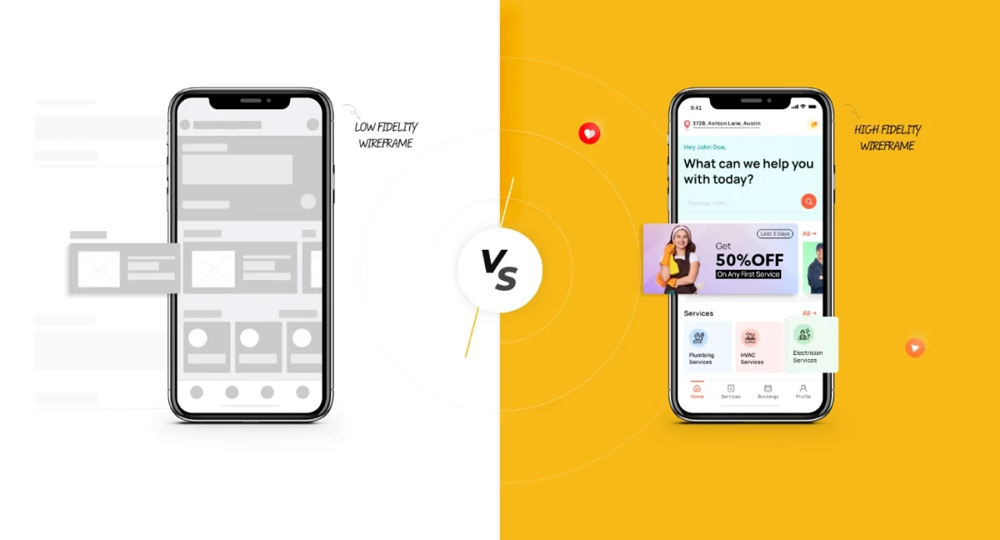
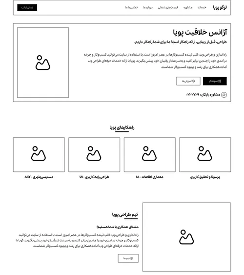
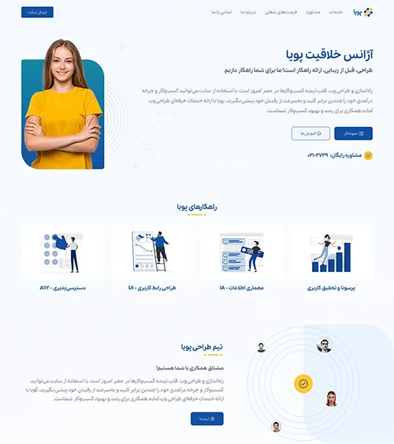

# Web prototype design

For many people, wireframe and sketch design may not be enjoyable. Because these designs have no color or surface. But in the prototyping stage, we go from the world of black and white to the world of color. After designing the project's wireframe, it's time to design the prototype. Implementing this section means that we are no longer at the low fidelity design scale and our design has reached the high fidelity design stage. At this stage, project details such as colors, precise typography and grid system, interactions, spacing, precise text and content, images and even video will be added. In addition, the project's ui kits are also completed.

In this session of the course, we plan to take a step forward in design and move on to prototype design in Figma. We also want to answer the question of what does a prototype mean? In this episode, we would be happy if you would accompany us until the end of this episode.

## What does high fidelity scale design involve?

In the previous session, when we talked about wireframe design , it was observed that in order to facilitate the implementation of the project and prevent decision-making errors and waste of time and money, it is better to first implement a wireframe (low-fidelity). But once the wireframe is implemented, in the next stages we move on to high fidelity. Implementing the prototype design includes adding colors, images, components, style guides, and completing the project. It is not necessarily correct to say that the prototype is necessarily the same wireframe that has been completed and nothing has changed. For example, a section may be implemented in the wireframe. The client initially agrees to its implementation, but later, for business reasons, that section is removed and not implemented in the prototype construction stage.

The image above is a good example of a prototype in a graphic user interface design project. Note that providing user interface design tutorials in the form of textual content can sometimes be difficult. Therefore, we definitely recommend that you watch the 4 videos in this session carefully and ask us your questions. In addition, if you did not watch the previous session, which was related to wireframe design, be sure to watch them as well to gain a grasp of the design of these two categories.

## Let's take design one step further by building a prototype.

To design a prototype, we need to move away from the gray world of wireframes and delve into more details in the design, including color, typography, style guides, components, and images, to make our design more complete. In this part of the user interface design course, we explained the prototype training in Figma for UI projects and the accessories related to this important knowledge.
