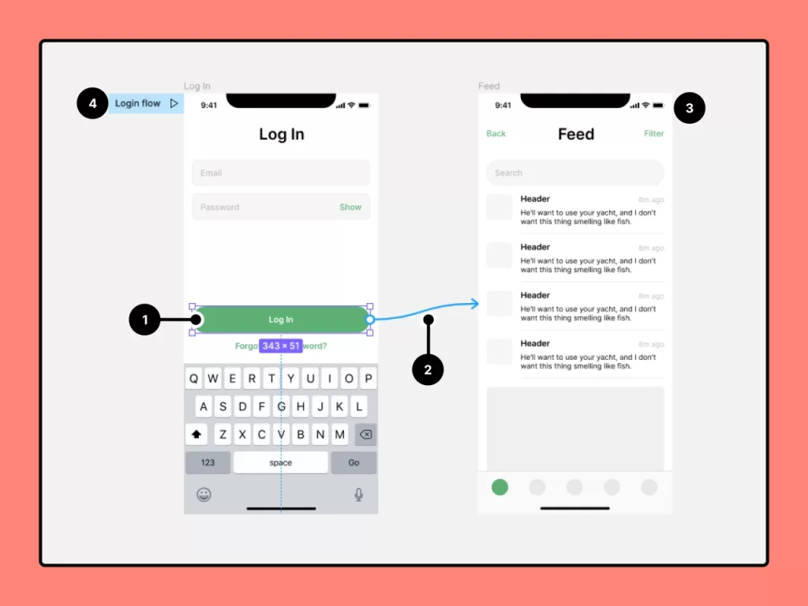

# Mobile application prototype

A mobile application or site page becomes important when it uses different elements to take us to other pages. In this case, we can access the service or page we want. For example, when we enter our login information and click on the Login button, we need to be redirected to another page to be able to fulfill our need. This operation is possible using a prototype. In this part of the UI UX course, we are going to examine the mobile application prototype. We would be happy if you would accompany us until the end of this session.

## The word prototype in Figma has 2 different meanings

So far, we have once mentioned the term prototype with the concept of low fidelity design and adding details to the project. But in Figma and in UI in general, the term prototype has another meaning, which is connecting pages and creating interactions. On the right side of the Figma software interface, there are 2 tabs, which are design and prototype. Until today's session, most of our training was in the design tab. But today's discussion is about the prototype tab.

Now what is the topic of this tab? In fact, it is in this tab that you connect your pages and frames to each other. Of course, you can also create prototypes between your variants, which is the topic of the next session, interactive components . Suppose you click on a food item in the Snap software. It scrolls to the middle of the page, or for example, you click on the hamburger menu of the Telegram application and a menu opens in Drawer mode. Or you click on a button to go from one page to another. All of this is created with the prototype tab.

## Is the Prototype tab just for mobile app design?

Absolutely not. It is true that mobile applications (sometimes) may have more pages. But this does not mean that we cannot create interactions and animations for other topics. You can create attractive and at the same time functional and suitable interactions for any project style using these golden lines of Figma prototypes. Of course, the topic of the video content of this session has also been chosen as mobile applications. Because regardless of the website project we have done, by the end of this course, you will be able to work on topics related to mobile applications.

I'll leave you with a visual guide to Figma prototyping . Both the video tutorial and the original language video are on Figma's own site. In the video of this session, the Prototype tab section in Figma + a mobile app prototype project has been implemented in detail, so be sure to watch it and ask us any questions you may have.

## Taxi mobile project exercise file

There are many design files in the Figma community and on the internet in general that can be used for practice. This includes stores, websites, apps, and anything else. But the project file for this session is also included here for you to use if you wish.

[Download the taxi companion project](https://rasam.agency/wp-content/uploads/hamrah-taxi.fig)

## Connecting pages to each other through prototypes

Using prototypes in mobile applications, we can navigate to different pages to access the desired pages. In this part of the UI/UX course, we explained the prototype section in Figma + Prototype of a mobile application project.
