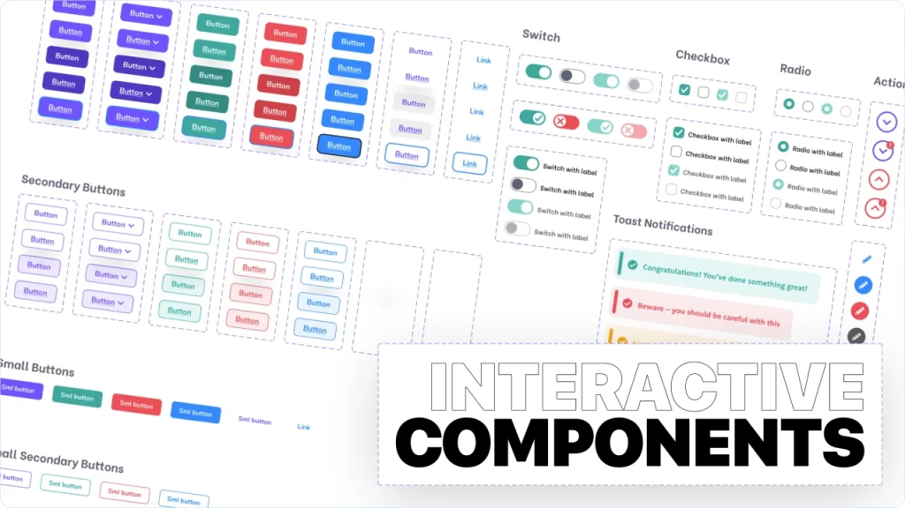

# Interactive Components Design

## Why should we use interactive components?

If you remember and have watched the previous sessions, we explained the tutorial on creating components and variants in Figma in its specific session. In the previous session, you also learned about creating an application prototype in Figma . But the point is, can we also create interactions between our variants? For example, we can make the same button component that we created change color or style with click or hover. Or, for example, we can create an accordion and make that component open and close with click. In this part of the tutorial on user interface design with Figma, we are going to create interactive components and variants. So, we invite you to join us until the end of this session.

Radio buttons, checkboxes, switch buttons, forms, and any component we create will need to be interactive components after creating different variants and states. You might be wondering if you can't create a button or component in the previous session when the Figma Prototype Tab tutorial was explained? The answer is that the same tab is used. But between variant items. In fact, we can say that nothing new has been added. In the previous session, you created components by connecting pages or frames to each other, but here you connect variant options to each other.

Moreover, by creating these attractive interactive components, you have also made your work easier. In fact, you create them once and you may use them on many pages. In other words, if you create your hamburger menu, you can use them on all pages and later it is easy to manage, edit and interact with the component in question and make it possible to edit the hamburger menu wherever it is used. This feature will greatly increase your speed.

## Examining Interactive Components in Practice

In this part of the UI/UX (User Interface and Experience) Designer course, we explained the interactive component design training for UI projects and the related knowledge.
