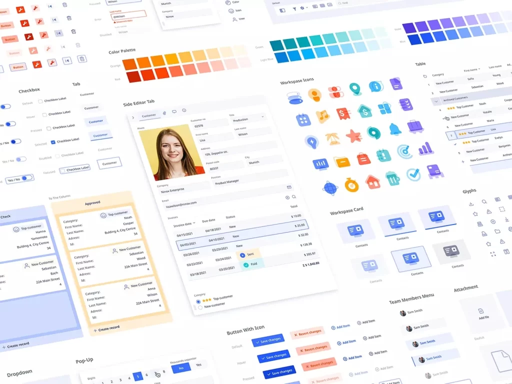
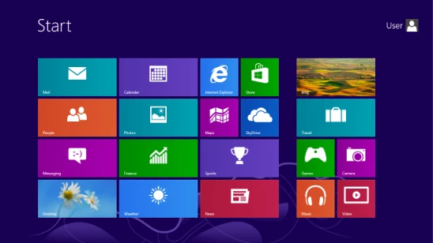
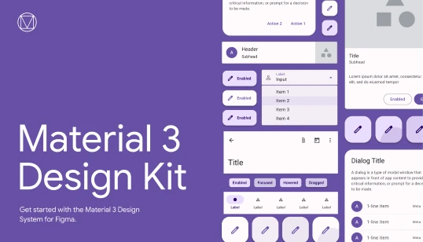
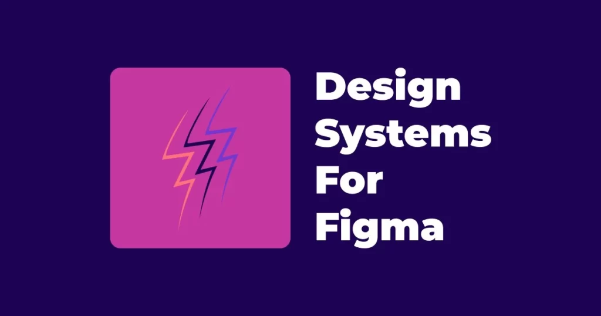

# Introduction to Design Systems

Just as there are different styles and structures for creating a work in the art of painting, this is also important in designing websites or digital products. Every company or business uses a specific style for design according to its needs. In this session of the User Experience and User Interface course, we intend to examine the topic of system design in UI. So we invite you to join us until the end of this part.

## Definition of system design

A design system is an integrated and independent structure of user interface design elements. The world's largest companies have their own design systems. In fact, they believe in a specific style of design and create various UI elements in accordance with that style and sometimes provide them to designers for website or application design. The concept of a design system is more general than UIKit. Like comparing formal wear to a suit. In fact, UIKit can be one or part of those elements.

It is true that the system design is created before the project prototype is implemented. But this does not mean that it cannot be changed during the project. Obviously, over time, the employer's opinion may change, our own opinion may change, our knowledge may change, or any other reason. Therefore, the system design may change and be updated over time.

## What is included in system design?

- Style guide or guide to designing and adding styles to Figma (which, if you remember, includes colors, typography, grid system, effects).
- Designing the UIkits required by the project, such as: buttons, checkboxes, radio buttons, switch buttons, forms, calendars, and any other elements that we may need in that project.
- Icons are another part of the design system. We may design them custom, we may use a ready-made package, or even Figma plugins. In any case, they must be present in the design system.

## Why should we design a system?

Of course, system design may not be done for all projects. Especially small projects where creating a simple style guide and a few UIkits may solve our problem. But in larger projects, especially projects that are carried out as a team, this category is very important. Even if it is not a team project, eventually you may leave that company one day and someone else will come. If the system design is made in accordance with the brand book and persona of that company, the new expert can easily carry out the work. The delivery of the work will be easier and even the speed of implementation will increase noticeably.

Suppose you want to set a 4 pixel radius or curvature for the buttons. If the design system and uikit are not working, other teammates may not follow it well and this difference in values ​​will cause many problems for the client and the programmers. According to the atomic design rule explained in the previous sessions, we should design small elements first so that we can move the project forward easily. Remember the example of building apartments with prefabricated equipment. The reason why these buildings in China can be built in a few days is because they had already prepared the elements they needed.

## Introducing the world's leading systems design

The world's leading companies have their own design systems, and in some cases, these design systems are so popular and widely used that some companies consider knowledge and experience with that design system a hiring advantage for the job seeker when hiring. So, keep in mind that you should at least have a moderate to high level of proficiency in Google's Material Design system.

## Skeuomorphism

This style of design is the implementation of UI elements in accordance with what the user perceives or even touches in the real world. This style existed in older versions of the iPhone. In this style, increased design time and cost, increased site size and reduced speed, implementation complexity for programmers and responsive design problems, etc. are considered.

## Flat Design

Microsoft introduced a new style of user interface design with Windows 8. This style, which was later called flat design and later fluent, no longer had the previous complexities and presented designers with a very simple style by eliminating curves, shadows, animations, bright colors, etc.
Of course, Microsoft changed and updated its system design over time after the introduction of Windows 10 and 11.

## Google Material Design

Google's argument was a little different. Google embraced flat design but claimed that Microsoft had gone too far in removing Skeuomorphic elements.
Google believed that it could create a more attractive UI with Material, which itself is based on flat design. In fact, Material uses shadows, animations, and curves more than Microsoft.

## Other design systems

Various other design systems from major companies in the world were also presented. The base design system from Uber, the design systems from Amazon, Atlassian, Mah, Shopify, and to top it all off, the design system from Apple, and many other design systems. In addition, Iranian design systems such as the Mah design system (translated from the English version), the Morph design system, and the Saint design system related to Cafe Bazaar (Wall).

## Where can we get system design?

There is a website called designsystemsforfigma.com that you can use to view popular Figma design systems and add them to Figma. Note that this website only links to the design systems on its site, and all the links are on the Figma site itself. Therefore, you can also find them from Figma's own community and search on Google.

## Choosing the right system design in UI

Without a doubt, by choosing the right design system in ui design, you can advance your design better and faster in line with your business brandbook. In this part of the ui ux online course, we explained the training and introduction of system design and the accessories related to this important knowledge.
