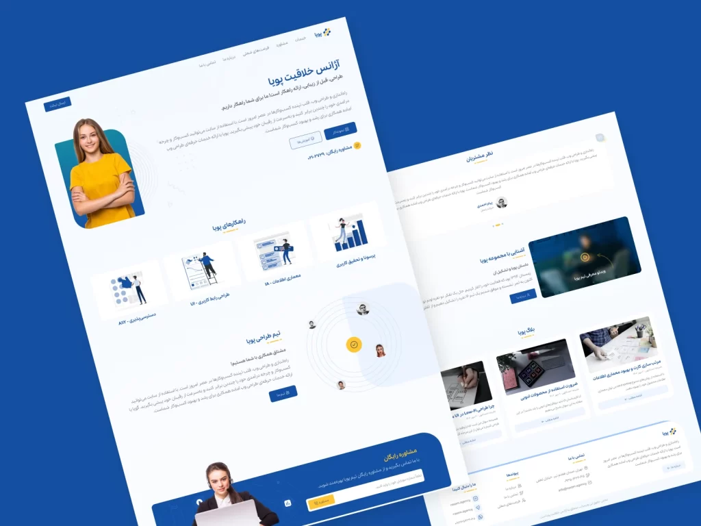
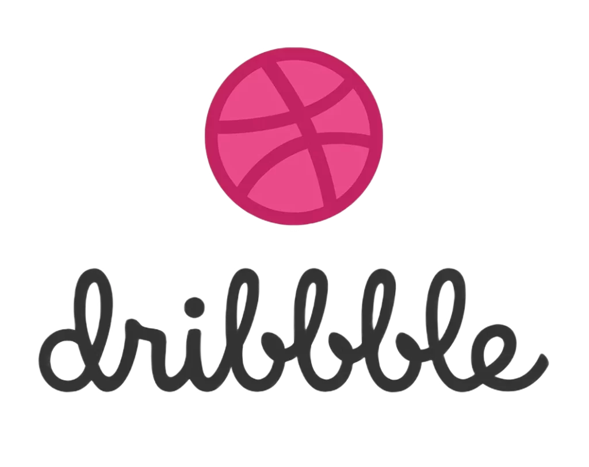
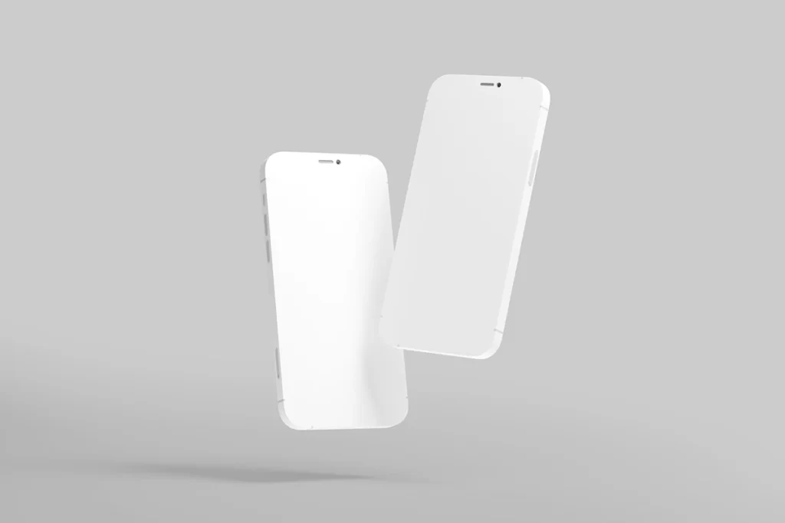
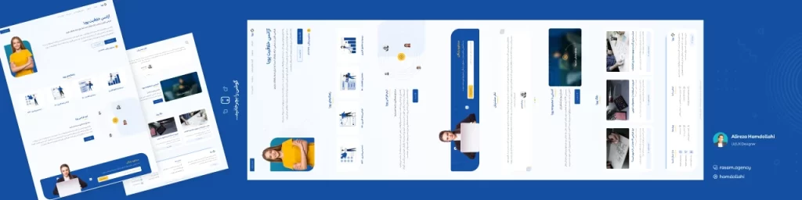

# Mockup and publishing the project on Instagram and Dribbble

When we create an attractive design work, it is better to expose it to different users to hear different opinions. After designing in Figma, it is better to prepare our final output in the form of a mockup so that we can share the design with many people. In this part of the user interface design training course, we are going to discuss the topic of mockup in Figma and publishing it on some platforms such as Dribbble and Instagram. Of course, if your project has an employer, you must also **deliver the project and handoff** , which we will discuss in the upcoming sessions. We invite you to join us until the end of this session.

## What is a mockup and why should we create one?

Suppose you have prepared a delicious dish. Obviously, you value the time you have spent. You will put it in a nice dish and you will definitely decorate it. Your project also has this characteristic. You have spent time and energy for it and by mockuping the project, you will definitely get the opportunity to be seen, talk to employers and collaborate more. The mockup is the output of your project, but sometimes by decorating and applying a series of simple graphic works, it can be mockuped and included in the relevant platforms.

For mockups, you can use plugins and files from the Figma community, online tools, or even design by yourself. Dribbble, Behance, Instagram, LinkedIn, and Pinterest are all suitable platforms for posting your mockup projects and portfolios.

## What is Dribbble and how does it help us?

Dribbble is a powerful platform for showcasing your design projects. These projects are on various topics and do not just include UI design. Just create an account on Dribbble and share your portfolio. This will be an opportunity for you to get projects and be seen. Of course, provided that we have spent time on our project, both quantitatively and qualitatively. Designers usually include a link to their Dribbble profile in their resume, LinkedIn, and Instagram so that people have access to their portfolios.

## Introducing tools and plugins for project mockups

You can find ready-made mockup images by using sites like unsplash.com and pexels.com and searching for the word mockup. Websites like freemockupworld.com, free-mockup.com, mockupworld.co, and smartmockups.com are also online tools that you can use to create good mockups. Additionally, by searching for terms like mockup and clay mockup in the Figma community, you will find many free and paid mockups.

The animocks package is also a powerful package for creating mockups that is available in the Figma community. Search for the same two terms Mockup and Clay Mockup in Figma plugins. You will definitely find many things. By searching for words like iphone 14 and even its lower versions, you will find good mockups in the Figma community, both files and plugins.

## What is Clay Mockup and why is it a good choice?

There is a plugin called Clay Mockup in the free software Figma. It is a good plugin, but what we mean by the term Clay Mockup here is not just this plugin. Rather, it means using very simple and minimal mockups. This type of mockup is new and popular and is used more by designers today. In contrast, there are other mockups that are so-called realistic and use real images for the mockup.

Both are good and we are not saying that you should only use Clay Mockup. But nowadays Clay Mockup is more popular and used by designers more.

## Mockup and publishing the project on Instagram

We will explain in the next session about designing posts and stories and Instagram content in Figma . But in this session, our focus is on project mockups. Both on Instagram and on other platforms. On Instagram, images are inserted either as a square, i.e. 1080 x 1080 pixels, or as a rectangle, i.e. 1080 x 1350. This means that the height is 25% greater than the width. Both are common and used.

To mockup the project on Instagram, we can draw a frame and set its width to the number of image slides. Its height can also be one of two sizes: 1080 or 1350, which depends on whether you want to make the post square or rectangular. Once the design is complete, we can slice and export it using Figma's Slice tool (click K). In the image above, there are 5 slides that are first designed in one piece and then sliced ​​and exported (completely done in the video tutorial).

## Mockup output in Figma and insertion into different platforms

After completing your design using the mockup feature in Figma, you can upload it to various platforms such as Instagram, Dribbble, and Pinterest. In this case, you can also get feedback from users. In this part of the UI/UX interface and user experience design course, we explained how to mockup a project in Dribbble and Instagram and the accessories related to this important knowledge.
