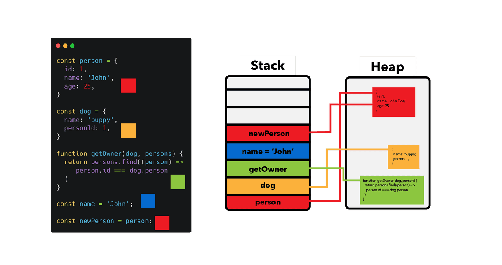

# Memoization

## How the Objects Store in Memory

JavaScript splits memory allocation into two main structures: the Call Stack and the Heap.


1. The Call Stack (Fast & Fixed Size)
   - Stores simple, primitive values directly (like numbers, booleans, or null).

   - Also stores variable names and their memory pointer (reference).

   - Small and highly structured, but limited in space.

2. The Memory Heap (Unstructured & Flexible)
   - A large, unstructured region of memory designed for dynamic data.

   - Holds actual object bodies, arrays, and functions—items whose size can grow or shrink at runtime.

### Step-by-Step Execution

When you write:

```Javascript
const user = { name: "Alice", age: 30 };
```

Heap Allocation: JavaScript allocates space in the Heap to hold the payload { name: "Alice", age: 30 }. This payload gets a specific memory address (e.g., #0x8f22).

Stack Assignment: JavaScript creates the variable user on the Call Stack. Instead of storing the object directly, it stores the address #0x8f22.

| CALL STACK             |                   | HEAP                                                                                  |
| :--------------------- | :---------------: | :------------------------------------------------------------------------------------ |
| **`user`** `(#0x8f22)` | $\longrightarrow$ | **`#0x8f22`**<br>`{` <br>&nbsp;&nbsp;`name: "Alice",`<br>&nbsp;&nbsp;`age: 30`<br>`}` |

When working with objects, there is a fundamental difference between mutating an existing object and reassigning a variable to a brand-new object.

Here is how both operations alter the Call Stack and Memory Heap:

**Scenario 1:** Mutating an Object
Mutating modifies the existing contents inside the Heap. The memory address on the Call Stack stays identical.

```JavaScript
const user = { name: "Alice", age: 30 };

// Mutation
user.age = 31;
```

```plaintext
CALL STACK                      MEMORY HEAP
+---------------+              +----------------------------------+
|               |              |                                  |
|  user         |------------->|  [#0x8f22]                       |
|  (#0x8f22)    |              |  { name: 'Alice', age: 31 }      |
|               |              |                                  |
+---------------+              +----------------------------------+
```

- **Call Stack:** The variable user still points to #0x8f22.
- **Memory Heap:** The data living inside #0x8f22 is updated directly in place.

**Scenario 2:** Reassigning an Object Variable
Reassigning creates a completely new object at a new location in the Heap, then updates the pointer on the Call Stack.

```JavaScript
let user = { name: "Alice", age: 30 }; // Stored at #0x8f22

// Reassignment
user = { name: "Bob", age: 25 }; // Stored at #0x9c44
```

```Plaintext
CALL STACK                      MEMORY HEAP
+---------------+              +----------------------------------+
|               |              |                                  |
|               |   (broken)   |  [#0x8f22]                       |
|  user         | - - - - - - X|  { name: 'Alice', age: 30 }      |
|  (#0x9c44)    |              |  (Unreferenced / Garbage Target) |
|               |              |                                  |
|               |              |  [#0x9c44]                       |
|               |--------------|->{ name: 'Bob', age: 25 }        |
+---------------+              +----------------------------------+
```

- **Call Stack:** The value of user changes from #0x8f22 to #0x9c44.
- **Memory Heap**: A brand-new object is created at #0x9c44.
- **Garbage Collection:** The original object at #0x8f22 has zero references pointing to it, making it eligible to be freed from memory.

## understand how Javascript compare values

based on previous subject we have:

```Javascript
const x = 2;
const y = 2;
x === y // =true, values are exactly the same
```

and

```Javascript
    const x = {id:2};
    const y = {id:2};
    x === y; // =false, values are the same but object's references are not the same
```

The fundamental reason for this difference lies in how JavaScript stores data in memory and how the strict equality operator (===) evaluates operands.

Here is the step-by-step breakdown:

1. **Primitive Values:** Compared by Value
   Primitives (numbers, strings, booleans, null, undefined, symbols, and BigInts) are immutable data types stored directly on the Call Stack.

   When you declare primitive variables:

   ```JavaScript
   const x = 2;
   const y = 2;
   x === y; // true
   ```

   Memory Allocation: The stack holds the literal value 2 in the slot reserved for x, and the literal value 2 in the slot reserved for y.

   Equality Check: The === operator compares the actual data values stored in those stack slots. Since 2 is identical to 2, it evaluates to true.

   ```Plaintext
   CALL STACK                        MEMORY HEAP
   +-------+-----------+          +-----------------------+
   |  x    |  #0x101   | -------->| #0x101: { id: 2 }     |
   +-------+-----------+          +-----------------------+
   |  y    |  #0x202   | -------->| #0x202: { id: 2 }     |
   +-------+-----------+          +-----------------------+
   ```

2. **Objects:** Compared by Reference (Memory Address)
   Objects (including arrays, functions, and standard {}) are complex, mutable data structures stored in the Memory Heap.
   When you instantiate two identical objects:

   ```JavaScript
   const x = { id: 2 };
   const y = { id: 2 };
   x === y; // false
   ```

   Memory Allocation:

   JavaScript creates a new object in the Heap at address #0x101 with content { id: 2 }.

   It creates a second new object in the Heap at address #0x202 with content { id: 2 }.

   On the Call Stack, variable x stores the address #0x101, and variable y stores the address #0x202.

   Equality Check: The === operator checks whether both variables contain the same memory address pointer on the stack, not whether the contents inside those heap addresses look the same.

   ```Plaintext
   CALL STACK MEMORY HEAP
   +-------+-----------+          +-----------------------+
   | x     | #0x101    | -------->| #0x101: { id: 2 } |
   +-------+-----------+          +-----------------------+
   | y     | #0x202    | -------->| #0x202: { id: 2 } |
   +-------+-----------+          +-----------------------+
   ```

   Because #0x101 !== #0x202, x === y evaluates to false.

3. **Achieving true with Objects**
   To make an equality check between objects return true, both variables must point to the exact same location in memory:

   ```JavaScript
   const x = { id: 2 };
   const y = x; // Copying the reference (address #0x101)

   x === y; // true
   ```

   ```Plaintext
   CALL STACK MEMORY HEAP
   +-------+-----------+
   | x     | #0x101    | ---\     +-----------------------+
   +-------+-----------+     >    | #0x101: { id: 2 }     |
   | y     | #0x101    | ---/     +-----------------------+
   +-------+-----------+
   ```

   Here, y holds a copy of the pointer #0x101. Because both variables hold the identical memory address, === evaluates to true.

## useMemo and useCallback

Both useMemo and useCallback are React Hooks used for performance optimization by memoizing data between re-renders, but they store different things in memory.

Core Difference

- useMemo memoizes the result of a calculation (a value).

- useCallback memoizes a function instance itself.

1. `useMemo`: Caching Computed Values
   useMemo runs your function during render and stores the returned value in memory. It only recalculates that value when one of its dependencies changes.

   ```JavaScript
   import { useMemo } from 'react';

   function ProductList({ products, filterText }) {
   // Expensive calculation: filtered list is cached until
   // 'products' or 'filterText' changes
   const filteredProducts = useMemo(() => {
      return products.filter(p => p.name.includes(filterText));
   }, [products, filterText]);

   return <div>{/* Render filteredProducts */}</div>;
   }
   ```

2. `useCallback`: Caching Function ReferencesIn JavaScript, functions are objects. Every time a parent component re-renders, any function defined inside it is created as a brand-new object in memory (a new reference).useCallback maintains the same memory reference for a function across renders unless its dependencies change.

   ```JavaScript
   import { useCallback } from 'react';
   import ChildComponent from './ChildComponent';

   function ParentComponent({ id }) {
   // Keeps the exact same function reference in memory across renders
   const handleClick = useCallback(() => {
   console.log('Clicked item:', id);
   }, [id]);

   return <ChildComponent onClick={handleClick} />;
   }
   ```

If ChildComponent is wrapped in React.memo, passing a memoized handleClick prevents ChildComponent from re-rendering every time ParentComponent updates.

### How They Relate Under the Hood

useCallback(fn, deps) is effectively shorthand for useMemo(() => fn, deps).

```JavaScript
// These two are functionally identical:
const memoizedCallback = useCallback(() => {
doSomething(a, b);
}, [a, b]);

const memoizedCallback = useMemo(() => {
return () => {
doSomething(a, b);
};
}, [a, b]);
```

### useCallback usage scenarios

**Scenario 1:** Passing Callbacks to `React.memo` Child Components
This is the most common use case. If a child component is wrapped in `React.memo`, it checks whether its props have changed before re-rendering.

Without `useCallback`, the callback function gets a new memory address on every parent render, breaking React.memo and forcing the child to re-render anyway.

```Javascript
import {useState, useCallback, memo} from "react"

const ExpensiveListItem = memo(({item, onDelete})=> {
return (
    <div>
      <span>{item.name}</span>
      <button onClick={() => onDelete(item.id)}>Delete</button>
    </div>
  );
})

function ItemList({ items }) {
  const [selectedId, setSelectedId] = useState(null);
  const handleDelete = useCallback((id) => {
    axios.delete(`/api/items/${id}`);
  }, []);
return (
    <div>
      {/* Changing selectedId re-renders ItemList,
         but ExpensiveListItem SKIPS re-rendering */}
      {items.map(item => (
        <ExpensiveListItem key={item.id} item={item} onDelete={handleDelete} />
      ))}
    </div>
  );
```

**Scenario 2:** Functions Used Inside `useEffect` Dependencies
If a `useEffect` hook calls a function defined in the component scope, that function must be declared in the `useEffect` dependency array.

Without `useCallback`, the function reference changes on every render, causing the `useEffect` to trigger continuously in an infinite loop.

```Javascript
import { useState, useEffect, useCallback } from 'react';

function UserProfile({ userId }) {
  const [user, setUser] = useState(null);

  // ✅ Stable reference across renders
  const fetchUserData = useCallback(async () => {
    const res = await fetch(`/api/users/${userId}`);
    const data = await res.json();
    setUser(data);
  }, [userId]); // Only updates when userId changes

  useEffect(() => {
    fetchUserData(); // Safely called inside effect
  }, [fetchUserData]); // Only re-runs when fetchUserData reference updates

  return <div>{user?.name}</div>;
}
```

**Scenario 3:** Custom Hooks Returning Functions
When writing reusable custom hooks that expose helper functions, consumers of your hook might pass those functions into `useEffect` or `React.memo` components.

Wrapping returned functions in `useCallback` ensures your custom hook doesn't break performance optimizations in the components that consume it.

```Javascript
import { useState, useCallback } from 'react';

// Custom hook for API requests
function useToggle(initialState = false) {
  const [state, setState] = useState(initialState);

  // ✅ Guaranteed stable reference for consumers of this hook
  const toggle = useCallback(() => {
    setState(prev => !prev);
  }, []);

  return [state, toggle];
}
```

**Scenario 4:** Context Providers (`Context.Provider`)
When passing function handlers through a React Context, wrapping them in `useCallback` (along with wrapping the context value in `useMemo`) prevents every context subscriber in the app from re-rendering whenever the parent updates unrelated state.

```JavaScript
import { createContext, useState, useCallback, useMemo } from 'react';

export const AuthContext = createContext();

export function AuthProvider({ children }) {
   const [user, setUser] = useState(null);

   // ✅ Stable function reference
   const logout = useCallback(() => {
      setUser(null);
      localStorage.removeItem('token');
   }, []);

   // Combined with useMemo for the value object
   const value = useMemo(() => ({ user, logout }), [user, logout]);

   return <AuthContext.Provider value={value}>{children}</AuthContext.Provider>;
}
```

### When useCallback Actually Hurt Performance

`useCallback` actually hurts performance or adds useless overhead when used in scenarios where reference equality does not matter.

1. **High Memory Allocation & Dependency Overhead**
   Every time a component renders, JavaScript still creates the inline function inside useCallback—plus an array for the dependencies.

   React then executes an additional step to compare every element in the dependency array with the previous render's array using `Object.is`.

   ```JavaScript
   // ❌ WORSE PERFORMANCE: You pay for function allocation +
   // dependency array creation + shallow comparison
   const handleClick = useCallback(() => {
   console.log('Clicked');
   }, []);

   // ✅ BETTER: Fast, direct function creation with zero React hook overhead
   const handleClick = () => {
   console.log('Clicked');
   };
   ```

2. **Handlers Passed to Native HTML Elements**
   Standard HTML elements (`<button>`, `<input>`, `<div>`) do not perform prop comparisons. Passing a memoized function to a `<button>` provides zero rendering optimization because DOM elements re-render purely based on their parent component's virtual DOM diffing.

   ```JavaScript
   // ❌ UNNECESSARY: <button> does not care about reference equality
   function Form() {
   const handleSubmit = useCallback(() => {
      // submit logic
   }, []);

   return <button onClick={handleSubmit}>Submit</button>;
   }
   ```

3. **Handlers Passed to Non-Memoized Components**
   If a child component is not wrapped in React.memo, it will re-render every single time the parent re-renders—regardless of whether its props changed or stayed identical.

   ```JavaScript
   // Child is NOT wrapped in React.memo
   function ChildButton({ onClick }) {
   return <button onClick={onClick}>Click me</button>;
   }

   function Parent() {
   // ❌ POINTLESS: ChildButton re-renders anyway whenever Parent renders!
   const handleClick = useCallback(() => {
      console.log('Clicked');
   }, []);

   return <ChildButton onClick={handleClick} />;
   }
   ```

4. **Over-Capturing / Missing Functional Updates**
   When a callback updates state based on previous state, developers often include that state variable in the dependency array. This causes useCallback to regenerate a brand-new function reference on every single state change, completely invalidating the memoization.

   ```JavaScript
   // ❌ BAD: Function reference changes on EVERY count update
   const increment = useCallback(() => {
   setCount(count + 1);
   }, [count]);

   // ✅ FIXED: Using functional update removes
   // 'count' dependency, keeping the function reference completely stable
   const increment = useCallback(() => {
   setCount(prev => prev + 1);
   }, []);
   ```

### useMemo usage scenarios

`useMemo` caches the result of a calculation between re-renders, recalculating it only when its dependencies change.

Here are the 4 primary production scenarios where `useMemo` is appropriate:

**Scenario 1:** Preserving Reference Equality for React.memo Children
Even if a calculation is fast, creating a new object or array inside a parent component generates a brand-new memory reference (#0x...) on every render. Passing that non-memoized reference to a child wrapped in React.memo breaks its memoization, forcing it to re-render unnecessarily.

```JavaScript
import { useMemo } from 'react';

function Dashboard({ userData, theme }) {
  // ✅ Keeps the SAME object reference in memory unless userData changes
  const chartConfig = useMemo(() => ({
    data: userData,
    colorScheme: 'blue',
    showLegend: true,
  }), [userData]);

  return (
    <div className={theme}>
      {/* HeavyChart (wrapped in React.memo) SKIPS re-renders when theme changes */}
      <HeavyChart config={chartConfig} />
    </div>
  );
}
```

**Scenario 2:** Heavy Computations on Large Datasets
When processing, sorting, or filtering large datasets (thousands of rows) or performing computationally expensive math (like transformations or data parsing), useMemo prevents blocking the main thread during unrelated state changes.

```JavaScript
import { useMemo } from 'react';

function TransactionHistory({ transactions, filterCategory }) {
  // ✅ Prevents re-running expensive sorting & math when unrelated parent state updates
  const categoryStats = useMemo(() => {
    return transactions
      .filter(t => t.category === filterCategory)
      .reduce((acc, t) => {
        acc.total += t.amount;
        acc.count += 1;
        return acc;
      }, { total: 0, count: 0 });
  }, [transactions, filterCategory]);

  return <div>Total Spent: ${categoryStats.total}</div>;
}
```

**Scenario 3:** Stabilizing Dependencies for Other Hooks (useEffect, useCallback)
If an object or array is listed in the dependency array of a useEffect or another hook, a non-memoized object reference will cause that effect to execute on every single render, often causing infinite loops.

```JavaScript
import { useState, useEffect, useMemo } from 'react';

function SearchResults({ query }) {
  // ✅ Keeps queryParams reference stable
  const queryParams = useMemo(() => ({
    search: query,
    page: 1,
    limit: 20
  }), [query]);

  useEffect(() => {
    // Safely runs ONLY when query changes, not on every render
    fetchData(queryParams);
  }, [queryParams]);

  return <div>...</div>;
}
```

**Scenario 4:** Context Providers (Context.Provider)
Passing an inline object as a Context value creates a new reference on every render of the Provider parent, forcing every subscriber component in the application to re-render—even if the context state didn't actually change.

```JavaScript
import { createContext, useState, useMemo } from 'react';

export const ThemeContext = createContext();

export function ThemeProvider({ children }) {
  const [theme, setTheme] = useState('dark');
  const [userSettings, setUserSettings] = useState({});

  // ✅ Combined into a memoized value object
  const value = useMemo(() => ({
    theme,
    setTheme,
    userSettings
  }), [theme, userSettings]);

  return (
    <ThemeContext.Provider value={value}>
      {children}
    </ThemeContext.Provider>
  );
}
```

### When useMemo and useCallback Actually Hurt Performance

Adding memoization isn't free. Every time you wrap a value or function, React has to:

- Allocate memory for the wrapper function and dependency array.

- Iterate through the dependency array on every single render to perform shallow comparisons (Object.is).

If the computation is cheap or the child component isn't memoized, you pay the memory and comparison overhead for zero benefit.

Example A: Memoizing Cheap Calculations

```JavaScript
// ❌ BAD: Memoizing simple primitive operations
const fullName = useMemo(() => `${firstName} ${lastName}`, [firstName, lastName]);

// ✅ BETTER: Direct execution is much faster than dependency checks
const fullName = `${firstName} ${lastName}`;
```

## how to measure component calculation execution times using performance.now() to determine if useMemo is necessary.

Measuring execution time with performance.now() gives you exact millisecond-level data to decide if an operation warrants useMemo.

Step-by-Step Implementation
Wrap your calculation in performance.now() calls before and after execution:

```JavaScript
import { useState } from 'react';

function DataViewer({ items, filterQuery }) {
  // 1. Start timer
  const startTime = performance.now();

  // 2. Perform the calculation
  const processedData = items.filter(item => {
    return item.name.toLowerCase().includes(filterQuery.toLowerCase());
  });

  // 3. End timer and log duration
  const endTime = performance.now();
  const duration = endTime - startTime;

  console.log(`[Perf Check] Calculation took ${duration.toFixed(3)} ms`);

  return (
    <ul>
      {processedData.map(item => (
        <li key={item.id}>{item.name}</li>
      ))}
    </ul>
  );
}
```

Benchmark Benchmarks & Action Plan
Run the profiler/console while triggering re-renders (e.g., typing into an unrelated input or toggling state in the parent).

| Execution Duration | Category                  | Action Required                                                                             |
| :----------------- | :------------------------ | :------------------------------------------------------------------------------------------ |
| **< 1 ms**         | Fast                      | **Do NOT use `useMemo`.** Plain JavaScript handles this effortlessly.                       |
| **1 ms – 16 ms**   | Noticeable                | **Optional.** Consider `useMemo` if re-renders occur rapidly (e.g., on keypress or scroll). |
| **> 16 ms**        | Heavy (Drops below 60fps) | **Use `useMemo`** (or optimize/paginate the dataset).                                       |

Caveats to Keep in Mind

1. Development vs. Production: Always test with Production Builds or large mock datasets. React runs extra checks in Development mode that artificially inflate execution times.

2. CPU Throttling: Test on lower-end hardware or use Chrome DevTools' CPU 4x/6x slowdown option to simulate real-world mobile device performance.
