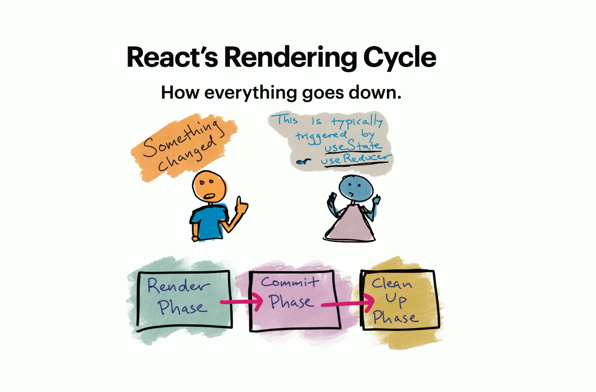
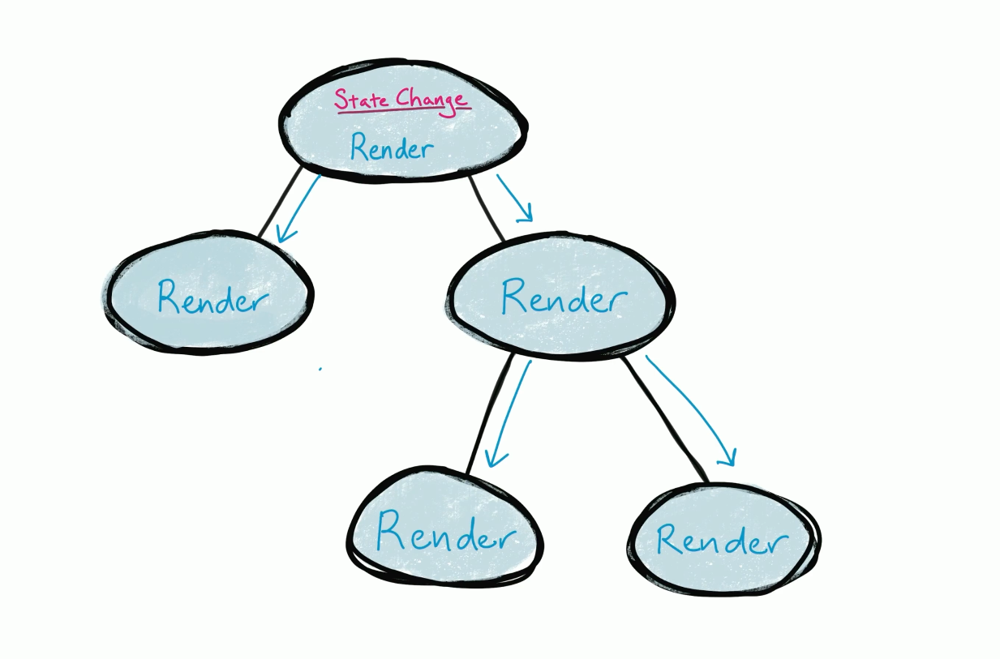

# Anatomy of a Re-Render

State typically changes for one of three reasons:

- Its state changed.
- The context changed.
- its parent changed.
- Its **_props_** changed.

There are _really_ only two types of state changes: **_Necessary_** and **_unnecessary_**.

in fact **_Necessary_** re-renders come in two flavors: **_Urgent_** and **_non-urgent_**

