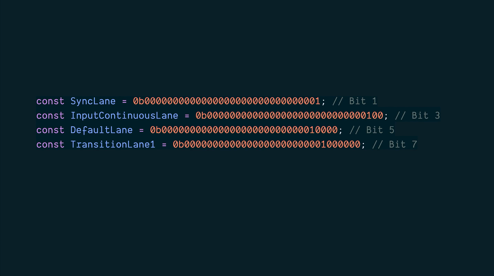

# Lanes

## Two Kins of Updates

This is an over simplification, but go with it.

- **Urgent Updates**: User input and stuff like that
- **Transition Updates**: Stuff explicitly marked as non-urgent by _you_.

## Should I Yield?

How does react decide when to yield.

- Every so often. Approximately after 5ms.
- Are there any higher priority tasks waiting?

## Life is Fast Lane

React tries to categorize work and put it into **_lanes_**.
If something comes in at a **_higher_** priority lane, React goes ahead and turns it attention to the more important thing.

## Lanes in React

A hand-wavy look at priorities.

- **SyncLane**: Immediate, blocking updates with (e.g. `flushSync`)
- User actions (**InputContinuousLane**): Clicks, key presses, dragging, scrolling.
- **DefaultLane**: The normal course of business.
- **TransitionLanes**: Stuff explicitly put into a lower priority lane.
- **RetryLanes**: Failed stuff that we're waiting to retry
- **IdleLane**: The lowest priority work.

## Lane Assignment

React puts things in their place.

- Assigns the updates to the appropriate lane.
- Groups updates in the same lanes together.
- Processes the lanes from the highest priority to the lowest.

## The Commit Phase

Commits are never interrupted. We have a full tree of what the DOM should look like. Let's make it happen.

That's because we're actively changing the DOM at this point and stopping in the middle could leave us in an inconsistent state.

## Take a picture

The Snapshot Phase

- React calls any lifecycle methods or hooks that need to read the DOM before React mutate it

- No DOM writes yet, just reads.

## Mutation

Let's change the DOM.

- react applies all the changes it decided on during the render phase.
- Creates, updates, or delete DOM nodes.
- Clean up any refs that no longer have nodes.
- runs passive effect cleanups scheduled for this commit.

## Layout Phase

Changed, but not painted.

- Perfect for measuring DOM layout or adjusting scroll position.
- if you ever used `useLayoutEffect`, this is where that goes down.

## Passive Effect

All done -- for now. Almost

- After the browser has painted. React schedules `useEffect` callbacks.
- These run asynchronously, so they don't block the paint.
- Great for data fetching, subscription, logging, timers, etc.
