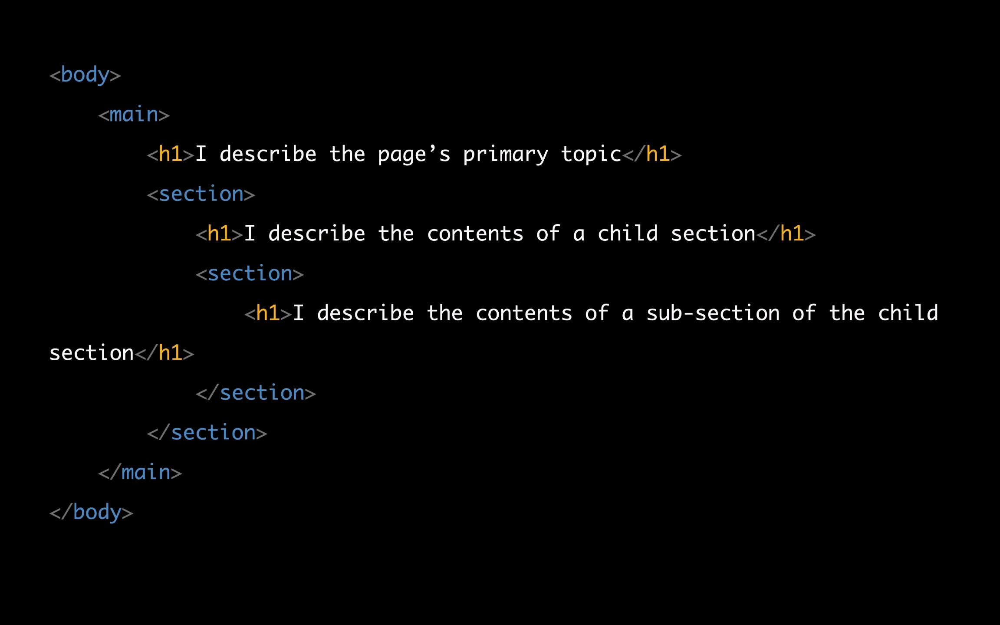
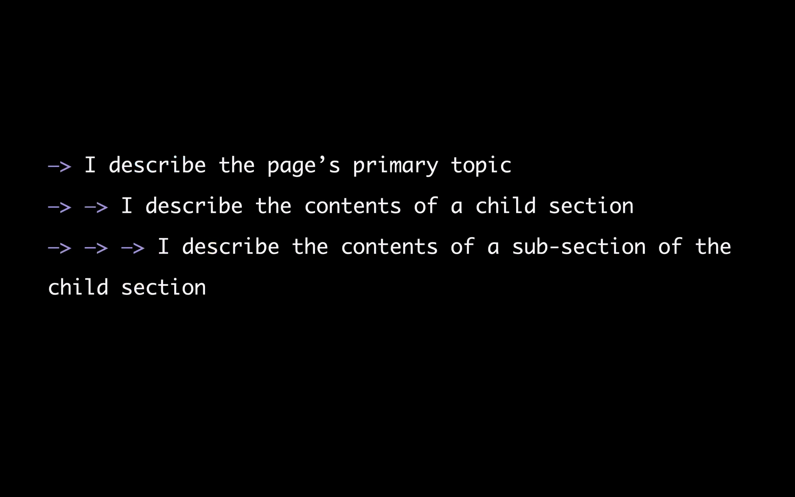
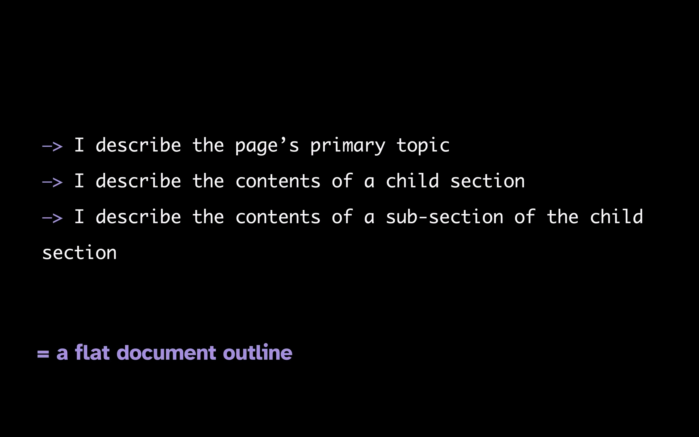
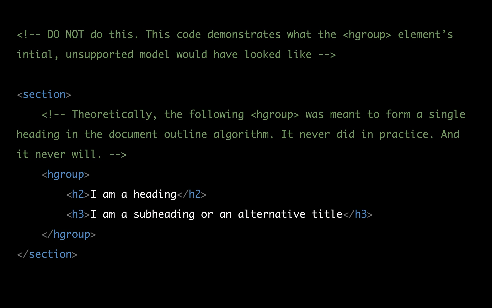

# Creating Hierarchy and Aiding User Navigation with HTML

## HTML Structural Elements

- can be used to create structures make contents to similarly perceivable
- reading screen is linear so screen readers have shortcuts to access these part of the documents
- such as h1-h6, ul, table, img, section, nav, main and ...
- Heading are **_the primary way_** off exploring and navigating webpages for screen reader users

- Result of WebAIM Screen Reader User survey showed that **85.7%** respondents reported that they find heading levels very or somewhat useful.

### Its important to implement an effective heading structure

a heading should describe the content that follows it.

- there is six level of heading, we have only one H1 per page and describe the primary topic of the page and can be identical to the document title

- What about the HTML5 document outline algorithm? it does not exist anymore and deprecated on July 2022
- What document outline algorithm was about? we can have h1 per section and the browser itself understand the main heading of the page and turn nested h1 to appropriate hx such as h3.





- so the document outline algorithm **was never implemented in any browser, nor will it be.**



The `<section>` element have generic role in ARIA but is't a generic container element. When an element is needed only for styling purposes or as a convenience for scripting, authors are encouraged to use the `<div>` element instead.
**A general rule is that the section element is appropriate only if the element's contents would be listed explicitly in the document's outline**

- use h1-h6 to create hierarchy in your document and don't skip heading levels by jumping from h1 to h3 or h4 and etc.


- don't choose a heading level based on the size of the text in contrast choose a heading level that appropriately reflects the content structure.
- Plan the content outline before the content is styled
- Don't use heading elements purely for styling purposes based on Success Criterion 1.3.1 Info nad Relationships (Level A)

  

- if a context looks like a heading, it should be implemented as a heading

### Tools for visualizing the heading structure of a page

- check if the heading structure makes sense,
- catch any missing heading levels that need remediating, and
- make sure that text that looks like a heading is actually presented as a heading in the outline
- use h123-Accessibility HTML5 Outliner
- Can you group heading together? No, The `hgroup` element represents a heading and related content. The my be used to group `h1-h6` element with one or more `p` elements containing content representing a subheading, alternative title or tagline.

here is the example:

```html
<h1>The reality dysfunction</h1>
<p>Space is not the only void</p>
```



### WCAG success criteria that tackle the use of headings:

- SC 1.3.1 Info and Relationship (Level A):

  1. CSS styles (and class names) **_do not convey meaning._**
  2. Using heading to create visual styles **_is a failure of SC 1.3.1_**


- SC 2.4.6 Heading and Labels (Level AA):

  1. heading text describes the content it precedes
  2. Does not mandate the use of headings
  3. Does not require content acting as a heading to be correctly marked up or identified as heading


- SC 2.4.10 Section Headings (Level AAA):
  1. when content is separated into sections, you must provide descriptive headings for these sections.


- fun note
  

### Fixing an existing document heading structure with ARIA


