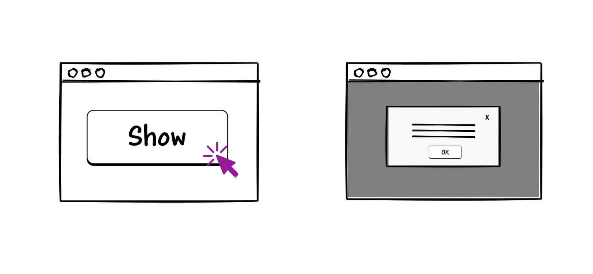
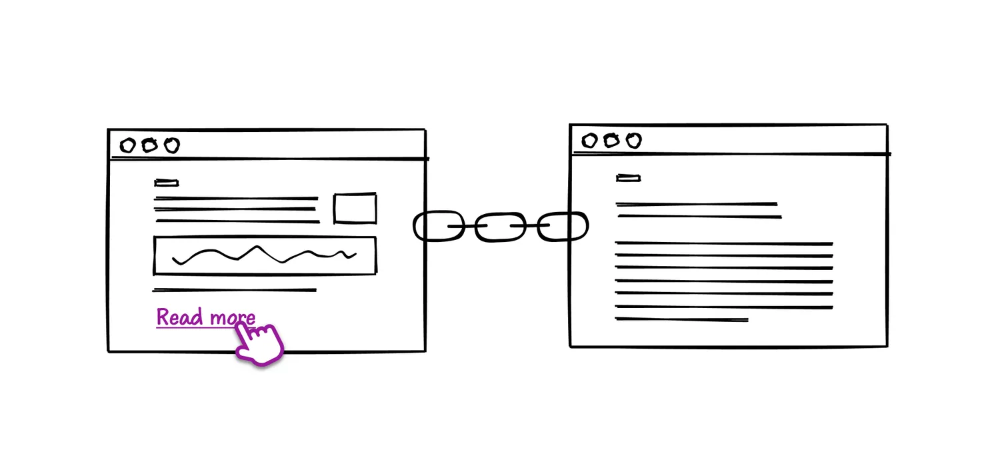

# Buttons vs. Links: Semantics and Usability

## Table of contents

- Buttons
- Links
  - Can you disable links?
- Choosing between a link and a button
- Enhancing a link into a button
  - Instate button semantics onto the link
  - Trigger an action when the anchor is clicked
  - Implement full keyboard functionality of a button
- Outro
- References, resources and recommended reading

What an element is determines how it can be used. Semantics convey what an element is, and therefore, how it can be used. And the semantics of a link and a button are not the same.

Links and buttons are both interactive elements, but that’s pretty much all they have in common. And yet they are frequently confused, misused, or used interchangeably – sometimes creating mild confusion, and other times completely breaking user expectations.

In this chapter, I want to clarify the difference between links and buttons, and why it is important. By the end of this chapter, you will be able to make a more informed decision about whether to use a link or a button for your components, as well as fix any possible inaccessible implementations in your current project(s).

And for those few instances where you may need to do so, we will cover requirements for accessibly enhancing links into buttons, as well as “disabling” links when needed.

Now, there’s a lot of information we could cover about links and buttons. In this chapter, we’ll focus on the difference between them from an accessibility standpoint. I have included links to articles from the Web community to dive deeper into other aspects of each if you’re keen to learn more.

## Buttons



**Buttons trigger actions**. On the Web, they are used to trigger programmable actions on the page. Programmable actions are actions that require JavaScript to work. As such, **a button requires JavaScript to do something**—such as opening a dialog, changing sections of content on the page, changing content layout, and so on and so forth. The only exception to this statement is a button within a form, in which case the button may submit the form.

```html
<button class="dialog-trigger">
  Open Dialog
</button>
```

An HTML `<button>` has an implicit button role. It comes with semantics and behavior baked into it. All browsers provide implicit button keyboard support. This means that a button is, by default:

- **Focusable** (it will receive focus when the user tabs through the page with a keyboard). Being focusable means that you don’t need to add a tabindex="0" to your buttons), and
- **keyboard operable** — it can be activated using Space and Enter (Return) keys.
  Native HTML buttons **can also be disabled using the `disabled` attribute**:

```html
<button disabled>I am disabled</button>
```

Probably the most important characteristic of a button is that, unless it’s within a form,**it won’t do anything without JavaScript**. Buttons don’t have any inherent behavior. To make a button do something, you’ll need to implement its interactive behavior yourself using JavaScript.

And that’s pretty much it.

Links, on the other hand, are very different.

## Links



While buttons perform actions, **links take you places**. That is the main differentiating factor between buttons and links.

_Technically,_ links can do much more than take you places. You can use a link to download a document:

```html
<a href="myfile.pdf" download
  >Download the book (PDF)</a
>
```

send an email via an email app:

```html
<a href="mailto:hello@sarasoueidan.com"
  >Send me an email</a
>
```

or even dial a phone number:

```html
<a href="tel:+1(555)5309">(555) 5309</a>
```

**What makes all of this possible is the href attribute**. The href attribute is what makes a link what it is — and quite literally so.

According to [the HTML living standard](https://html.spec.whatwg.org/multipage/text-level-semantics.html#the-a-element):
