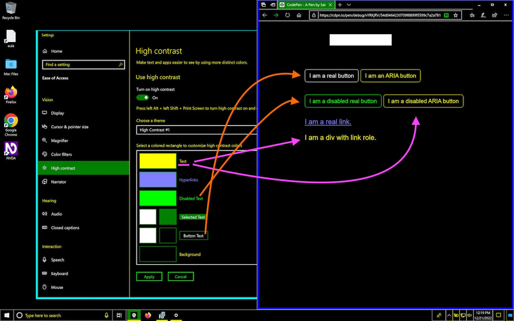
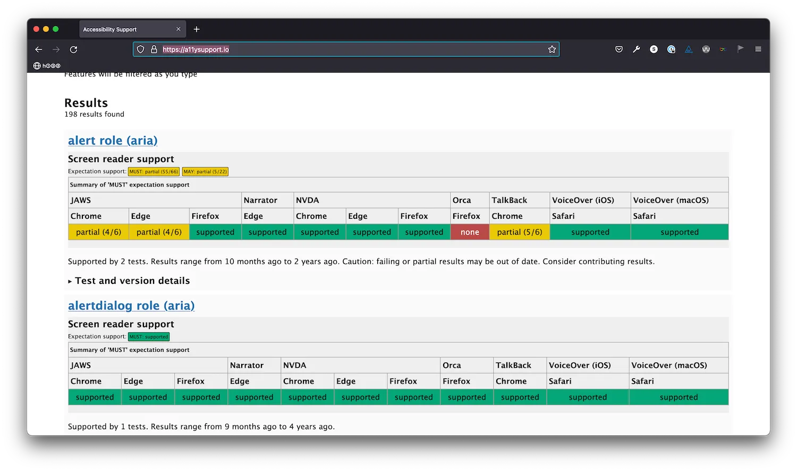

# ARIA 101

## Table of contents

- What is WAI-ARIA (a.k.a ARIA)?
- ARIA and HTML semantics
- ARIA is analogous to CSS for assistive technologies
- Overview of ARIA attributes
  - ARIA roles: Supply, modify, and remove semantics.
    - Types of ARIA roles
  - ARIA states and properties
    - ARIA states: express state and respond to user interaction
    - ARIA properties: create relationships, provide labels, and describe
- There are strict rules that govern ARIA attributes
  - Roles, states and properties are not all applicable on all HTML elements
  - There are strict parent-child relationships between some ARIA attributes
  - ARIA is finite: You cannot make up your own role values
  - ARIA attributes may have unwanted side effects
- So what does ARIA do again?
- What does ARIA not do?
  - ARIA roles don’t add behavior
  - ARIA states don’t respond to user interaction on their own
  - ARIA does not impact how content is presented by all assistive technologies
- How well is ARIA supported across screen readers?
- Outro
- References, resources and further reading

HTML provides semantic elements that represent various types of content & interactive controls. And using those elements is critical for providing accessibility information to assistive technology users. Without meaningful semantics, our Web content and user interfaces would not be perceivable, operable, or understandable by assistive technology users.

But the user interfaces we build today often require a little more complexity than HTML offers. We design and build more dynamic interface components that change content and respond to user interaction. We create tooltips, disclosure widgets, accordions, tabbed interfaces, drag-and-drop interfaces, and many more complex user interactions that HTML provides no semantic elements for.

To create a Tabs component today, you can use a bunch of `<div>`s and style them to give them the visual affordances of Tabs. But how do you convey the semantics of such a component to screen reader users so that they too can understand the nature of this component? How do you let a screen reader know that this button is in fact a tab that toggles a tab panel, if HTML doesn’t provide these semantics? How do you make sure the user understands how to operate it, or what the current state of the component is? (like which tab is currently active?)

The answer lies with ARIA.

We’ve mentioned ARIA attributes a few times throughout the course already. In this and the following few chapters, we will take a deeper look into what ARIA is, and how to use it responsibly in your projects.

## What is WAI-ARIA (a.k.a ARIA)?

WAI_ARIA is and acronym for \_\_Web Accessibility Initiative - Accessible Rich Internet Applications. It is commonly known as ARIA.

[ARIA](https://www.w3.org/TR/wai-aria/)is a Web standard that defines a set of attributes that extend HTML. These attributes are used to add semantic roles, states, and properties to HTML elements, so that they can be better understood by assistive technologies.

## ARIA and HTML semantics

ARIA attributes can be used to **explicitly** modify the implicit semantics of HTML elements and, by extension, the information that is exposed to assistive technologies in the accessibility tree. As such, they can completely change how an element is perceived by assistive technologies like screen readers.

While this may sound like ARIA competes with HTML, it doesn’t. ARIA supplements HTML semantics. It does not replace HTML, nor does it change its behavior. (More on this in a few minutes.)

Many ARIA attributes mirror native HTML semantics — they expose the same semantics that HTML tags and attributes expose; other attributes provide semantics that do not natively exist in HTML or that have gaps in implementation.

Most semantic HTML elements, as we learned in [a previous chapter](https://practical-accessibility.today/chapters/html-semantics), have implicit ARIA roles. What this means is that the browser interprets these HTML elements and treats them as if an ARIA role were assigned to them. In the case where an HTML element has the semantic meaning we need, the addition of ARIA is redundant and is even discouraged.

## ARIA is analogous to CSS for assistive technologies

I like to think of ARIA as being similar to CSS in that it creates user interface affordances to the assistive technologies that rely on it.

Affordance is, by definition:

**_the quality or property of an object that defines its possible uses or makes clear how it can or should be used_**

Using CSS, we provide visual affordances to our interfaces. ARIA provides “semantic affordances” to screen reader users in that it “paints” a non-visual “picture” of the page to screen reader users.

So, how many ARIA attributes and types of attributes are there?

## Overview of ARIA attributes

[The ARIA specification](https://www.w3.org/TR/wai-aria-1.1/) contains a list of all ARIA attributes that can be applied to HTML elements, with these attributes divided into **roles**, and **states** and **properties** that are supported by a role.

### ARIA roles: Supply, modify, and remove semantics

ARIA roles describe what an element _is_, which is an indication of how it is meant to be used.

In addition to providing roles that mirror semantics already available in HTML (such as buttons, checkboxes, lists, headings, etc.), ARIA also provides roles that are not natively available in HTML. So, using ARIA roles, you can “polyfill” missing semantics, or override native ones.

For example, if you’re creating a Tabs components, you may create the tablist that controls the tab using the tablist role:

```html
<!-- there is currently no native HTML element that maps to the tablist role
     so the ARIA tablist role can be used to supply the missing semantics -->
<div role="tablist">..</div>
```

Using the `tablist` role on the `<div>` element overrides its implicit `generic` role and exposes it as a `tablist` in the accessibility tree.

Then you may use `<button>`s to create the tabs within the tablist by explicitly assigning the `tab` role to each button:

````html
</div><div role="tablist">
    <button role="tab">Overview</button>
    <button role="tab">Specifications</button>
    <button role="tab">..</button>
    ..
</div>```

And then you may create the panels for the Tabs component using the `tabpanel` role:

```html
<section role="tabpanel">
    ..
</section>
````

ARIA roles are represented in the accessibility tree as part of the accessibility information of an element. So they can completely change how an element is exposed to assistive technologies.

**_Note_**: Before moving on it is important to note that ARIA roles only affect the accessibility information of an element in the accessibility tree, but they have no effect on the DOM.

ARIA roles modify an element’s semantics. They describe what the element is to screen readers. But they do not add interactive behavior to it. Even if a role describes an interactive element (such as the tab role), it does not make the element interactive.

When we talked about semantics in the semantics chapter, we said that semantics describe what an element is. We also said that the browser adds interactive behavior to native interactive elements (like `<button>`s). But it does not do the same thing for ARIA roles. When you use an interactive ARIA role, the browser will not add the interactive behavior to the element that the role is used on. You will need to do that using JavaScript. We will talk more about what ARIA doesn’t do in another section.

tablist is a composite role. Composite roles must be used in conjunction with other roles to compose one UI widget. tablist is used in conjunction with the tab, and tabpanel roles to create a Tabs widget.

There are also other types of ARIA roles.

### Types of ARIA roles

The specification separates the available roles into six categories:

- [Abstract roles](https://www.w3.org/TR/wai-aria-1.1/#abstract_roles). These are the roles that other roles are built upon (sort of like the “superclass” of ARIA roles). Abstract roles are not meant to be used in content. So, you won’t be using these.

- [Landmark roles](https://www.w3.org/TR/wai-aria-1.1/#landmark_roles). These represent landmark regions — key areas of a page that are used as navigational aids. There are 8 landmark roles (which we already learned about in the previous chapters).

- [Document structure roles](https://www.w3.org/TR/wai-aria-1.1/#document_structure_roles). These roles describe **elements that make up the structure of the page**, rather than the whole page, e.g. headings, articles, lists, images, etc.

- [Widget roles](https://www.w3.org/TR/wai-aria-1.1/#widget_roles). These **describe interactive, mainly JavaScript-based user interface components** such tabs, switches, menus, etc. These roles do not add behavior to the element they are used on. You will have to use JavaScript to make them do what they are meant to do. We will elaborate more on this in another section.

- [Live Region roles](https://www.w3.org/TR/wai-aria-1.1/#live_region_roles). These identify content blocks whose dynamic updates are meant to be conveyed outside the flow of the rest of the content.

- [Window roles](https://www.w3.org/TR/wai-aria-1.1/#window_roles). These roles describe “windows” within the browser, such as a modal dialog.

If you use semantic HTML, you’ll find that you will only need a handful of these roles in your day-to-day work.

HTML already provides native elements for document structure roles: lists, images, headings, etc. It also provides sectioning elements that are mapped to ARIA landmarks, as we mentioned in [a previous chapter](https://practical-accessibility.today/chapters/landmark-regions/).

If you use all of these HTML elements for their intended purpose (which, again, you should do), you won’t need to also use their equivalent ARIA roles.

## ARIA states and properties

In addition to role attributes, ARIA also contains attributes that represent the state and properties of an element.

Both states and properties provide additional accessibility information about an element. They are both prefixed with the `aria-` prefix.

### ARIA states: express state and respond to user interaction

ARIA state attributes are used to express the state of an element.

For example, the `aria-pressed` (state) attribute can be used to indicate whether a button is currently pressed (true) or not (false):

```html
<!-- aria-pressed indicates that this button is in fact a toggle button that is either currently pressed or not pressed -->
<button aria-pressed="true">Dark theme</button>
```

There is currently no equivalent attribute in HTML to express that a button is pressed. So ARIA can be used to “polyfill” that piece of information.

Similarly, `aria-expanded` (state) indicates that the thing the button controls, such as a disclosure, is expanded (“open”) or collapsed (“closed”).

```html
<nav>
  <button
    class="nav__toggle"
    aria-expanded="false">
    Menu
  </button>
  <ul class="nav__list">
    ..
  </ul>
</nav>
```

`aria-expanded` was typically used in conjunction with the `aria-controls` property (which is [no longer exposed by most screen readers](https://a11ysupport.io/tech/aria/aria-controls_attribute)). For example, the following snippet indicates that the button is used to expand/collapse an element with an ID agreement that contains the license agreement, and that the element is currently collapsed:

```html
<button
  aria-expanded="false"
  aria-controls="agreement">
  Show license agreement
</button>
<div id="agreement">
  <!-- license agreement -->
</div>
```

When the user presses the button, the panel is expanded and the aria-expanded value must change to indicate that. A sighted user can see when a panel is opened; but a blind screen reader user will rely on the state attribute to know that. This _**state change requires JavaScript**_.

States are often based on user interaction. The value of a state property, such as aria-expanded, needs to be updated dynamically, via JavaScript. So, **the usefulness of many ARIA attributes is tied to the presence of JavaScript**.

In fact, JavaScript is imperative for creating accessible custom interactive components. Because of that, it is considered a best practice to add ARIA states using JavaScript, because they require JavaScript to do what they do.

When JavaScript is absent — due to network failures or whatnot — these attributes would not only be useless, but they could even be actively confusing.

Using ARIA attributes responsibly and inclusively requires a mindset change if you don’t normally approach building user interfaces with a progressive enhancement mindset. To avoid creating broken interfaces, and to ensure the content is accessible regardless of the context the user is accessing it in, progressive enhancement is the way to go. We will see many practical examples and applications of this throughout the course.

Another ARIA state attribute is `aria-current`, which is used to represent the current item within a set of related elements. For example, `aria-current` may be used to indicate the current page in a navigation list:

```html
<nav>
  <ul>
    <li><a href="/about/">About Us</a></li>
    <li>
      <a href="/work/" aria-current="page"
        >Work</a
      >
    </li>
    <li><a href="/contact/">Contact Us</a></li>
  </ul>
</nav>
```

You can find a list of all the available ARIA state attributes in the ARIA specification.

The state of an element, just like its role, is included in the accessibility tree and exposed to screen reader users via the accessibility API.

So,

1. ARIA roles indicate what an element is.
1. ARIA states indicate the current state of the element.

### ARIA properties: create relationships, provide labels, and describe

ARIA properties describe the properties of an element — such as its name, description, current value, or its relationship to other elements.

Unlike ARIA states, most ARIA properties are less likely to change throughout an element’s life-cycle.

Some properties that hold element values, such as `aria-valuetext` and `aria-valuenow`, should change as the user changes the value of the element (the HTML range slider, for these two attributes).

The `aria-controls` attribute we saw in the previous section is an example of an ARIA property that creates a relationship between the element it is used on and the element it points to.

The `aria-hidden` attribute is a property that indicates that an element is hidden and will therefore not be included in the accessibility tree and exposed to screen readers:

```html
<!-- this svg image is excluded from the accessibility tree and is therefore hidden from screen readers -->
<svg
  viewBox="0 0 24 24"
  width="24"
  height="24"
  aria-hidden="true">
  <!-- svg content here -->
</svg>
```

The `aria-label` property defines the string of text to be used as an accessible name of an element.

```html
<!-- the aria-label attribute value provides an accessible name for the button
     This button will be announced as "Submit, Button" by most screen readers -->
<button aria-label="Submit"></button>
```

The `aria-labelledby` and `aria-describedby` attributes point to the elements on the page that should be used to provide an accessible name and description (respectively) to the element they are used on. (We will learn all about naming and describing elements in [another chapter](https://practical-accessibility.today/chapters/accNames-and-descriptions/).)

```html
<section aria-labelledby="faq_label">
  <h2 id="faq_label">
    Frequently Asked Questions
  </h2>
  ..
</section>

..

<label for="password">
  <input
    type="password"
    id="password"
    aria-describedby="pass_hint" />
</label>
<p id="pass_hint">
  Your password should be at least 8 characters
  long.
</p>
```

You can find a list of all the ARIA property attributes in the ARIA specification.

So, to recap:

1. ARIA roles indicate what an element is.
2. ARIA states indicate the current state of the element.
3. ARIA properties describe the properties of the element (e.g. its name, description, current value, or its relationship to other elements).

## There are strict rules that govern ARIA attributes

There are strict rules that dictate how ARIA roles, states, and properties can be used.

Understanding ARIA roles, states and properties and the relationships between them is very, very important.

### Roles, states and properties are not all applicable on all HTML elements

Some attributes are only allowed on a subset of HTML elements, and are forbidden on other elements. Whereas other attributes are [global](https://www.w3.org/TR/wai-aria-1.1/#global_states) and can be used on most HTML elements.

The [ARIA in HTML specification](https://www.w3.org/TR/html-aria/#docconformance) provides a table that lists all the HTML elements and their built-in (implicit) ARIA roles, and documents what roles, states and properties are permitted on them.

For example, the list of ARIA roles that may be used on a `<button>` element are `checkbox`, `link`, `menuitem`, `menuitemcheckbox`, `menuitemradio`, `option`, `radio`, `switch` or `tab`. Other roles are not permitted.

```html
<!-- Don’t do this.
     The heading role is NOT permitted on the button element. -->
<button role="heading" aria-level="2">
  I am supposed to be a heading but I am not
</button>
```

For instance, heading is not among the roles permitted on `<button>`s. `<button>` is an interactive element, whereas headings are static text. If the heading role is used on a `<button>`, the role will be in conflict with the nature of the element it is being set on. This mismatch between the semantics conveyed and the actual functionality of the element creates usability problems, and may create a barrier for some users if they can no longer interact with it as announced. This, in turn, would result in a violation of WCAG SC 4.1.2.

Before using an ARIA role on an HTML element, make sure to check whether or not that role is permitted on the element. Otherwise, instead of enhancing the accessibility of your components, ARIA will end up contributing to a broken and inaccessible experience.

## There are strict parent-child relationships between some ARIA attributes

The use of some attributes is restricted to specific contexts or parents. Some roles can only be used as a child to a specific — usually composite — role.

For example, the tab role is only valid in the context of a `tablist` (which is a composite role).

**Authors MUST ensure elements with role tab are contained in, or owned by, an element with the role tablist. — [The ARIA Specification, tab role definition](https://www.w3.org/TR/wai-aria-1.1/#tab)**

And the `tablist` expects tabs as children. The following markup is, therefore, not valid:

```html
<nav>
  <ul>
    <li><a href="#" role="tab">Tab One</a></li>
    <li><a href="#" role="tab">Tab Two</a></li>
    <li><a href="#" role="tab">Tab Three</a></li>
    <li><a href="#" role="tab">Tab Four</a></li>
  </ul>
</nav>
```

Whereas this markup is:

```html
<ul role="tablist">
  <button role="tab">Tab One</button>
  <button role="tab">Tab Two</button>
  <button role="tab">Tab Three</button>
  <button role="tab">Tab Four</button>
</ul>
```

Similarly, elements with the menuitem role are expected to be children of an element with a menu or menubar role. And menuitem can have no interactive children, so a button or link, or an element with implicit button or link roles, would be invalid.

It is important that you learn and understand how ARIA attributes are used and nested, especially if you’re creating components that are re-used in various contexts across a website or application.

Many design systems and pattern libraries utilize ARIA attributes to create accessible components. These components may be used in contexts that conflict with the ARIA roles they have, resulting in broken experiences. If you’re working on such pattern libraries or design systems, make sure to provide clear documentation about the requirements for re-use, to ensure your components are used appropriately.

## ARIA is finite: You cannot make up your own role values

The ARIA specification documents all available attributes and their allowed values. You cannot make up your own attributes or values of those attributes.

This markup is invalid:

```html
<!-- This is invalid. There is no ARIA "carousel" role. -->
<div role="carousel"></div>
```

And so is this:

```html
<!-- This is invalid. There is no ARIA "breadcrumb" role. -->
<nav role="breadcrumb">
  <ul>
    <li><a href=""></a></li>
    <li><a href=""></a></li>
    <li><a href=""></a></li>
  </ul>
</nav>
```

A `<nav>` element already tells the user that this is a navigation. The next piece of information the user needs is the purpose of the navigation. You can indicate that by giving the navigation a label:

```html
<nav aria-label="Breadcrumb">
  <ul>
    <li><a href=""></a></li>
    <li><a href=""></a></li>
    <li><a href=""></a></li>
  </ul>
</nav>
```

Now the screen reader will announce two pieces of information: what the element is (role), as well as what it’s name is. It will announce “Breadcrumb, Navigation”, which is self-explanatory. You don’t need a “breadcrumbs” role set to indicate its purpose.

And last but not least, keep in mind that that:

### ARIA attributes may have unwanted side effects

Some ARIA attributes can have unwanted side effects. Applying an attribute to an element may affect other elements in ways that you may not expect.

For example, using role="button" on an element will “erase” the semantics of all of that element’s children. This is also true for native HTML elements that map to the button role like `<button>` and `<summary>`.

```html
<div role="button">
  <h3>
    My semantics should be suppressed because I am
    contained in a button
  </h3>
</div>

<button>
  <h3>
    My semantics should be suppressed because I am
    contained in a button
  </h3>
</button>
```

You can find this piece of information [in the ARIA specification](https://www.w3.org/TR/wai-aria-1.1/#button) under the “Children Presentational” property of each attribute. When this property is true, the children of a role become “presentational”. This means browsers should treat all descendants as if they had `role="presentation"`, which suppresses an element’s semantics in the accessibility tree. (We will learn more about this in [another chapter](https://practical-accessibility.today/chapters/hiding-techniques/).)

You see, ARIA is extremely powerful but also very dangerous if you don’t know what you’re doing. If you’re not aware of how roles, states and properties work together, you can end up creating a more confusing and inaccessible user experience.

The ARIA specification already documents the requirements for ARIA roles in the definition of each role and attribute. Each role also includes a list of attributes that are supported by the role, and how that role may affect an element’s descendants.

And the [ARIA in HTML specification](https://www.w3.org/TR/html-aria/) defines the conformance rules for using ARIA in HTML. These rules define what conformance testing tools should check for and flag in case of a violation or misuse. As a developer, you should also be aware of these rules so that you avoid using ARIA in ways it is not intended to.

## So what does ARIA do again?

ARIA provides semantic meaning via roles, states and properties that may or may not have native HTML equivalent to represent them. It supplements or changes the accessibility information that the browser exposes about elements in the accessibility tree, to make them more understandable by assistive technologies.

- You can use ARIA to create or modify semantics.
- You can use ARIA to define and expose values.
- You can use ARIA to provide accessible names.
- You can use ARIA to define and expose states.
- You can use ARIA to define and expose properties.
- You can use ARIA to announce when dynamic content changes happen on the page

ARIA is very useful to override native semantics in instances where you’re enhancing static content into dynamic, interactive widgets. For example, enhancing a series of sections into an accordion or a Tabs component. Or enhancing a navigation list into an application menubar.

ARIA is also very helpful for fixing accessibility in legacy code that you can’t change. For example, you may add landmark roles to regions of the page that are marked up using meaningless `<div>`s. Or you may use heading roles and their associated aria-levels to fix an inefficient document outline.

But there’s only so much ARIA can do…

## What does ARIA not do?

Equally important to understanding what ARIA does is understanding what ARIA doesn’t do.

### ARIA roles don’t add behavior

ARIA changes the element’s accessibility information in the accessibility tree, but it does not affect the page’s DOM. It provides meaning, but it does not add behavior or functionality. This is one of the most important things to understand about ARIA, and one of the things that can easily trip up developers that are new to accessibility.

For demonstration purposes, let’s assume that you need to repurpose the meaningless `<div>` into a button. If you set `role="button"` on the `<div>`, this `<div>` is now exposed as a button in the accessibility tree. This, however, does not mean that the `<div>` has become a button. Even if you style the `<div>` to look like a button, it is still a `<div>`. The role attribute doesn’t make it focusable, nor does it add the necessary keyboard behavior that is expected for a button.

A `<div>` will only become a button when it does button-y things. And it is on you to implement all the necessary button behavior and interactivity. You will need to:

1. make the `<div>` focusable,
2. add [proper keyboard functionality](https://adrianroselli.com/2022/04/brief-note-on-buttons-enter-and-space.html) (ensure that it is operable using Space and Enter keys while accounting for the differences in those interactions)
3. make it do something when it is activated!

**ARIA is a promise**. When you add `role="button"` to an element, you’re telling screen reader users that this thing they are “seeing” is a button, and that they can operate it a certain way (as announced by their screen reader). If you don’t provide the operability of a button that they expect, you will have lied to them.

So, every time you consider using an ARIA attribute, ask yourself what promise you are making to the user, and whether you are fulfilling that promise. Even better, ask yourself: is there an HTML element that I can use instead? And if the answer is yes, use that.

Interactive ARIA widget roles (including button, checkbox, searchbox, radio, switch, tab, etc.) are used to indicate that elements are supposed to be interactive, but they do not make them interactive. The DOM and behavior is still determined by the native HTML element you use, and any interactivity you add to it using JavaScript. The browser will not add interactive behavior to interactive ARIA roles like it does to native HTML elements.

When you use an interactive ARIA role, you’re telling a screen reader user that the element is interactive. If you don’t implement the necessary interactive behavior of a role, you introduce a new barrier to access, and a usability problem.

In his article [“Stop Giving Control Hints to Screen Readers”](https://adrianroselli.com/2019/10/stop-giving-control-hints-to-screen-readers.html), accessibility consultant Adrian Roselli notes that:

**When a screen reader encounters an element on the page that invites interaction beyond reading, it typically provides users with instructions how to consume or interact with it.**

For example, here is a short video from Adrian’s article demonstrating how VoiceOver announces various HTML patterns and controls, including instructions on how to consume or interact with them.

What this all means is that when you use an ARIA role on an element, and especially if that role is interactive, screen reader users will expect that they can follow their screen reader’s instructions to activate the element. But if you don’t implement the expected interactivity into it, you create a usability problem.

Note that this does not, however, mean that the screen reader will automagically know which key combinations the user should use to operate your custom widget(s). If you create a custom interactive component and require custom key combinations to activate it, the screen reader will not provide those instructions to the user. As we mentioned in a [previous chapter](https://practical-accessibility.today/chapters/wcag-vs-usability/), you want to avoid using key combinations that the user is not familiar with in order to avoid any possible usability issues.

## ARIA states don’t respond to user interaction on their own

ARIA states also don’t respond to user interaction on their own. They `indicate` that the element is interactive by exposing a state. But `you` need to manage that the state change using JavaScript. When the user presses a toggle button, `you` need to respond to the press and `you` need to convey the state change using JavaScript.

This is why I said earlier that JavaScript is imperative for creating truly accessible custom interactive components. This is also why it is almost always best to use native HTML controls over custom controls whenever you can. When you do, the browser does all of this work for you.

And last but not least…

### ARIA does not impact how content is presented by _all_ assistive technologies

ARIA does not impact how content is presented by _all_ assistive technologies.

ARIA only affects the semantics exposed via the accessibility tree. This means that the accessibility information you expose using ARIA will not be exposed to assistive technologies that don’t get their information from the accessibility tree. Those assistive technologies will still rely on native, semantic HTML to properly present your content to the user.

Forced Colors modes like Windows High Contrast Mode (WHCM) (now Contrast Themes in Win 11 and standardized under forced-colors mode in CSS) gets its accessibility information from the HTML elements you use. Any ARIA you use to modify those elements will have no effect on how it will present your content.

WHCM applies custom colors to links and buttons and other interactive elements on a page, using a reduced color palette taken from the operating system (but controllable by the user). The following image shows how a native button and a native link are styled by WHCM, versus how their ARIA counterparts are rendered.



An HTML `<button>` gets its text, border, and face colors from the system colors because they have a direct mapping. A `<div>`, on the other hand, does not have that system-level mapping, so WHCM treats it as though it is a string of text. Giving the `<div>` a button (or text) role has no effect on how WHCM styles it, as this image demonstrates with its lack of those same system colors.

The faux-button and faux-link use a `<div>` with button and link roles respectively.

```html
<button class="btn">I am a real button</button>
<div class="btn" role="button" tabindex="0">
  I am an ARIA button
</div>

<button class="btn" disabled>
  I am a disabled real button
</button>
<div
  class="btn"
  role="button"
  tabindex="0"
  aria-disabled="true">
  I am a disabled ARIA button
</div>

<a href="#">I am a real link.</a>
<br />
<br />
<div role="link" tabindex="0">
  I am a div with link role.
</div>
```

WHCM ignores the semantics defined by ARIA, and renders the `<div>`s disguised as button and link as simple text instead, because it gets the information it needs directly from the HTML markup, not from the accessibility tree. And this all makes sense because ARIA is meant to be an extension of HTML for _semantic purposes_, not for styling purposes.

To ensure your content remains as accessible as possible, reach for native HTML elements. ARIA should be a last resort. If there is one and only one thing you take away from this chapter, let it be that ARIA should be treated as spackle, not rebar, as Eric Bailey [describes it](https://css-tricks.com/aria-spackle-not-rebar/).

At the end of the day, ARIA is a Web technology. And just like other Web technologies, there may be implementation gaps or bugs that prevent it from doing what it is meant to do.

Speaking of which, how well is ARIA supported across browsers and screen readers?

## How well is ARIA supported across screen readers?

ARIA support and behavior is varied between platforms, accessibility APIs, browsers, and assistive technologies.

Like other Web technologies, some parts of ARIA may be well supported across browsers and screen readers; other parts may be partially supported; and some parts that are implemented may have bugs in implementation.

Unlike other Web technologies like CSS or JavaScript, there is no way to check for ARIA support. The best thing you can do is to rely on native semantics as much as possible, use ARIA to the best of your knowledge, and then test your work with various browser and assistive technology combinations to ensure that you have implemented the expected experience.

ARIA can also have compatibility issues. Not all screen reader users use the latest version of their screen reader. And not all screen reader users are on macOS or the latest version of whichever platform they’re on. In fact, screen reader users often use older versions of their screen reader to keep compatibility issues to a minimum.

I like to refer to [a11ysupport.io](https://a11ysupport.io/) to get an high-level overview of ARIA attributes and their expected support across various browser and screen reader combinations.



That being said, the tests on a11ysupport may not always be up-to-date. If you refer to a11ysupport, make sure that you always perform your own testing to check that something works. Just like any other type of web technologies, ARIA implementations can suddenly break. Browsers and screen readers get updated, support may be added or removed, and user expectations change rapidly.

Try to keep ARIA use to a minimum. If you can create a component using meaningful, semantic HTML alone, or if you can simplify a design pattern and implement it using fewer attributes that have robust support, then do so.

Fortunately, most attributes that you will need to use in your day-to-day work have robust support. We’re going to see quite a few of those attributes throughout the course.

## Outro

ARIA attributes are the second most powerful tool in our accessibility arsenal. The first most powerful tool is semantic HTML! 😉

To demonstrate how ARIA works and what it does and doesn’t do, in the next chapter, we’re going to build a custom button component from scratch. As simple as that may sound, it takes a little more work to do properly than you may think.

## References, resources and further reading

- [Demystifying WAI-ARIA](https://www.davidmacd.com/blog/wai-aria-accessbility-for-average-web-developers.html)
- [WAI-ARIA Overview](https://www.w3.org/WAI/standards-guidelines/aria/)
- [ARIA is spackle not rebar](https://css-tricks.com/aria-spackle-not-rebar/)
- [“ARIA in HTML” (by Scott O’Hara)](https://www.scottohara.me/blog/2021/07/07/aria-in-html.html)
- [Quick Note on ARIA and Windows High Contrast Mode](https://www.scottohara.me/blog/2019/02/12/high-contrast-aria-and-images.html)
- [Stop giving control hints to screen readers](https://adrianroselli.com/2019/10/stop-giving-control-hints-to-screen-readers.html)
