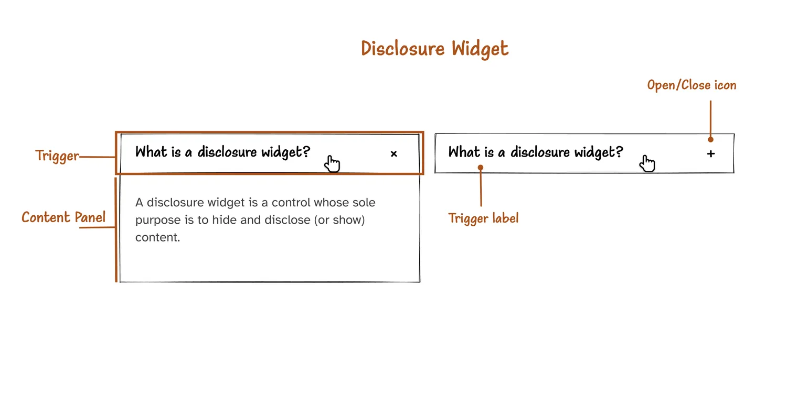
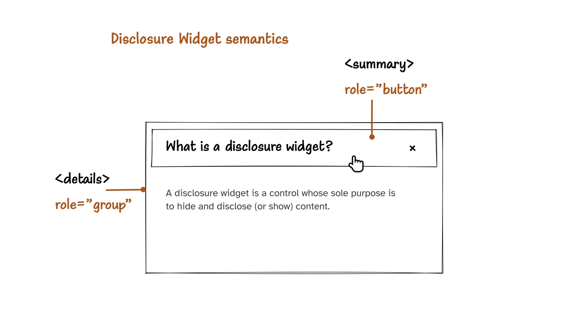

# Disclosure Widgets

In this chapter, we’re going to build a simple disclosure widget.

## What is a disclosure widget?

A disclosure widget is **a control** whose sole purpose is to hide and disclose (or show) content. It is implemented as **a button** (which we’ll refer to as the trigger from now on) that, when activated, toggles the display of **some content** (which we’ll refer to as the content panel).



Many more complex components (such as accordions, drop-down, and off-canvas navigations) use disclosure widgets as building blocks. So it is important to understand what disclosure widgets are and how they work, and to get their foundations right to prepare for the more complex patterns.

In this chapter, we’re going to discuss options for creating a simple disclosure widget using HTML, as well as using ARIA. We’re going to look into accessibility and usability requirements — from the choice of markup, to styling, and behavior. We’re also going to discuss the usability benefits of choosing a progressive enhancement strategy for building the custom ARIA widget.

So, let’s dive in!

## HTML or ARIA?

You can create a disclosure widget either using native HTML alone, or with the help of ARIA.

You know by now that [the first rule of ARIA](https://www.w3.org/TR/using-aria/#rule1) states that:

**If you can use a native HTML element or attribute with the semantics and behavior you require already built in, instead of re-purposing an element and adding an ARIA role, state or property to make it accessible, then do so.**

**Under what circumstances may this not be possible?**

- **If the feature is available in HTML but it is not implemented or it is implemented, but accessibility support is not.**
- **If the visual design constraints rule out the use of a particular native element, because the element cannot be styled as required.**
- **If the feature is not currently available in HTML.**

So, does HTML provide a native disclosure widget? (Hint: yes, it does.) And does the native widget provide the semantics and behavior you require already built in? The answers to these questions will determine whether you will go native, or create your own custom disclosure widgets.

## The HTML details & summary elements

HTML provides two elements that, together, are meant to represent a disclosure widget: the `<details>` element, and its child the `<summary>` element.

From [the HTML Standard:](https://html.spec.whatwg.org/multipage/interactive-elements.html#the-details-element)

**The `<details>` element represents a disclosure widget from which the user can obtain additional information or controls. […] The first `<summary>` element child of the element, if any, represents the summary or legend of the details.**

The `<details>` element represents the disclosure widget container, and the first `<summary>` element child will be the disclosure widget’s trigger.

```html
<!-- This is a native disclosure widget. -->
<details>
  <summary>[ trigger label ]</summary>

  <!-- disclosure content -->
  <p>..</p>
</details>
```

When the `<summary>` is activated, the browser toggles an open attribute on the `<details>` element, which in turn toggles the display of the widget’s content.

A disclosure widget can only have one trigger. If you provide more than one `<summary>`, the browser will only use the first one for its intended purpose:

```html
<details>
  <summary>I am the trigger</summary>
  <summary>I shouldn’t even be here..</summary>

  <p>...</p>
</details>
```

Don’t provide more than one `<summary>`. But do provide a `<summary>`.

Every disclosure widget needs a trigger. If you don’t provide one for the native disclosure, the browser will provide one for you, and most browsers will give it a generic “Details” label (or its localized text), which is probably not what you want.

The following disclosure widget demonstrates how a `<details>` with no `<summary>` is rendered by your browser:

### Accessibility

`<details>` & `<summary>`, like other native HTML controls, come with semantic **roles, state, and keyboard interaction built-in.**

- `<details>` is mapped to the group role.
- `<summary>` [is mapped by many browsers](https://www.w3.org/TR/html-aria/#el-summary) to the button role.



`Note that, if you dig a little deeper into the HTML Accessibility API mappings, you’ll notice that the <summary> element may be exposed as a “Push Button”, or even a “disclosure triangle”, depending on the platform and AAPI. Consider this a hint that not all screen readers will announce <summary> the same way to their users.`

`Indeed, if you check what the <summary> is announced like using various browser and screen reader combinations, you’ll find that it will be announced as a “Summary”, a “Button”, and a “Disclosure Triangle” depending on which pairing you are checking it with.`

`VoiceOver announces it as a “disclosure triangle” when it is paired with Chrome (v109) on macOS, and it announces it as a “Summary” when it is paired with Safari. NVDA paired with Firefox announces it as a “button”.`

`You may have noticed that NVDA announces the triangle marker as part of the summary’s name; and it even announces the direction that the triangle is pointing. We will talk more about this and what this means shortly.`

`This difference in announcements is not a bug and it is not something you need to worry about. And it is most certainly not something you should try to work around. For example, you don’t want to force screen readers to announce it as a button by explicitly overriding the <summary>’s role using role="button". Because, when you do that, some browsers may treat the <summary> element as a standard <button> element, and since the <button> element doesn’t convey state, you will lose the expanded/collapsed state communicated by the <summary> element.`

`You rarely ever have to work around implicit ARIA role mappings. So, don’t do it.`

Like other native HTML controls, the browser bakes keyboard interactions into the `<summary>` element by default. This means that, like a `<button>`, it is operable using both Space and Enter keys.

When the `<summary>` is activated, the browser toggles the open attribute on the `<details>` element, which communicates that its contents are expanded or collapsed to assistive technology users.

All of this means that `<details>` and `<summary>` come with all the disclosure widget accessibility requirements (semantics and behavior) built in. ✅

### Styling with CSS

Styling `<details>` & `<summary>` with CSS is straightforward.

Browsers provide a default triangle icon for the `<summary>` element which visually indicates the current state of the widget (expanded or collapsed). To apply your custom icon, you can remove the default triangle and replace it with your own icon. But doing so will currently impact how the state of the disclosure widget is communicated by some screen readers.

In his article [“The details and summary elements, again”](https://www.scottohara.me//blog/2022/09/12/details-summary.html), accessibility engineer Scott O’Hara notes that:

**It’s worth noting that with Firefox in particular, it exposes the default disclosure widget triangle marker as part of the `<summary>`’s accessible name. […]**

**If removing this marker so you can insert your own custom chevron or other visual expanded/collapsed state marker, it will actually make the state of the widget unclear with Firefox and VoiceOver, since the announcement of the default triangle direction is the only way state is communicated in that pairing.**

**However, Firefox and VoiceOver alone is not the only pairing that is impacted by the removal of the default triangle marker. VoiceOver, JAWS and NVDA all have an issue with consistently announcing the toggled state of the disclosure widget if this marker is removed.**

**Something to keep in mind as you determine just how important it is to restyle an element whose semantics are, at least presently, semi-reliant on their default styling.**

_If_ you _need_ to remove the default arrow, you can use the `list-style` property and set its value to none — similar to how you remove default list markers. For Webkit browsers, you currently need to use the `::-webkit-details-marker` pseudo-element to select the triangle, and then remove it using `display: none`.

```css
summary::-webkit-details-marker {
  display: none;
}

summary {
  list-style: none;
}
```

Then, you can provide your own icon using an inline `<svg>`, for example:

```html
<details>
  <summary>
    <svg
      viewBox=".."
      width=".."
      height=".."
      aria-hidden="true">
      ..
    </svg>
    <span
      >[ Disclosure widget trigger label ]</span
    >
  </summary>
</details>
```

Since the `<summary>` element conveys state on its own, the SVG icon adds no information that is relevant to the user. So you can treat it as decorative and hide it from screen readers using the aria-hidden attribute to avoid unnecessary announcements. (We will learn all about aria-hidden, as well as other methods for hiding content inclusively, in [another chapter](https://practical-accessibility.today/chapters/hiding-techniques/).)

You may, of course, also use other methods to provide an icon to the trigger, such as using a CSS background image, or a CSS pseudo-element (like `::before`). But SVG comes with accessibility as well as styling advantages over other methods. For example, when an element’s name is derived from its contents (as is the case for our trigger here), most browsers will include any pseudo-content in the name. This means that the icon you add using the `::before` pseudo-element may be announced as part of the `<summary>`’s accessible name. And there is currently no way in CSS to prevent that from happening. SVG is also more flexible in terms of styling, animating, as well as adapting the icon for Forced Colors Modes like Windows High Contrast Mode, which we will learn much more about in [another chapter](https://practical-accessibility.today/chapters/forced-colors-mode/).

## Can we use `details & summary` for all our disclosure widget needs?

So, since `<details>` and `<summary>` provide a native, accessible way to create a disclosure widget, does this mean that we can use them for all our disclosure widget needs? Can we use them anytime and _every_ time we need to hide and reveal content?

The answer is: **It Depends™️**. It depends on what you’re building, and whether or not the semantics and behavior that `<details>` and `<summary>` provide are suitable for the pattern you’re creating.

When you search for content on a page using the browser’s “Find in page” search functionality, Chromium browsers (like Chrome and Edge) will automatically expand the `<details>` panel if it contains your search terms. You can see that in action on any page that uses `<details>` and `<summary>`. This is helpful for users searching for information that might be buried in a disclosure widget. But it is something you want to keep in mind when you use `<details>` & `<summary>`, because this behavior may not be suitable for many patterns you might be building (like for a tabs or a drop-down navigation, for instance). If you do use `<details>` & `<summary>` as a building block for a component that shouldn’t expose this functionality, you will need to use JavaScript to override this behavior.

We will see more than a couple of complex patterns in this course, and we will discuss how `<details>` could fit into them, and why it may not.

In fact, unless you’re building a simple, solo disclosure widget like the example we just saw — where you’re just showing and hiding some content within the context of longer content (like an article), you’re most likely going to need to use JavaScript and ARIA to get the result that you need.

## Custom ARIA disclosure widget

When you have specific style, behavior, or semantic requirements that the native disclosure widget doesn’t provide, you can create your own custom disclosure widget with the help of ARIA.

To create a custom disclosure widget, you will need:

1. a trigger (typically a button), and
2. (probably a container of) some content that the trigger will expand/collapse.

## Roles, States, and Properties

**The disclosure widget trigger should be exposed as a `button`**. So, to create the trigger, you can use the native `<button>` element, which is implicitly mapped to the `button` role. Of course, if you have to, you can also create your own custom button using ARIA like we did in [a previous chapter.](https://practical-accessibility.today/chapters/aria-button/)

```html
<button>[ trigger label ]</button>
```

The content container that the trigger will control can be any grouping element (e.g. `<div>`, `<section>`, `<article>`). Which element you choose will depend on how you want the content panel to be exposed to assistive technologies. In most cases, unless the content is important enough to expose as a landmark region or a group, a `<div>` will be suitable.

```html
<button>[ trigger label ]</button>
<div>...</div>
```

And, for styling purposes, you may also wrap both the trigger and the panel in a generic container (`<div>`).

```html
<div>
  <button>[ trigger label ]</button>
  <div>...</div>
</div>
```

At this point I’m also going to include a class name that we can use to style the disclosure widget in another section.

```html
<div class="disclosure-widget">
  <button>[ trigger label ]</button>
  <div>...</div>
</div>
```

**The trigger also needs to convey the state** of the disclosure widget, indicating when the content panel is expanded or collapsed.

[The aria-expanded (state) attribute](https://www.w3.org/TR/wai-aria-1.1/#aria-expanded) is used to indicate whether the grouping element that the trigger controls is currently expanded or collapsed. This means that, using aria-expanded on the the `<button>`, you can communicate to the user when the disclosure widget is expanded (`true`) or collapsed (`false`). You will need to use JavaScript to update the value of `aria-expanded`. We will get to this shortly.

```html
<div class="disclosure-widget">
  <button aria-expanded="[ true | false ]">
    [ trigger label ]
  </button>
  <div>...</div>
</div>
```

Notice that, unlike the native disclosure widget, state in the custom disclosure widget is communicated by the widget’s trigger, not the container. With the native widget, the open attribute is set on the `<details>` element, not the `<summary>` (its trigger). For ARIA disclosure widgets, you want to set the aria-expanded attribute on the trigger (the `<button>`), not on the panel, nor on their generic container.

In addition to communicating state with `aria-expanded`, you can also (optionally) add the `aria-controls` attribute to the trigger to establish a direct relationship between the trigger and the panel it controls. The value of the `aria-controls` attribute is the unique id of that panel.

```html
<div class="disclosure-widget">
  <button
    aria-expanded="[ true | false ]"
    aria-controls="[ panel ID ]">
    [ trigger label ]
  </button>
  <div id="[ panel ID ]">...</div>
</div>
```

The aria-controls property is optional for disclosure widgets, and it is [currently not exposed](https://a11ysupport.io/tech/aria/aria-controls_attribute) to most screen reader users when it is used in this context. But, like other ARIA attributes, it can be used as a styling hook in your CSS, or for easier element references in your JavaScript.

To visually indicate state, I’m going to use an inline `<svg>` to add an icon to the trigger, which we will later animate using CSS when the disclosure widget is expanded/collapsed. Since the `aria-expanded` (state) attribute is enough to communicate state to screen reader users, we can hide the `<svg>` icon using `aria-hidden.`

```html
<div class="disclosure-widget">
  <button
    aria-expanded="[ true | false ]"
    aria-controls="[ panel ID ]">
    <svg
      width="12"
      height="8"
      viewBox="-2 -2 14 12"
      aria-hidden="true">
      <g fill="none" transform="rotate(-90 6 4)">
        <path
          fill="currentColor"
          d="M1.41.59l4.59 4.58 4.59-4.58 1.41 1.41-6 6-6-6z" />
        <path d="M-6-8h24v24h-24z" />
      </g>
    </svg>
    [ trigger label ]
  </button>
  <div id="[ panel ID ]">...</div>
</div>
```

### Interactive behavior

The disclosure widget trigger must be operable using both `Space` and `Enter` keys (as is expected for a button). When you use the native `<button>`, the browser will provide this functionality for you. All you need to do then is to make the button do something when it is operated (in our case: we need to expand/collapse the panel). If you create a custom button using a `<div>` element, you’re going to need to implement the expected keyboard button functionality like we did in a [previous chapter.](https://practical-accessibility.today/chapters/aria-button/)

A disclosure widget is typically collapsed by default. To collapse the panel, you can use the hidden attribute, which is the HTML equivalent of CSS’s `display: none`. It hides the panel from all users, including assistive technology users.

```html
<div class="disclosure-widget">
  <button
    aria-expanded="[ true | false ]"
    aria-controls="[ panel ID ]">
    [ trigger label ]
  </button>
  <div id="[ panel ID ]" hidden>...</div>
</div>
```

When the trigger is activated, the content panel’s display is toggled, and the value of the aria-expanded attribute must be updated to convey the state of the panel. This requires JavaScript.

Using a short script, you can toggle the value of `aria-expanded` when the trigger is activated, as well as toggle the presence of the `hidden` attribute on the panel.

```javascript
let trigger = document.querySelector(
    ".disclosure-widget > button"
  ),
  panel = document.querySelector(
    ".disclosure-widget > div"
  );

trigger.addEventListener("click", function () {
  if (
    this.getAttribute("aria-expanded") === "true"
  ) {
    this.setAttribute("aria-expanded", "false");
    panel.setAttribute("hidden", "");
  } else {
    this.setAttribute("aria-expanded", "true");
    panel.removeAttribute("hidden");
  }
});
```

Alternatively, instead of showing and hiding the panel from your JavaScript, you can hook into the aria-expanded attribute in your CSS, and use it to toggle the display of the panel. Using [the CSS adjacent sibling selector](https://developer.mozilla.org/en-US/docs/Web/CSS/Adjacent_sibling_combinator), you can select the panel and show/hide it depending on the value of `aria-expanded`:

```css
.disclosure-widget > button {
  ..;
}

/* when the trigger is "not expanded", hide the panel it controls */
.disclosure-widget
  > button[aria-expanded="false"]
  + div {
  display: none;
}
```

And while you’re at it, you can animate the `<svg>` icon when the trigger’s state changes:

```css
.disclosure-widget
  > button[aria-expanded="true"]
  > svg {
  transform: rotate(90deg);
}
```

And this is all you need to create an accessible, custom disclosure widget.

## Live demo

Here is a live demonstration of the ARIA disclosure widget:

You can also view the [debug version of the ARIA disclosure widget](https://cdpn.io/pen/debug/poZLeMj/4d2f146b15735f13bd1f33628078e89f).

The `<button>` with the `aria-expanded`(state) attribute communicate to the user that this button expands/collapses something. The label of the button indicates what that thing is. For example, if the button’s label is “License agreement”, it indicates that this button toggles the display of the license agreement. If the button’s label is “Navigation”, it indicates that, when the user activates the button, they will toggle the display of the Navigation. And so on and so forth. As I mentioned earlier, we will see examples of more complex components that use disclosure widgets as building blocks in upcoming chapters.

## A more inclusive and resilient approach to building a custom disclosure widget

As you just saw, building a custom ARIA disclosure widget is straightforward. Create the trigger; and a content panel. Using JavaScript, toggle the display of the content panel when the trigger is activated; and communicate the state of the disclosure widget to assistive technologies using the `aria-expanded` attribute on the trigger.

Unlike the native `<details>` disclosure widget, the ARIA disclosure widget _requires_ JavaScript to do what it is meant to do.
While _most_ users will (most likely, almost always) have JavaScript enabled, there are [many reasons why JavaScript may fail to load on a page.](https://kryogenix.org/code/browser/everyonehasjs.html) Some common reasons are:

- The request for the JavaScript file may not succeed if the user is on a spotty connection, like if they are on a train and their Internet connection goes away before your JavaScript loads.
- There may be bugs in the script itself, such as weird dependencies or interactions with other scripts.
- The JavaScript may fail if the user has a browser extension installed that injects scripts into the page or alters the DOM in ways that you did not expect.
- Users may have data saver mode turned on; if they do and they’re on a 2G or otherwise slow connection, Chrome will disable all scripting.
  When you build a custom interactive component with the assumption that the JavaScript will most certainly run, you run the risk of making your content inaccessible to many people.

If the JavaScript doesn’t run or doesn’t load for some reason, the user is faced with a “broken” control, and a broken disclosure widget.

As an inclusive designer/developer, you want to ensure your content works for all your users, regardless of what their context is.

There is a better way to build custom interactive widgets that ensures that the content will remain accessible even when your CSS and JavaScript aren’t used: **Using Progressive Enhancement**.

The purpose of progressive enhancement is **to ensure a usable and accessible minimum user experience**. It aims to make content more inclusive by making it available to all users, regardless of their context.

## Progressively enhancing the disclosure widget

We mentioned earlier that the content panel in a disclosure widget is initially collapsed, and is expanded when the trigger is activated. So, if the disclosure widget relies on JavaScript and the JavaScript isn’t available, the trigger won’t work, and the content inside the panel will not be accessible.

Furthermore, someone may be viewing your content in the browser’s reader mode (or in reading apps) that _disable_ JavaScript and drop your styles.

Since (most of) your markup remains in reader modes, if you create a custom widget and you hard-code the `hidden` attribute on the content panel in your markup, the content inside the panel will not be rendered and it will, therefore, be inaccessible.

It is generally a best practice to add the controls as well as the ARIA attributes that require JavaScript to work _after_ the JavaScript runs, _from_ inside your script. This ensures that screen reader and other assistive technology users won’t be presented with broken controls, and that they won’t be barred from accessing the content inside the disclosure widget if your JavaScript isn’t used.

So, instead of hard-coding the `<button>` and ARIA attributes into your HTML:

1. Start with a “static” version of the content, where the panel is initially shown. This will be the default state of the widget, and will ensure that the content remains accessible.

2. Enhance the content into an interactive disclosure widget. To do that, using JavaScript:
   1. Create and prepend the `<button>` to the `<div>` that wraps the widget’s content.
   2. Add and manage ARIA attributes (aria-expanded, aria-controls).

```html
<div class="disclosure-widget">
  <div class="panel">
    This is the disclosure widget’s content. This
    content is accessible even if JavaScript is
    disabled. Try it. Disable JavaScript in your
    browser and see.
  </div>
</div>
```

Here is a live demonstration of that:

You can also view the [debug version of the progressively-enhanced disclosure widget.](https://cdpn.io/pen/debug/zYLWPbg/33263fa2920aaa5fccd5c9e39ad1a376)

If you enable JavaScript, you will see that the content of the disclosure widget is displayed, and the button is not rendered at all — which is good because it won’t work without JavaScript anyway. But the content of the disclosure widget remains accessible, even if JavaScript doesn’t work for whatever reason.

## Outro

As we move through the course chapters, we will see a few more examples of custom components that require JavaScript to do what they are meant to do. Considering that **progressive enhancement is the most inclusive strategy for creating accessible components**, we’re going to follow the same thinking and apply the same workflow to build those components that we discussed in this chapter.

In the next chapter, we’re going to build an accordion component which, by definition, is a group of disclosure widgets. We’re going to discuss how to enhance a group of solo disclosure widgets into an accordion component, and we will discuss accessibility as well as usability considerations to keep in mind when doing so.

## References, resources and recommended reading

- [Details / Summary Are Not [insert control here]](https://adrianroselli.com/2019/04/details-summary-are-not-insert-control-here.html)
- [Disclosure Widgets](https://adrianroselli.com/2020/05/disclosure-widgets.html)
- [Everyone has JavaScript, right?](https://kryogenix.org/code/browser/everyonehasjs.html)
- [The details and summary elements, again](https://www.scottohara.me/blog/2022/09/12/details-summary.html)
- [Using the aria-controls attribute](https://tink.uk/using-the-aria-controls-attribute/)
