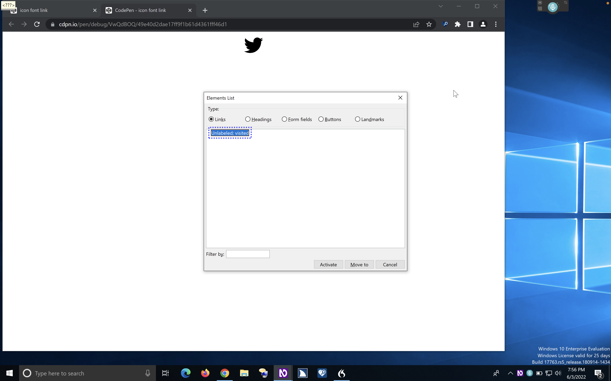

# Accessible names and descriptions

## Table of contents

- What is an accessible name?
- What is the difference between an accessible name and a label?
- Inspecting an element’s accessible name in the DevTools
- What elements need an accessible name?
  - Interactive elements must have an accessible name
  - Some non-interactive elements benefit from having an accessible name
  - Not all elements can have a name
- Accessible descriptions
  - The difference between a description and a name
- Outro
- References, resources and recommended reading

We use labels everywhere in life. We use them to label jars and boxes and containers of things. We use them to identify items or describe what’s in them. Whether in the real world or the digital world, elements of user interfaces need to be identified and described so that people can understand what their purpose is and how to use them.


When a user comes across a button or a form field or control on a page, how do they know what that button does, or what kind of input the form field expects if they don’t have labels that identify their purpose? And when there are multiple buttons on the page, how does the user know which one’s which? how do they know what action each button triggers? If a form contains multiple input fields, how does the user know what input each field expects? And if there are multiple of the same landmark region on the page, how do they identify the purpose of each region and what type of content it contains?

Visible labels are used to **identify the purpose** of user interface elements, as well as to **distinguish an element from other elements** in the interface. An **accessible** name serves the same purpose, but is primarily targeted at assistive technology users.

In this and the following two chapters, we’re going to learn all about accessible names and descriptions. In this chapter, we’re going to define what accessible names are, why they are important, and how they are different from accessible descriptions. In the [next chapter](https://practical-accessibility.today/chapters/accName-techniques/), we’re going to learn about the different techniques you can use to provide accessible names and descriptions to elements that need them. And finally, [in the third chapter of this series](https://practical-accessibility.today/chapters/accName-computation/), we’re going to learn about the order of priority that browsers follow in order to determine the accessible name of an element.

So, let’s dive right in!

## What is an accessible name?

The “name” or “accessible name” (**accName**) of an element is a string of text **that is programmatically associated with an element**, and is exposed by the browser to assistive technologies via the accessibility tree. This name is used to provide a label for the element to assistive technologies users.

Remember when we said in [the accessibility tree (**accTree**) chapter](https://practical-accessibility.today/chapters/the-accessibility-tree/) that elements that are relevant to accessibility are represented as objects in the accTree? And that each object has properties that describe the element to assistive technology users—such as a role, a name, and a description. We also mentioned that these properties are only included if you include them in your markup. To make sure an object has a name, you need to make sure its name is programmatically associated with the element. We will learn all about what this means in this and the next two chapters.

But first, we need to clarify the difference between a label and a name, because these two terms are often used interchangeably, even though they mean different things. And it is important that you know the difference between them (if you don’t already) in order to design and build components that work for assistive technology users.

## What is the difference between an accessible name and a label?

In the context of Web accessibility, a visible _label_ and a _name_ are not strictly the same. Though, ideally, they should be identical.

If you read through the Web Content Accessibility Guidelines, you’ll find that the guidelines differentiate between a “label” and a “name”. Success criterion **2.5.3 Label in Name** is the clearest demonstration of that. It states that:

**For user interface components with labels that include text or images of text, the name contains the text that is presented visually.**

The “text that is presented visually” part refers to an element’s label. The “name” refers to the the string of text that is presented to assistive technologies.

Just because an element has a label, does not guarantee that it has an accessible name. You must ensure that it does.

For example, most input fields are typically provided with a visible label. A sighted user can associate the label with its input using visual cues like layout and positioning. But unless that label is programmatically associated with the input field, it won’t be exposed as a name to assistive technologies. The input then has no name, and a blind screen reader user will not be able to identify the input or its purpose.

```html
<!-- this input field has a visible label but no name -->
<span>Username</span>
<input type="text" />
```

In order to expose the label as a name to the input, you must create a programmatic association between them. Using the native `<label>` element, you can provide a label and associate it with the input using the for and id attributes:

```html
<label for="username">Username</label>
<input type="text" id="username" />
```

Another example of an element that may have a visible label but no name is an icon button. An icon button has a graphical label (the icon). But the button also needs a text string as a name. The name of the button should be provided as a (visually-hidden) string of text that describes the action that the button initiates. Similarly, icon-only links need an accessible name that describes the destination of the link. One way to do that is to provide a visually-hidden piece of text inside the link.

```html
<!-- this link has a graphical label, but no (pronounceable) name -->
<a href="https://twitter.com/SaraSoueidan">
  <i class="fa-brands fa-twitter"></i>
</a>

<!-- this link has a graphical label, and an accessible name -->
<a href="https://twitter.com/SaraSoueidan">
  <span class="visually-hidden">Twitter</span>
  <i class="fa-brands fa-twitter"></i>
</a>
```

The label and the name should ideally match. When they do, _all_ users are presented with the same label. When a sighted screen reader user focuses on a control, the name they hear should match the visual label that they see on the page. This is also important for speech control users. Speech control users speak the label of a control in order to activate it. When the speech recognition software processes speech input, it looks for _an accessible name_ that matches the name spoken by the user. And if it doesn’t find it, it won’t activate the control.

When the label and the name don’t match, success criterion **2.5.3 Label in Name** requires that the name _contains_ the label. We will elaborate more on what this means, how to include the label in the name, and how a mismatch between the label and the name affects users of assistive technologies in [another chapter.](https://practical-accessibility.today/chapters/label-in-name/)

## Inspecting an element’s accessible name in the DevTools

You can inspect what an element’s accessible name is by using the browser DevTools.

Here’s an example of an icon-link which uses an icon font to provide its label.

```html
<button href="https://twitter.com/SaraSoueidan">
  <i class="fa-brands fa-twitter"></i>
</button>
```

If we inspect the accessibility object created for the link in the accessibility tree, you’ll see that the link’s name, which is derived from its contents, is a meaningless character. This character is what the icon font stylesheet provided. More on this later.

If we fire up VoiceOver to quickly test this, VoiceOver will announce the presence of a link, but it won’t announce a name.

If you test the link using NVDA with Chrome on Windows, you’ll get a similar result. In fact, if we press the `insert+F7` shortcut to pull up a list of all the links on the page, you’ll even see that NVDA explicitly notes that the link is _unlabelled_.



The link contains an empty element (`<i>`). And while the stylesheet provides a unicode character, this character is not recognized by assistive technologies. So, the link is treated as empty. And with no other method providing an accessible name, the link has none.

Using the DevTools, you can get insights into whether or not an element has an accName, what the accName is, and where the browser gets this accName from. You can also see a list of the various ways that an element _might_ get an accessible name, which is what we will talk in more detail about in the next two chapters. Using the insights provided in the accessibility tree, you can find and fix accessible name issues on elements, and make sure you’re providing accessible names to the elements that need them.

## What elements need an accessible name?

Not every element that has a label necessarily has an accessible name. But certain elements _must_ have an accessible name. Some non-interactive elements benefit from having accessible names. And there are elements that are not even _allowed_ to have one…

### Interactive elements must have an accessible name

If it is interactive, it must have an accessible name.

**Success Criterion 3.3.2 Labels or Instructions (Level A)** of the WCAG states that:

**Labels or instructions are provided when content requires user input.**

This means that all form controls (and/or widgets) that expect user input are **required to have a visible label**, and a description where needed.

**Success Criterion 1.3.1 Info and Relationships (Level A)** states that:

**Information, structure, and relationships conveyed through presentation can be programmatically determined or are available in text.**

This criterion mandates that information that is presented visually can be programmatically determined so that assistive technology users can perceive the same information that is conveyed visually. When visible labels are provided, these **labels must be programmatically associated with their elements.**

**Success Criterion 4.1.2 Name, Role, Value (Level A)** states that:

**For all user interface components (including but not limited to: form elements, links and components generated by scripts), the name and role can be programmatically determined;**

In other words, all of these components are **required to have an accessible name.**

These success criteria are Level-A requirements. This means that they are a baseline accessibility requirement that your content must meet in order to be accessible.

And lastly, the fifth rule of ARIA use states that **"All interactive elements must have an accessible name"**. Whether native or custom, all controls and interactive elements are required to have an accessible name.

The results of the 2022 WebAIM One Million survey showed that:

- 50.1% of homepages had empty links,
- 27.2% had empty buttons, and
- 46.1% of pages reported having missing form input labels

These three issues were among the top 6 most common accessibility issues found on the top 1,000,000 websites. Addressing these issues would significantly improve accessibility across the Web.

### Some non-interactive elements benefit from having an accessible name

Some non-interactive elements benefit from having accessible names, too.

We mentioned in [the landmark regions chapter](https://practical-accessibility.today/chapters/landmark-regions/) that when you have multiple of the same landmark region, these regions benefit from accessible names that identify the purpose of each region, which aids the user in navigating the page more efficiently.

```html
<nav aria-label="Site">
  <!-- main site navigation links -->
</nav>

<!--...-->

<nav aria-label="Social">
  <!-- social links -->
</nav>
```

Tables, dialogs, and form field groupings also benefit from accessible names.

When you provide a name to a group of controls in a form, **the group name provides context which helps further identify the purpose of these controls.** For example, grouping radio buttons or checkboxes using a `<fieldset>` and providing an accessible name to the group using the `<legend>` element helps the user identify the purpose of these checkboxes and radio buttons:

```html
<fieldset>
  <legend>I want to receive</legend>
  <div>
    <input
      type="checkbox"
      name="newsletter"
      id="check_1" />
    <label for="check_1"
      >The weekly newsletter</label
    >
  </div>
  <div>
    <input
      type="checkbox"
      name="promotions"
      id="check_2" />
    <label for="check_2"
      >Offers and promotions</label
    >
  </div>
  […]
</fieldset>
```

The group label helps the user understand why they are being provided a group of options.

Grouping form fields also creates a relationship between these fields, and the group label identifies the purpose of these fields. For example, Shipping and Billing addresses require the same type of information and, by extension, the same type of input fields. Since the fields in both addresses share the same labels, the `<fieldset>`s create a relationship between the fields of each address, and the `<legend>`s provide the accessible names that identify the purpose of each group.

```html
<!-- example borrowed from https://www.w3.org/WAI/tutorials/forms/grouping/ -->
<fieldset>
  <legend>Shipping Address:</legend>
  <div>
    <label for="shipping_name">
      <span class="visuallyhidden">Shipping </span
      >Name: </label
    ><br />
    <input
      type="text"
      name="shipping_name"
      id="shipping_name" />
  </div>
  <div>
    <label for="shipping_street">Street:</label
    ><br />
    <input
      type="text"
      name="shipping_street"
      id="shipping_street" />
  </div>
  […]
</fieldset>
<fieldset>
  <legend>Billing Address:</legend>
  <div>
    <label for="billing_name">
      <span class="visuallyhidden">Billing </span
      >Name: </label
    ><br />
    <input
      type="text"
      name="billing_name"
      id="billing_name" />
  </div>
  <div>
    <label for="billing_street">Street:</label
    ><br />
    <input
      type="text"
      name="billing_street"
      id="billing_street" />
  </div>
  […]
</fieldset>
```

Without grouping the related fields together and identifying their purpose, it would be impossible for the user to know which input field expects the billing address and which one requires the shipping address.

## Not all elements can have a name

Not all HTML elements can have a name.

Some ARIA roles are “Name prohibited” — meaning that they are not allowed to have an accessible name. These roles are:

- caption (In HTML: `<caption>` or `<figcaption>`)
- code (In HTML: `<code>`)
- definition
- deletion (In HTML: `<del>`)
- emphasis (In HTML: `<em>`)
- generic (In HTML: `<div>` and `<span>`)
- insertion (In HTML: `<ins>`)
- mark (In HTML: `<mark>`)
- paragraph (In HTML: `<p>`)
- presentation (any element with `role=“presentation"`)
- strong (In HTML: `<strong>`)
- subscript (In HTML: `<sub>`)
- suggestion
- superscript (In HTML: `<sup>`)
- term (In HTML: `<dfn>`)
- time (In HTML: `<time>`)

Any element that has one of these roles — whether implicit, or explicitly set — cannot have an accessible name. This means that this very common piece of code is invalid:

```html
<!-- this is not valid -->
<div aria-label="[ accName ]">
  <!-- Some text that may have accessibility issues, such dynamic text that animates on a letter-by-letter basis -->
</div>
```

and so is this:

```html
<!-- this is not valid -->

<span aria-label="Twitter"
  ><!-- some icon maybe --></span
>
```

`<div>`s and `<span>`s are generic containers. If you remember from [the HTML semantics chapter](https://practical-accessibility.today/chapters/html-semantics/), we said that the `generic` role creates **a _nameless_ container element which has no semantic meaning on its own.** So generic containers are not meant to have an accessible name. And this applies to _all_ elements that are mapped to a `generic` role. If an element’s role is not meaningful, it doesn’t get an accessible name. This means that slapping an `aria-label` on `<div>`s and `<span>`s will not fix accessibility issues caused by mis-using these elements.

Before you give an accessible name to an element, remember to check if it _can_ have an accessible name.

If you’re using a `<div>` as a container for a region that _should_ have a name, **you will need to give the `<div>` a meaningful role that describes its purpose so that is qualifies for accessible name**. We saw a practical application of this in t[he accordions chapter](https://practical-accessibility.today/chapetrs/accordion/), where we gave the `<div>` an accessible name after assigning it a meaningful group role. And we will see more examples of this in other chapters, too.

```html
<!-- the region role is a meaningful role that identifies a useful region of the page. Useful regions can have accessible names -->
<div
  role="region"
  aria-label="[ accessible name ]">
  <!-- div content -->
</div>
```

`aria-label` is but one way you can provide an accessible name to an element. We will learn about the different techniques to provide accessible names to elements in [the next chapter.](https://practical-accessibility.today/chapters/accName-techniques/)
